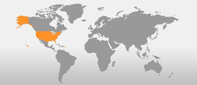

## Course Directory

### Return to the course outline

[← Back to AP CSA / 返回课程目录](../../index.html)

## Groupwork Coding Challenge {.image-fit}

### Countries Array

{fig-align="center" width="30%"}

In this challenge, you will create a guide to different countries using arrays.

## Parallel Array Data

### Required lists

Use the Active Code window to create four parallel arrays and initialize them using initialization lists.

The order of these arrays has to match so that you can use the same index and get corresponding values out.

## Required Data

### Countries 1-5

| Countries | Capitals | Languages | Image filenames |
|---|---|---|---|
| China | Beijing | Chinese | China.jpg |
| Egypt | Cairo | Arabic | Egypt.jpg |
| France | Paris | French | France.jpg |
| Germany | Berlin | German | Germany.jpg |
| India | New Delhi | Hindi | India.jpg |
 
## Required Data

### Countries 6-10

| Countries | Capitals | Languages | Image filenames |
|---|---|---|---|
| Japan | Tokyo | Japanese | Japan.jpg |
| Kenya | Nairobi | Swahili | Kenya.jpg |
| Mexico | Mexico City | Spanish | Mexico.jpg |
| United Kingdom | London | English | UK.jpg |
| United States | Washington D.C. | English | US.jpg |

## Optional Additions

### Extra countries

The source encourages you to add additional country, capital, and language names that match in position in the parallel arrays.

These can represent your family origins or places you would like to visit.

The source notes that regional map images are also available:

`south-america.png`, `central-america.png`, `north-america.png`, `asia-pacific.png`, `europe.png`, `africa.png`, and `middle-east.png`.

## Challenge Steps

### Random access

Choose a random number using `Math.random()` and the `length` of one of the arrays.

Save it in a variable called `index`.

Use the random `index` to access the corresponding item in each parallel array.

## Challenge Output

### Print matching data

Print out:

::: {.tight-list}
- the country name
- its capital
- its language
- the map image for that country
:::

## Image Helper

### Source-provided method

For the images, the `printHTMLimage` method has been given.

It gets the image URL online and prints it out as an HTML image.

This works in the Active Code environment.

The optional object-oriented refactor challenge from the source is omitted as optional enrichment.

## challenge-array-countries Starter

### `activecode:: challenge-array-countries`

::: {.code-scroll}
```java
public class Countries
{
    public static void main(String[] args)
    {
        // TODO 1. Declare 4 arrays and initialize them to the given values.
        // Countries: China, Egypt, France, Germany, India, Japan, Kenya, Mexico,
        // United Kingdom, United States
        // Capitals: Beijing, Cairo, Paris, Berlin, New Delhi, Tokyo, Nairobi,
        // Mexico City, London, Washington D.C.
        // Languages: Chinese, Arabic, French, German, Hindi, Japanese, Swahili,
        // Spanish, English, English
        // Filenames for map images: China.jpg, Egypt.jpg, France.jpg, Germany.jpg,
        // India.jpg, Japan.jpg, Kenya.jpg, Mexico.jpg, UK.jpg, US.jpg

        // TODO 2. Pick a random number up to the length of one of the arrays and save
        // in the variable index

        // TODO 3. Print out the info in each array using the random index

        // Example of showing image files using an array called images (your array
        // name above may be different)
        // (this will only work in Active Code)
        // TODO: Uncomment and adapt the image code after creating your images array.
        // Countries obj = new Countries();
        // obj.printHTMLimage(images[index]);

    }

    // This method will just work in Active Code which interprets html
    public void printHTMLimage(String filename)
    {
        String baseURL =
                "https://raw.githubusercontent.com/bhoffman0/CSAwesome/master/_sources/Unit6-Arrays/6-1-images/";
        System.out.print("");
    }
}
```
:::

## Test Targets

### Output and image

The tests check that:

::: {.tight-list}
- `main` prints country, capital, language, and image information
- the output contains `.jpg`
- the output contains `<img src`
:::

The classroom output should show one randomly selected country's corresponding data.

## Test Targets

### Randomness and arrays

The tests also check that:

::: {.tight-list}
- running `main` repeatedly can pick more than three different countries
- the code declares four `String[]` arrays, plus the `String[] args` parameter in `main`
:::

The expected array count is reported as `5 x String[]` because `main` contributes one of them.

## Classroom Check

### A complete answer should include

::: {.tight-list}
- create four parallel `String[]` arrays with matching order
- use `Math.random()` and array `length` to pick a valid index
- print country, capital, language, and image data from the same index
- uncomment or use the image helper call
- explain why changing the order of one parallel array breaks correspondence
:::

## End

### 4.3 Part 3 complete

Next: arrays of objects.
