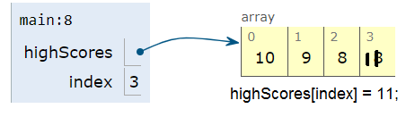
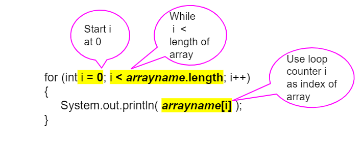

## Course Directory

### Return to the course outline

[← Back to AP CSA / 返回课程目录](../../index.html)

## Topic Intro

### Traversal visits array elements

An <span class="term">array traversal</span> (数组遍历) processes each element, or a selected range of elements, using a loop.

{fig-align="center" width="48%"}

Traversal connects loop counters to array indices.

## Standard For Loop

### Use the index when you need positions

{fig-align="center" width="52%"}

```java
for (int i = 0; i < values.length; i++)
{
    System.out.println(values[i]);
}
```

This loop visits every valid index from `0` to `values.length - 1`.

## Trace Task

### Sum an array

```java
int[] values = {3, 5, 2};
int sum = 0;

for (int i = 0; i < values.length; i++)
{
    sum += values[i];
}

System.out.println(sum);
```

Answer: `10`.

## Arrays as Parameters

### A method can traverse a received array

```java
public static int sum(int[] values)
{
    int total = 0;
    for (int i = 0; i < values.length; i++)
    {
        total += values[i];
    }
    return total;
}
```

The parameter stores a reference to the array object.

## Partial Traversal

### Sometimes only part of the array should be processed

```java
for (int i = 0; i < 4; i++)
{
    nums[i] *= 3;
}
```

This loop changes only the first four elements. Always check that the array has enough elements before using a fixed bound.

## Common Errors

### Off-by-one mistakes break traversals

Wrong:

```java
for (int i = 0; i <= values.length; i++)
{
    System.out.println(values[i]);
}
```

Correct:

```java
for (int i = 0; i < values.length; i++)
{
    System.out.println(values[i]);
}
```

## Enhanced For Loop

### Use for-each when index is not needed

{fig-align="center" width="44%"}

```java
for (int value : values)
{
    System.out.println(value);
}
```

For-each is concise for reading elements, but it does not give direct access to the index.

## Enhanced For Loop Limitation

### It cannot replace array elements directly

```java
for (int value : values)
{
    value++;
}
```

This changes only the local loop variable, not the array elements.

Use an indexed loop when modifying array contents.

## Groupwork Coding Challenge {.image-fit}

### SpellChecker

{fig-align="center" width="34%"}

Write a method that traverses an array of dictionary words and checks whether a target word appears.

Key pattern: loop through words, compare with `equals`, return early when found.

## Classroom Check

### A strong answer should...

::: {.tight-list}
- write an indexed traversal from `0` to `array.length - 1`
- use array elements inside an accumulator or search
- explain why `i < array.length` avoids out-of-bounds errors
- choose for-each when no index or mutation is needed
- explain why for-each cannot directly replace array elements
:::

## End

### Return to the course outline

[← Back to AP CSA / 返回课程目录](../../index.html)
