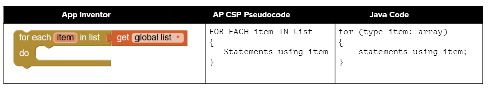

## Course Directory

### Return to the course outline

[← Back to AP CSA / 返回课程目录](../../index.html)

## Enhanced For-Loop

### For-each loop

There is a special kind of loop that can be used with arrays called an **enhanced for loop** or a **for each loop**.

This loop is much easier to write because it does not involve an index variable or the use of `[]`.

It sets up a variable that is set to each value in the array successively.

## For-Each Syntax

### Read the loop aloud

To set up a for-each loop, use:

```java
for (type variable : arrayname)
```

The `type` is the type for elements in the array.

Read it as: "for each variable value in arrayname".

## For-Each Comparison {.image-fit}

### App Inventor, AP CSP, and Java

{fig-align="center" width="78%"}

The source compares the Java enhanced for-loop with similar list traversal ideas in AP CSP Pseudocode and App Inventor.

## Java Examples

### Element type matters

```java
int[] highScores = {10, 9, 8, 8};
String[] names = {"Jamal", "Emily", "Destiny", "Mateo"};

// for each loop: for each value in highScores
for (int value : highScores)
{
    System.out.println(value);
}

// for each loop with a String array to print each name
for (String name : names)
{
    System.out.println(name);
}
```

## When to Use For-Each

### All elements, no index, no mutation

Use the enhanced for-each loop with arrays whenever you can, because it cuts down on errors.

You can use it whenever:

::: {.tight-list}
- you need to loop through all the elements of an array
- you do not need to know their index
- you do not need to change their values
:::

It starts with the first item in the array and continues through the last item.

## Coding Exercise

### `activecode:: foreach1`

Try the following code.

Notice the for-each loop with an `int` array and a `String` array.

Add another high score and another name to the arrays and run again.

## foreach1 Starter

```java
public class ForEachDemo
{
    public static void main(String[] args)
    {
        int[] highScores = {10, 9, 8, 8};
        String[] names = {"Jamal", "Emily", "Destiny", "Mateo"};
        // for each loop with an int array
        for (int value : highScores)
        {
            System.out.println(value);
        }
        // for each loop with a String array
        for (String value : names)
        {
            System.out.println(value); // this time it's a name!
        }
        // TODO: Add another high score and another name to the arrays.
    }
}
```

## foreach1 Test Targets

### Runestone checks

Original output contains:

```text
10
9
8
8
Jamal
Emily
Destiny
Mateo
```

After the student change, output should be longer than the original and include another high score and name.

## Equivalent Loops

### Rewrite between loop forms

Code written using an enhanced `for` loop to traverse elements in an array can be rewritten using an indexed `for` loop or a `while` loop and vice versa.

They are equivalent in terms of functionality, but the enhanced `for` loop is more concise and easier to read.

## Coding Exercise

### `activecode:: evenLoop`

Rewrite the following `for` loop, which prints out the even numbers in the array, as an enhanced for-each loop.

Make sure it works.

```java
public class EvenLoop
{
    public static void main(String[] args)
    {
        int[] values = {6, 2, 1, 7, 12, 5};
        // TODO: Rewrite this loop as a for each loop and run
        for (int i = 0; i < values.length; i++)
        {
            if (values[i] % 2 == 0)
            {
                System.out.println(values[i] + " is even!");
            }
        }
    }
}
```

## evenLoop Test Targets

### Runestone checks

Expected output:

```text
6 is even!
2 is even!
12 is even!
```

The test also checks that the code contains a for-each loop over `values`.

## Enhanced For Loop Limitations

### Changing loop variable is not changing the array

What if we had a loop that incremented all the elements in the array?

Would that work with an enhanced for-each loop?

Unfortunately not.

Only the variable in the loop would change, not the real array values.

Assigning a new value to the enhanced `for` loop variable does not change the value stored in the array.

## Coding Exercise

### `activecode:: incrementLoop`

The for-each loop below cannot change the values in the array because only the loop variable value will change.

Run it and then change the loop to an indexed `for` loop to make it change the array values.

## incrementLoop Starter

::: {.code-scroll}
```java
public class IncrementLoop
{
    public static void main(String[] args)
    {
        int[] values = {6, 2, 1, 7, 12, 5};
        // Can this loop increment the values?
        // TODO: Change this to an indexed for loop that updates values[i]
        for (int val : values)
        {
            val++;
            System.out.println("New val: " + val);
        }
        // Print out array to see if they really changed
        System.out.println("Array after the loop: ");
        for (int v : values)
        {
            System.out.print(v + " ");
        }
    }
}
```
:::

## incrementLoop Test Targets

### Runestone checks

Expected output after the fix:

```text
New val: 7
New val: 3
New val: 2
New val: 8
New val: 13
New val: 6
Array after the loop:
7 3 2 8 13 6
```

The test also checks for an indexed `for` loop.

## Source Note

### When not to use for-each

Enhanced for-each loops cannot be used in all situations.

Only use for-each loops when you want to loop through **all** the values in an array without changing their values.

Do not use for-each loops if:

::: {.tight-list}
- you need the index
- you need to change the values in the array
- you want to loop through only part of an array or in a different order
:::

## Quick Check

### `mchoice:: mcq_for_each1`

What are some reasons you would use an enhanced for-each loop instead of a `for` loop?

```text
I: If you wish to access every element of an array.
II: If you wish to modify elements of the array.
III: If you wish to refer to elements through a variable name instead of an array index.
```

Correct answer: **I and III only**.

## Quick Check

### `mchoice:: mcqfor-each2`

What is the output?

```java
int[] numbers = {44, 33, 22, 11};
for (int num : numbers)
{
    num *= 2;
}
for (int num : numbers)
{
    System.out.print(num + " ");
}
```

## Answer Reasoning

### For-each does not change array values

Correct output:

```text
44 33 22 11
```

The array is unchanged because the for-each loop cannot modify the array elements.

## Classroom Check

### A complete answer should include

::: {.tight-list}
- write the syntax `for (type variable : arrayname)`
- use for-each only when all elements should be visited
- rewrite an indexed loop as a for-each loop when no index is needed
- explain why for-each cannot modify primitive array elements
- switch to an indexed loop when the array values must change
- identify I and III as valid for-each reasons
:::

## End

### 4.4 Part 3 complete

Next: traversing arrays of objects.
