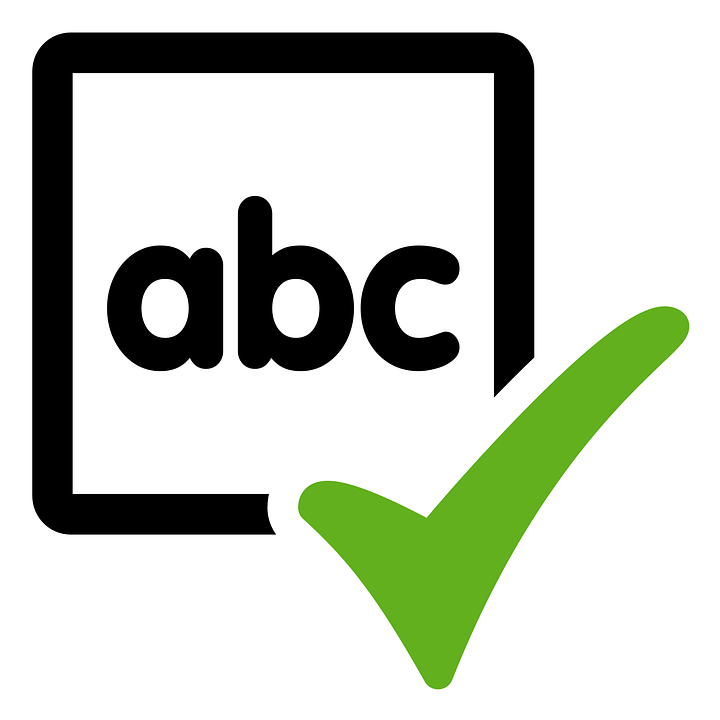

## Course Directory

### Return to the course outline

[← Back to AP CSA / 返回课程目录](../../index.html)

## Traversing Arrays of Objects

### Indexed loops and enhanced for loops both work

Both indexed `for` loops and enhanced `for` loops can be used to traverse (遍历) an array of objects.

The source example uses a `Student` class and a `StudentArray` class that searches for a student with a specific name.

When multiple classes are used on Runestone, only the class with `main` should be `public`; the other classes start with `class` instead of `public class`.

## Coding Exercise

### `activecode:: student-array`

Run the `StudentArray` class.

It uses the class `Student` below it and creates an array of `Student` objects.

Using the `StudentArray` `print()` method as a guide, write a `StudentArray` method called `findAndPrint()` which takes a `String name` as an argument.

Use an enhanced `for` loop to traverse the array and find a `Student` with the same name.

## student-array Starter

::: {.code-scroll}
```java
public class StudentArray
{
    private Student[] array;
    private int size = 3;

    // Creates an array of the default size
    public StudentArray()
    {
        array = new Student[size];
    }

    // Creates an array of the given size
    public StudentArray(int size)
    {
        array = new Student[size];
    }

    // Adds Student s to the array at index i
    public void add(int i, Student s)
    {
        array[i] = s;
    }

    // prints the array of students
    public void print()
    {
        for (Student s : array)
        {
            // this will call Student's toString() method
            System.out.println(s);
        }
    }

    /* Write a findAndPrint(name) method */

    public static void main(String[] args)
    {
        // Create an object of this class and pass in size 3
        StudentArray roster = new StudentArray(3);
        // Add new Student objects at indices 0-2
        roster.add(0, new Student("Skyler", "skyler@sky.com", 123456));
        roster.add(1, new Student("Ayanna", "ayanna@gmail.com", 789012));
        roster.add(2, new Student("Dakota", "dak@gmail.com", 112233));
        roster.print();
        System.out.println("Finding student Ayanna: ");
        // uncomment to test
        // roster.findAndPrint("Ayanna");
    }
}
```
:::

## Student Class

::: {.code-scroll}
```java
class Student
{
    private String name;
    private String email;
    private int id;

    public Student(String initName, String initEmail, int initId)
    {
        name = initName;
        email = initEmail;
        id = initId;
    }

    public String getName()
    {
        return name;
    }

    public String getEmail()
    {
        return email;
    }

    public int getId()
    {
        return id;
    }

    // toString() method
    public String toString()
    {
        return id + ": " + name + ", " + email;
    }
}
```
:::

## student-array Test Targets

### Runestone checks

The unit tests check that student code includes:

::: {.tight-list}
- a `findAndPrint(String` method header
- an uncommented call to `roster.findAndPrint(`
- one enhanced `for` loop over `Student` objects inside `findAndPrint`
- use of `.equals(`
- use of `.getName()`
:::

## Object References in For-Each

### Mutating attributes through references

Normally an enhanced `for` loop cannot be used to modify primitive values in an array because the loop variable does not refer to the real object in the array.

When an array stores object references, the attributes can be modified by calling methods on the enhanced `for` loop variable.

The references stored in the array are unchanged, but the loop variable is another reference to the same objects.

## Groupwork Coding Challenge

### SpellChecker

{fig-align="left" width="14%"}

In this challenge, you will use an array of English words from a dictionary file to see if a given word is spelled correctly.

The source encourages working in pairs.

The challenge includes a dictionary file of 10,000 English words which is read into the array `dictionary` for you.

## SpellChecker Required Tasks

### Keep the source order

1. Write a `print10` method that prints out the first 10 words of the dictionary array. Do not print out the whole array of 10,000 words.
2. Write a `spellcheck` method that takes a word as a parameter and returns `true` if it is in the dictionary array. It should return `false` if it is not found.
3. Optional Challenge: Write a method `printStartsWith(String)` that prints out the words that start with a `String` of letters in the `dictionary` array. This is not autograded.

The `spellcheck` algorithm is called a **linear search** (线性搜索): step through the array one element at a time looking for a certain element.

## SpellChecker Starter

::: {.code-scroll}
```java
import java.io.*;
import java.nio.file.*;
import java.util.*;

public class SpellChecker
{
    // This dictionary has 10,000 English words read in from a dictionary file in
    // the constructor
    private String[] dictionary = new String[10000];

    /* 1. Write a print10() method that prints out the first
     * 10 words of the dictionary array. Do not print out the whole array!
     */

    /* 2. Write a spellcheck() method that takes a word as a
     * parameter and returns true if it is in the dictionary array.
     * Return false if it is not found.
     */

    // Do not change "throws IOException" which is needed for reading in the input
    // file
    public static void main(String[] args) throws IOException
    {
        SpellChecker checker = new SpellChecker();
        // Uncomment to test Part 1
        // checker.print10();

        /* // Uncomment to test Part 2
        String word = "catz";

        if (checker.spellcheck(word) == true)
        {
            System.out.println(word + " is spelled correctly!");
        }
        else
        {
            System.out.println(word + " is misspelled!");
        }

        word = "cat";
        System.out.println(word + " is spelled correctly? " + checker.spellcheck(word));
        */

        // 3. optional and not autograded
        // checker.printStartsWith("b");
    }
```
:::

## SpellChecker Constructor

::: {.code-scroll}
```java
    // The constructor reads in the dictionary from a file
    public SpellChecker() throws IOException
    {
        // Let's use java.nio method readAllLines and convert to an array!
        List<String> lines = Files.readAllLines(Paths.get("dictionary.txt"));
        dictionary = lines.toArray(dictionary);

        /* The old java.io.* Scan/File method of reading in files, replaced by java.nio above
        // create File object
        File dictionaryFile = new File("dictionary.txt");

        //Create Scanner object to read File
        Scanner scan = new Scanner(dictionaryFile);

        // Reading each line of the file
        // and saving it in the array
        int i = 0;
        while(scan.hasNextLine())
        {
            String line = scan.nextLine();
            dictionary[i] = line;
            i++;
        }
        scan.close();
        */
    }
}
```
:::

## SpellChecker Datafile and Tests

### `dictionary.txt` and Runestone checks

The source uses `dictionary.txt` from `dictionary10K.txt`.

The tests check:

::: {.tight-list}
- `checker.print10();` is uncommented in `main`
- `print10()` prints `a aa aaa aaron ab abandoned abc aberdeen abilities ability`, one word per line
- `spellcheck("dogz")` returns `false`
- `spellcheck("dog")` returns `true`
- code uses `.equals(`
:::

## Groupwork Design Challenge

### Design an Array of Objects for your Community

In the last lesson, you came up with a class of your own choice relevant to you or your community.

In the last lesson, you created an array to hold objects of your class.

Copy your array of objects code from the last lesson.

In this challenge, add a loop to traverse your array to print out each object.

## Community Challenge Starter

```java
public class          // Add your class name here!
{
    // Copy your class from lesson 4.3 below.


    public static void main(String[] args)
    {
       // Create an array of 3 objects of your class.

       // Initialize array elements 0-2 to new objects of your class.


       // Write a for loop that traverses the array and calls
       // the print method of each object in the array


    }
}
```

## Community Challenge Test Targets

### Runestone checks

Student code should:

::: {.tight-list}
- include an array declaration of size `3`
- include a `for` loop
- call `.print` in the loop
- produce at least 3 lines of output from `main`
:::

## Classroom Check

### A complete answer should include

::: {.tight-list}
- choose indexed or enhanced `for` loops for object-array traversal
- use `s.getName().equals(name)` or equivalent object comparison in `findAndPrint`
- explain that for-each loop variables can call mutator methods on referenced objects
- implement `print10()` without printing all 10,000 dictionary words
- return `false` only after the whole dictionary has been searched
- use a loop to print each object in the community object array
:::

## End

### 4.4 Part 4 complete

Next: implementing array algorithms.
