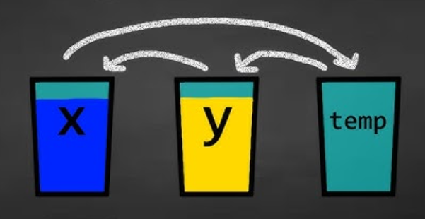

## Course Directory

### Return to the course outline

[← Back to AP CSA / 返回课程目录](../../index.html)

## Topic Intro

### Arrays reuse familiar algorithm patterns

Array algorithms combine traversals with Unit 2 patterns:

::: {.tight-list}
- sum and average
- min and max
- search
- test a property
- pairs and duplicates
- rotate and reverse
:::

## Sum and Average

### Accumulate while traversing

```java
int sum = 0;
for (int value : values)
{
    sum += value;
}
double average = (double) sum / values.length;
```

Use an enhanced for loop when the index is not needed.

## Mixed-Up Algorithm

### Average of an array

```java
public static double average(int[] values)
{
    int sum = 0;
    for (int value : values)
    {
        sum += value;
    }
    return (double) sum / values.length;
}
```

Key decisions: initialize before loop, update inside loop, divide after loop.

## Min and Max

### Store the best value seen so far

```java
int max = values[0];
for (int i = 1; i < values.length; i++)
{
    if (values[i] > max)
    {
        max = values[i];
    }
}
```

Start with an existing element so the algorithm works with negative numbers.

## Search and Early Return

### Return when the target is found

```java
public static boolean contains(int[] values, int target)
{
    for (int value : values)
    {
        if (value == target)
        {
            return true;
        }
    }
    return false;
}
```

The final `return false` belongs after the loop.

## Back-to-Front Traversal

### Some algorithms move backward

```java
for (int i = values.length - 1; i >= 0; i--)
{
    System.out.println(values[i]);
}
```

Backward traversal is useful when shifting, removing, or comparing with earlier elements.

## Test a Property

### Check whether all elements satisfy a condition

```java
public static boolean allOdd(int[] values)
{
    for (int value : values)
    {
        if (value % 2 == 0)
        {
            return false;
        }
    }
    return true;
}
```

One counterexample is enough to return `false`.

## Pairs and Duplicates

### Nested loops compare combinations

```java
for (int i = 0; i < values.length; i++)
{
    for (int j = i + 1; j < values.length; j++)
    {
        if (values[i] == values[j])
        {
            System.out.println("duplicate");
        }
    }
}
```

The inner loop starts at `i + 1` to avoid comparing an element with itself.

## Reverse an Array

### Swap from both ends

{fig-align="center" width="34%"}

```java
int left = 0;
int right = values.length - 1;
while (left < right)
{
    int temp = values[left];
    values[left] = values[right];
    values[right] = temp;
    left++;
    right--;
}
```

## Classroom Check

### A strong answer should...

::: {.tight-list}
- implement sum and average with an accumulator
- initialize min or max from an existing array element
- place early returns correctly in search algorithms
- use nested loops for pairs and duplicate checks
- reverse an array by swapping values from both ends
:::

## End

### Return to the course outline

[← Back to AP CSA / 返回课程目录](../../index.html)
