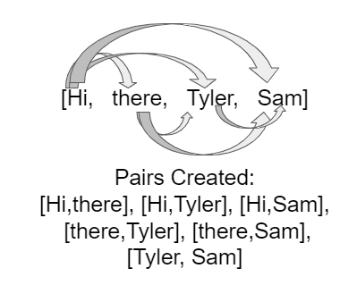

## Course Directory

### Return to the course outline

[← Back to AP CSA / 返回课程目录](../../index.html)

## ArrayList of Student Objects

### Traverse objects

You can put any kind of objects into an `ArrayList`.

For example, here is an `ArrayList` of `Student`s.

Although the print statement works here, you may want a nicer printout.

## Coding Exercise

### `activecode:: StudentList`

Add a for-each loop that prints out each student and then a new line.

## StudentList Starter

::: {.code-scroll}
```java
import java.util.*;

public class StudentList
{
    // main method for testing
    public static void main(String[] args)
    {
        ArrayList<Student> roster = new ArrayList<Student>();
        roster.add(new Student("Skyler", "skyler@sky.com", 123456));
        roster.add(new Student("Ayanna", "ayanna@gmail.com", 789012));
        // Replace this with a for each loop that prints out each student on a
        // separate line
        System.out.println(roster);
    }
}
```
:::

## Student Class

```java
class Student
{
    private String name;
    private String email;
    private int id;

    public Student(String name, String email, int id)
    {
        this.name = name;
        this.email = email;
        this.id = id;
    }

    // toString() method
    public String toString()
    {
        return id + ": " + name + ", " + email;
    }
}
```

## StudentList Test Targets

### Runestone checks

Expected output:

```text
123456: Skyler, skyler@sky.com
789012: Ayanna, ayanna@gmail.com
```

The tests also check for a `for` loop.

## Groupwork Coding Challenge

### FRQ Word Pairs

This challenge is based on the 2018 AP CSA FRQ #2 WordPair.

The source encourages working in pairs.

You are given a class called `WordPair` that can store pairs of words.

## WordPair Class

```java
class WordPair
{
    private String word1;
    private String word2;

    public WordPair(String word1, String word2)
    {
        this.word1 = word1;
        this.word2 = word2;
    }

    public String getFirst()
    {
        return word1;
    }

    public String getSecond()
    {
        return word2;
    }

    public String toString()
    {
        return "(" + word1 + ", " + word2 + ")";
    }
}
```

## Coding Exercise

### `activecode:: ArrayListWordPair1`

Create an `ArrayList` of `WordPair` objects.

Look at the `StudentList` example for help.

```java
import java.util.*;

public class WordPairTest
{
    public static void main(String[] args)
    {
        // Create an ArrayList of WordPair objects called pairs

        pairs.add(new WordPair("hi", "there"));
        pairs.add(new WordPair("hi", "bye"));
        System.out.println(pairs);
    }
}
```

## ArrayListWordPair1 Test Targets

### Runestone checks

Expected output:

```text
[(hi, there), (hi, bye)]
```

The code should contain:

```java
ArrayList<WordPair>
```

## Word Pairs Pattern {.image-fit}

### Pair each word with later words

{fig-align="left" width="26%"}

In this FRQ, you are given an array of words.

You create pairs by taking the first word and pairing it with all the other words, then taking the second word and pairing it with all but the first one, and so on.

## Constructor Pseudocode

### Build allPairs

::: {.tight-list}
- initialize `allPairs` to an empty `ArrayList` of `WordPair` objects
- loop through the `words` array for the first word from index `i = 0` to `length - 1`
- loop through the rest of the word array starting from index `j = i + 1`
- add the new `WordPair` from the `i`th word and `j`th word to `allPairs`
:::

## Coding Challenge

### `activecode:: challenge-WordPairs`

Complete the constructor for `WordPairsList`.

It should add pairs of words from a given array to the `ArrayList`.

Then complete `numMatches()`.

## WordPairsList Starter

::: {.code-scroll}
```java
import java.util.*;

public class WordPairsList
{
    private ArrayList<WordPair> allPairs;

    public WordPairsList(String[] words)
    {
        // WRITE YOUR CODE HERE
        // initialize allPairs to an empty ArrayList of WordPair objects

        // nested loops through the words array to add each pair to allPairs

    }

    public int numMatches()
    {
        // Write the code for the second part described below
        return 0;
    }

    public String toString()
    {
        return allPairs.toString();
    }
```
:::

## WordPairsList Main

```java
    public static void main(String[] args)
    {
        String[] words = {"Hi", "there", "Tyler", "Sam"};
        WordPairsList list = new WordPairsList(words);
        System.out.println(list);
        // For second part below, uncomment this test:
        // System.out.println("The number of matched pairs is: " +
        // list.numMatches());
    }
}
```

## challenge-WordPairs Test Targets

### Part 1 pairs

For `{"Hi", "there", "Tyler", "Sam"}`, expected pairs:

```text
[(Hi, there), (Hi, Tyler), (Hi, Sam), (there, Tyler), (there, Sam), (Tyler, Sam)]
```

For `{"Hi", "Hi", "Test", "Test"}`, expected pairs:

```text
[(Hi, Hi), (Hi, Test), (Hi, Test), (Hi, Test), (Hi, Test), (Test, Test)]
```

## numMatches

### Count equal first and second words

In the next part, write a method called `numMatches`.

It counts and returns the number of pairs where the first word is the same as the second word.

For `["hi","bye","hi"]`, generated pairs are `["hi","bye"]`, `["hi","hi"]`, and `["bye","hi"]`.

In the second pair, the first word is the same as the second word, so `numMatches` returns `1`.

## numMatches Test Target

### Runestone check

For `{"Hi", "Hi", "Test", "Test"}`:

```text
The number of matched pairs is: 2
```

Use a loop through `allPairs`.

For each `WordPair`, compare `getFirst()` and `getSecond()` with `.equals`.

## Classroom Check

### A complete answer should include

::: {.tight-list}
- use for-each to print each `Student` on a separate line
- declare `ArrayList<WordPair>`
- build pairs with nested loops where `j` starts at `i + 1`
- add `new WordPair(words[i], words[j])` to `allPairs`
- implement `numMatches` by checking every `WordPair`
- compare strings with `.equals`, not `==`
:::

## End

### 4.9 Part 3 complete

Next: implementing ArrayList algorithms.
