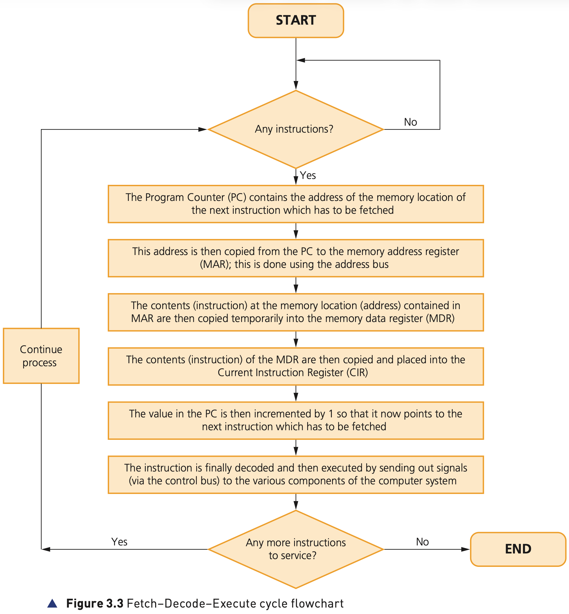

## Course Directory

### Return to the main outline

[← Back to Unit 3 Directory / 返回 Unit 3 目录](../../index.html)

## Fetch-Decode-Execute cycle

### The CPU instruction cycle

To carry out a set of instructions, the CPU first fetches some data and instructions from memory and stores them in suitable registers.

Both the address bus (地址总线) and data bus (数据总线) are used in this process.

Once this is done, each instruction needs to be decoded before finally being executed. This is known as the Fetch-Decode-Execute cycle (取指-译码-执行循环).

## Fetch-Decode-Execute cycle

### Figure 3.3: whole flowchart

{fig-align="center" width="70%"}

::: {.figure-note}
Use the flowchart as the full route: PC → MAR → MDR → CIR → PC increment → decode → execute → repeat or end.
:::

## Fetch

### 1/4 PC contains the next instruction address

The Program Counter (PC) (程序计数器) contains the address of the memory location of the next instruction which has to be fetched.

The cycle begins by checking whether there are any instructions to process.

If there are no instructions, the process ends.

## Fetch

### 2/4 PC to MAR using the address bus

This address is copied from the PC to the memory address register (MAR) (存储器地址寄存器).

This is done using the address bus.

At this point, the CPU has identified where the next instruction is stored in memory.

## Fetch

### 3/4 Memory contents to MDR

The contents, or instruction, at the memory location contained in MAR are copied temporarily into the memory data register (MDR) (存储器数据寄存器).

Both data and instructions can be stored in MDR.

In this stage, MDR is holding the fetched instruction.

## Fetch

### 4/4 MDR to CIR and PC incremented

The contents of the MDR are copied and placed into the Current Instruction Register (CIR) (当前指令寄存器).

The value in the PC is then incremented (递增) by 1 so that it now points to the next instruction which has to be fetched.

## Decode

### Interpreting the instruction

The instruction is then decoded (译码) so that it can be interpreted in the next part of the cycle.

The CPU works out what operation is required and which components will need to act.

## Execute

### Control signals carry out the instruction

The instruction is finally executed (执行) by sending out signals via the control bus (控制总线) to the various components of the computer system.

This allows each instruction to be carried out in its logical sequence.

## Repeat or end

### Any more instructions to service?

After execution, the CPU checks whether there are any more instructions to service.

If there are more instructions, the process continues with the next instruction address already prepared in the Program Counter.

If there are no more instructions, the process ends.

## Classroom Check

### Register sequence answer

A complete explanation should include this register sequence:

PC contains next address → PC copied to MAR → memory contents copied to MDR → MDR copied to CIR → PC incremented → instruction decoded and executed.

Do not simply write “the CPU fetches, decodes and executes”.

## End

### Return to the main outline

[← Back to Unit 3 Directory / 返回 Unit 3 目录](../../index.html)
