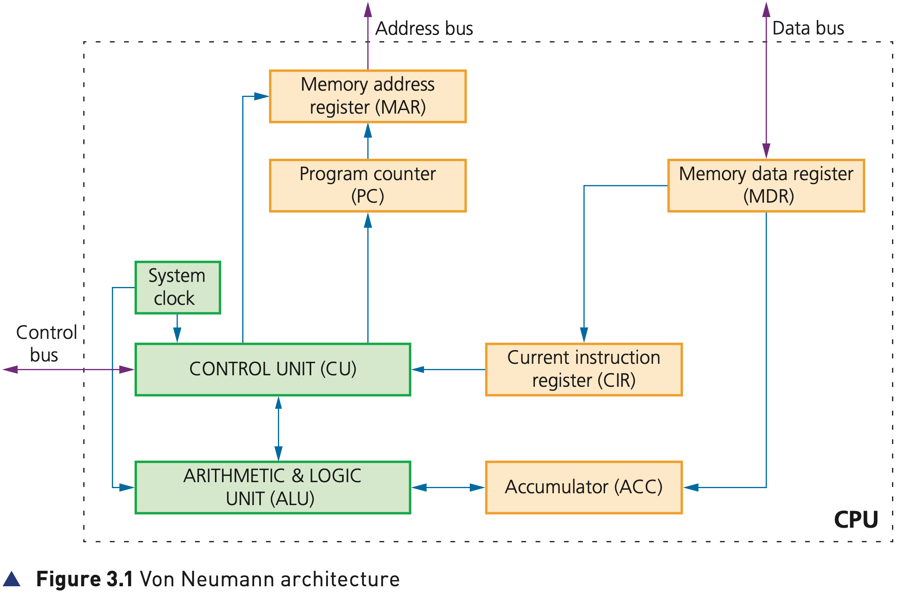

## Course Directory

### Return to the main outline

[← Back to Unit 3 Directory / 返回 Unit 3 目录](../../index.html)

## Von Neumann architecture

### Why stored programs mattered

Early computers were fed data while the machines were actually running.

It wasn’t possible to store programs (程序) or data (数据), which meant they couldn’t operate without considerable human intervention.

In the mid-1940s, John von Neumann developed the concept of the stored program computer (存储程序计算机).

## Von Neumann architecture

### Four main novel features

The von Neumann architecture had the following main novel features:

::: {.tight-list}
- the concept of a central processing unit (CPU or processor)
- the CPU can access memory directly; in the textbook wording, the CPU was able to access the memory directly
- computer memories could store programs as well as data
- stored programs were made up of instructions which could be executed in sequential order (顺序)
:::

## Von Neumann architecture

### Figure 3.1: one simple representation

{fig-align="center" width="94%"}

::: {.figure-note}
Read the diagram as a stored-program model: CPU, registers, buses and memory cooperate so instructions can be fetched, decoded and executed.
:::

## Components of the CPU

### Main CPU components in the textbook

The main components of the CPU are the Control Unit (CU) (控制单元), Arithmetic & Logic Unit (ALU) (算术逻辑单元) and system clock (系统时钟).

Figure 3.1 also shows the named registers and the buses used to move information around the architecture.

## Arithmetic & Logic Unit (ALU)

### Arithmetic and logic operations

The ALU allows the required arithmetic, for example +, - and shifting, or logic, for example AND and OR, operations to be carried out while a program is being run.

It is possible for a computer to have more than one ALU to carry out specific functions.

Multiplication and division are carried out by a sequence of addition, subtraction and left or right logical shift operations.

## Control Unit (CU)

### Instruction address and interpretation

The control unit reads an instruction from memory.

The address of the location where the instruction can be found is stored in the Program Counter (PC) (程序计数器).

This instruction is then interpreted using the Fetch-Decode-Execute cycle (取指-译码-执行循环).

## Control Unit (CU)

### Signals and synchronisation

During that process, signals are generated along the control bus (控制总线) to tell the other components in the computer what to do.

The control unit ensures synchronisation (同步) of data flow and program instructions throughout the computer.

A system clock is used to produce timing signals on the control bus. Without the clock, the computer would simply crash.

## RAM and IAS

### Immediate Access Store

The RAM holds all the data and programs needed to be accessed by the CPU.

The RAM is often referred to as the Immediate Access Store (IAS) (立即访问存储器).

The CPU takes data and programs held in backing store (后备存储, e.g. a hard disk drive) and puts them into RAM temporarily.

## RAM and IAS

### Why data is moved into RAM

This is done because read/write operations carried out using the RAM are considerably faster than read/write operations to backing store.

Consequently, any key data needed by an application will be stored temporarily in RAM to considerably speed up operations.

## Registers

### General and special purpose

One of the most fundamental components of the von Neumann system are the registers (寄存器).

Registers can be general or special purpose.

The textbook focuses on special purpose registers (专用寄存器), which are explained more fully in the Fetch-Decode-Execute cycle.

## Specific purpose registers

### Table 3.1: names and abbreviations

::: {.clean-table}
| Register | Abbreviation used | Function / purpose |
|---|---|---|
| current instruction register | CIR | stores the current instruction being decoded and executed |
| accumulator | ACC | stores data temporarily during ALU calculations |
| memory address register | MAR | stores the address of the memory location currently being read from or written to |
| memory data / buffer register, also called Memory Data Register | MDR | stores data just read from memory or data about to be written to memory |
| program counter | PC | stores the address where the next instruction to be read can be found |
:::

## Figure 3.1 register focus

### Match the names to the diagram

In Figure 3.1, the special purpose registers are placed around the CPU model:

::: {.tight-list}
- MAR and MDR support memory access.
- PC points to the next instruction.
- CIR holds the instruction being decoded and executed.
- Accumulator (ACC) supports ALU calculations.
:::

## System buses and memory

### Figure 3.2: CPU, memory and input/output

{fig-align="center" width="92%"}

::: {.figure-note}
Figure 3.2 shows how the CPU connects to memory and input/output ports using the control bus, address bus and data bus.
:::

## System buses and memory

### Bridge to the next deck

Earlier, Figure 3.1 referred to components labelled as buses (总线).

Figure 3.2 shows how these buses are used to connect the CPU to the memory and to input/output devices (输入/输出设备).

The next deck focuses on the details of system buses and memory read/write operations.

## Classroom Check

### Explain the architecture in one route

A strong answer should connect these ideas:

stored program computer → CPU accesses memory directly → memory stores programs and data → registers hold addresses/instructions/data temporarily → buses connect CPU, memory and I/O.

## End

### Return to the main outline

[← Back to Unit 3 Directory / 返回 Unit 3 目录](../../index.html)
