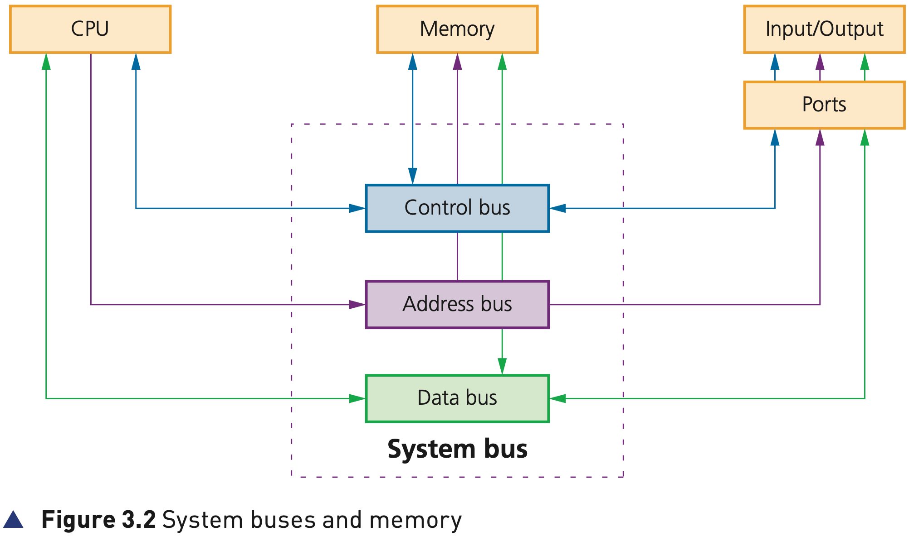
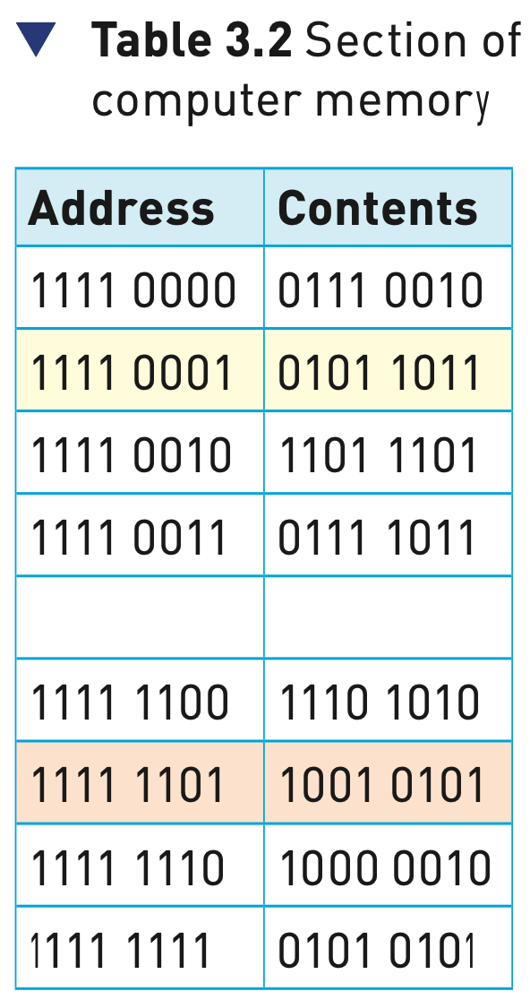

## Course Directory

### Return to the main outline

[← Back to Unit 3 Directory / 返回 Unit 3 目录](../../index.html)

## System buses and memory

### Figure 3.2: connecting the CPU

{fig-align="center" width="92%"}

::: {.figure-note}
Figure 3.2 shows how the CPU is connected to memory and input/output ports through the control bus, address bus and data bus.
:::

## Memory

### Partitions, address and contents

The computer memory is made up of a number of <span class="term">partitions</span> (分区).

Each partition consists of an <span class="term">address</span> (地址) and its <span class="term">contents</span> (内容).

The address will uniquely identify every location in the memory and the contents will be the binary value stored in each location.

## Memory

### Table 3.2: section of computer memory

{fig-align="center" width="42%"}

::: {.figure-note}
Table 3.2 uses 8 bits for each address and 8 bits for the content. In a real computer memory, the address and its contents are actually much larger than this.
:::

## READ operation

### 1/2 Address first

Suppose we want to read the contents of memory location <span class="mark">1111 0001</span>.

The address of location 1111 0001 to be read from is first written into the <span class="term">MAR (memory address register)</span> (存储器地址寄存器).

```text
MAR: 1 1 1 1 0 0 0 1
```

## READ operation

### 2/2 Read signal and contents

A <span class="term">read signal</span> (读取信号) is sent to the computer memory.

The contents of memory location 1111 0001 are then put into the <span class="term">MDR (memory data register)</span> (存储器数据寄存器).

```text
MDR: 0 1 0 1 1 0 1 1
```

## WRITE operation

### 1/3 Data first

Suppose we want to show how the value <span class="mark">1001 0101</span> was written into memory location <span class="mark">1111 1101</span>.

The data to be stored is first written into the <span class="term">MDR</span>.

```text
MDR: 1 0 0 1 0 1 0 1
```

## WRITE operation

### 2/3 Destination address

This data has to be written into location with address <span class="mark">1111 1101</span>.

So this address is now written into the <span class="term">MAR</span>.

```text
MAR: 1 1 1 1 1 1 0 1
```

## WRITE operation

### 3/3 Write signal

Finally, a <span class="term">write signal</span> (写入信号) is sent to the computer memory.

The value <span class="mark">10010101</span> will then be written into the correct memory location.

The exam distinction is clear: <span class="term">MAR holds the address</span>; <span class="term">MDR holds the data / contents</span>.

## Input and output devices

### Why buses connect beyond memory

Input and output devices are the main method of entering data into and getting data out of computer systems.

Input devices convert external data into a form the computer can understand and process.

Output devices show the results of computer processing in a human understandable form.

## (System) buses

### Parallel transmission components

(System) buses are used in computers as <span class="term">parallel transmission</span> (并行传输) components.

Each wire in the bus transmits one bit of data.

There are three common buses used in the von Neumann architecture:

::: {.tight-list}
- <span class="term">address bus</span> (地址总线)
- <span class="term">data bus</span> (数据总线)
- <span class="term">control bus</span> (控制总线)
:::

## Address bus

### Carries addresses throughout the system

As the name suggests, the address bus carries addresses throughout the computer system.

Between the CPU and memory, the address bus is <span class="term">unidirectional</span> (单向的), i.e. bits can travel in one direction only.

This prevents addresses being carried back to the CPU, which would be an undesirable feature.

## Address bus

### Bus width and addressable memory

The width of a bus is very important.

The wider the bus, the more memory locations that can be directly addressed at any given time.

::: {.tight-list}
- a bus width of 16 bits can address \(2^{16}\), or <span class="mark">65 536</span>, memory locations
- a bus width of 32 bits allows <span class="mark">4 294 967 296</span> memory locations to be simultaneously addressed
:::

## Data bus

### Bidirectional data movement

The data bus is <span class="term">bidirectional</span> (双向的), allowing data to be sent in both directions along the bus.

This means data can be carried from CPU to memory, from memory to CPU, and to and from input/output devices.

It is important to point out that data can be an address, an instruction or a numerical value.

## Data bus

### Word length and performance

As with the address bus, the width of the data bus is important.

The wider the bus, the larger the <span class="term">word length</span> (字长) that can be transported.

A word is a group of bits which can be regarded as a single unit, for example 16-bit, 32-bit or 64-bit word lengths.

Larger word lengths can improve the computer’s overall performance.

## Control bus

### Signals from the control unit

The control bus is also <span class="term">bidirectional</span>.

It carries signals from the <span class="term">control unit (CU)</span> to all the other computer components.

It is usually 8-bits wide. There is no real need for it to be any wider since it only carries control signals.

## Classroom Check

### Keep the three buses separate

A complete answer should separate:

::: {.tight-list}
- <span class="term">address bus</span>: carries addresses; CPU to memory is unidirectional.
- <span class="term">data bus</span>: carries data in both directions; affects word length.
- <span class="term">control bus</span>: carries control and timing signals from the CU.
:::

For memory operations, remember: <span class="mark">MAR = address</span>, <span class="mark">MDR = data/contents</span>.

## End

### Return to the main outline

[← Back to Unit 3 Directory / 返回 Unit 3 目录](../../index.html)
