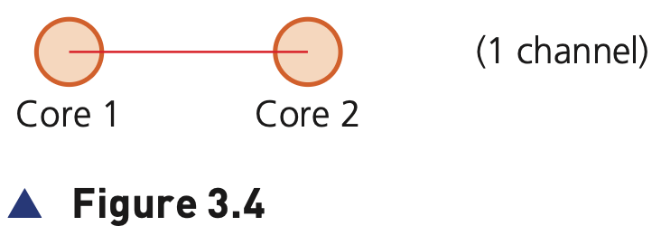
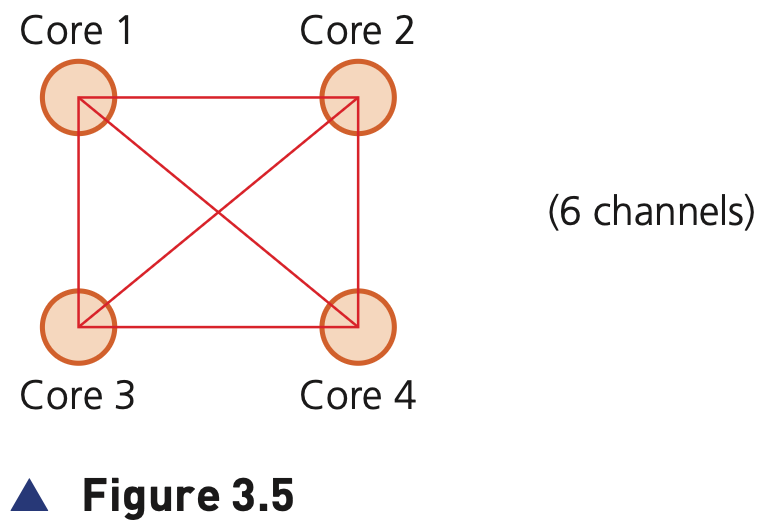

## Course Directory

### Return to the main outline

[← Back to Unit 3 Directory / 返回 Unit 3 目录](../../index.html)

## Cores, cache and internal clock

### CPU performance is not one factor

The textbook considers several factors that determine the performance of a CPU.

The first thing to consider is the role of the system clock (系统时钟), but overall performance is not determined by clock speed alone.

Other factors include bus width, overclocking, cache memory and the number of cores.

## System clock

### Clock cycle and synchronisation

The clock defines the clock cycle (时钟周期) that synchronises all computer operations.

As mentioned earlier, the control bus transmits timing signals, ensuring everything is fully synchronised.

By increasing clock speed, the processing speed of the computer is also increased.

## Clock speed

### 3.5 GHz example

A typical current value is 3.5 GHz.

This means 3.5 billion clock cycles a second.

However, it isn’t possible to say that a computer’s overall performance is necessarily increased by using a higher clock speed.

## Bus width as a performance factor

### Address bus and data bus

The width of the address bus and data bus can also affect computer performance.

A wider address bus can allow more memory locations to be addressed.

A wider data bus can allow a larger word length to be transported in one transfer.

## Overclocking

### Changing BIOS settings

Overclocking (超频) is a factor to consider.

The clock speed can be changed by accessing the BIOS (Basic Input/Output System) (基本输入输出系统) and altering the settings.

This makes the CPU run at a clock speed higher than the computer was designed for.

## Overclocking

### Two textbook risks

Using a clock speed higher than the computer was designed for can lead to problems:

::: {.tight-list}
- execution of instructions outside design limits can lead to seriously unsynchronised operations (不同步操作); the computer would frequently crash and become unstable
- overclocking can lead to serious overheating (过热) of the CPU, again leading to unreliable performance
:::

## Cache memory

### Faster access than RAM

The use of cache memory (高速缓存) can also improve CPU performance.

Unlike RAM, cache memory is located within the CPU itself, which means it has much faster data access times than RAM.

Cache memory stores frequently used instructions and data that need to be accessed faster.

## Cache memory

### CPU checks cache first

When a CPU wishes to read memory, it will first check out the cache.

It will then move on to main memory/RAM (主存/RAM) if the required data isn’t there.

The larger the cache memory size, the better the CPU performance.

## Number of cores

### What a core contains

The use of a different number of cores can improve computer performance.

One core (核心) is made up of an ALU, a control unit and the registers.

Many computers are dual core (双核) or quad core (四核).

## Number of cores

### Why more cores are used

The idea of using more cores alleviates the need to continually increase clock speeds.

However, doubling the number of cores doesn’t necessarily double the computer’s performance.

The CPU must communicate with each core, and this communication reduces overall performance.

## Number of cores

### Figure 3.4: dual core communication

{fig-align="center" width="64%"}

::: {.figure-note}
With a dual core, the CPU communicates with both cores using one channel, reducing some of the potential performance increase.
:::

## Number of cores

### Figure 3.5: quad core communication

{fig-align="center" width="68%"}

::: {.figure-note}
With a quad core, the CPU communicates with all four cores using six channels, considerably reducing potential performance.
:::

## Summary for performance answers

### Four textbook summary points

::: {.tight-list}
- increasing bus width, data and address buses, increases the performance and speed of a computer system
- increasing clock speed will potentially increase the speed of a computer
- a computer’s performance can be changed by altering bus width, clock speed and use of multi-core CPUs
- use of cache memories can also speed up a CPU’s performance
:::

## Activity 3.1

### Use as a check before instruction sets

Activity 3.1 asks students to:

::: {.tight-list}
- name three buses used in the von Neumann architecture
- describe the function of each named bus
- describe how bus width and clock speed can affect computer performance
- complete a Fetch-Decode-Execute paragraph using correct terms
:::

## Classroom Check

### Avoid one-factor performance answers

A strong answer should not say only “higher clock speed makes the computer faster”.

It should consider the balance between bus width, clock speed, cache memory, number of cores and overclocking risks.

## End

### Return to the main outline

[← Back to Unit 3 Directory / 返回 Unit 3 目录](../../index.html)
