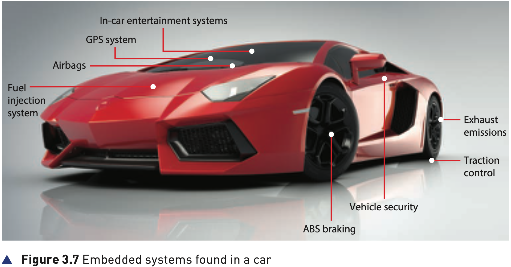
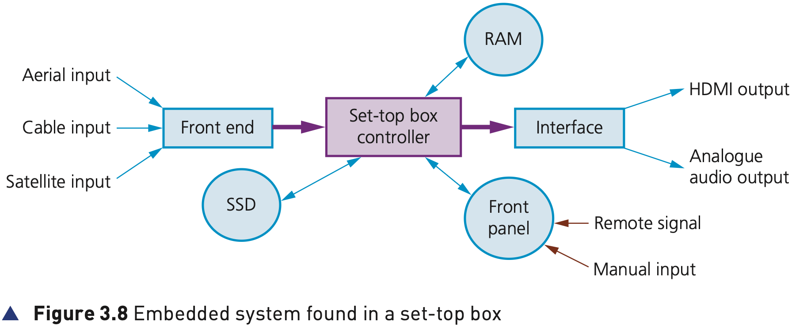
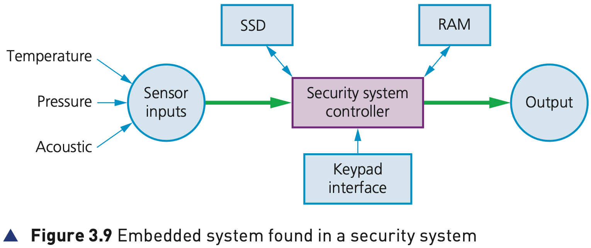
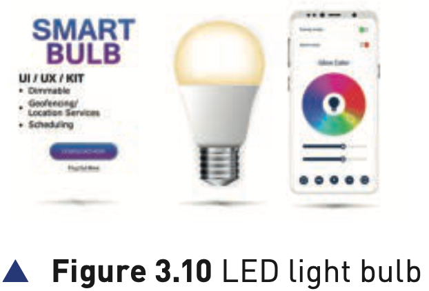
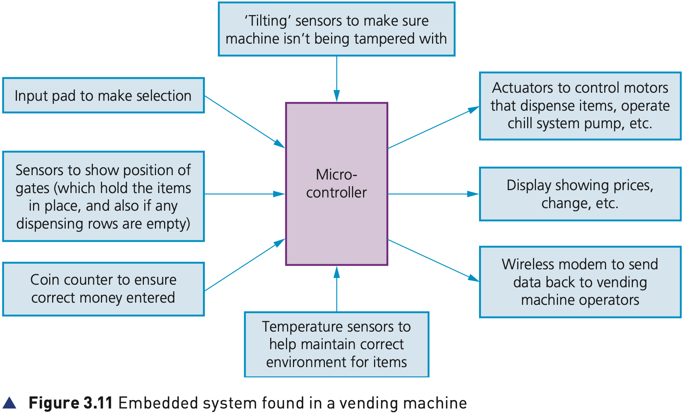
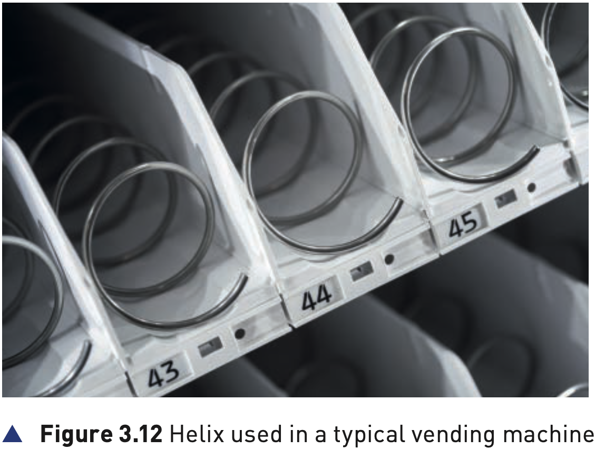

## Course Directory

### Return to the main outline

[← Back to Unit 3 Directory / 返回 Unit 3 目录](../../index.html)

## Examples of embedded systems

### Use the same explanation pattern

These examples show embedded systems controlling dedicated devices rather than running many unrelated applications.

For each example, keep the same route:

input → embedded controller → controlled output → specific task.

## Motor vehicles

### Figure 3.7: embedded systems found in a car

{fig-align="center" width="92%"}

::: {.figure-note}
Modern cars contain many separate embedded systems. Each one controls a specific function rather than acting as a general computer.
:::

## Motor vehicles

### Examples shown in the textbook figure

Figure 3.7 includes:

::: {.tight-list}
- GPS system
- Airbags (安全气囊)
- Fuel injection system (燃油喷射系统)
- exhaust emissions control
- traction control
- vehicle security
- ABS braking (防抱死制动)
- in-car entertainment systems
:::

## Set-top box

### Figure 3.8: embedded system found in a set-top box

{fig-align="center" width="94%"}

::: {.figure-note}
A set-top box uses an embedded system to manage inputs, storage, controller functions, interface signals and outputs.
:::

## Set-top box

### Recording, playback and decoding

In this example, a set-top box (机顶盒) uses an embedded system to allow recording and playback of television programmes.

It can be operated remotely by the user when not at home using an internet-enabled device, or by using the interface panel when at home.

## Set-top box

### Inputs and outputs

The embedded system looks after functions involving inputs from a number of sources:

::: {.tight-list}
- a Solid State Device (SSD), where television programmes can be stored or retrieved
- a satellite signal, where it is necessary to decode the incoming signal
- aerial, cable or satellite input
:::

Outputs can include HDMI output and analogue audio output.

## Security systems

### Figure 3.9: embedded system found in a security system

{fig-align="center" width="94%"}

::: {.figure-note}
The controller receives sensor inputs and keypad input, then sends warning outputs.
:::

## Security systems

### Sensors, settings and warning output

The security code is set in RAM and the alarm is activated or deactivated using the keypad.

Data from sensors is sent to the controller, which checks against values stored on the SSD.

An output can be a signal to flash lights, sound an alarm or send a message to the home owner via their mobile phone.

## Lighting systems

### What the system needs to control

Embedded systems are used in modern sophisticated lighting systems, from simple home use to major architectural lighting systems.

For a large office, the system needs to control the lighting taking into account:

::: {.tight-list}
- the time of day or day of the week
- whether the room is occupied
- the brightness of the natural light
:::

## Lighting systems

### Automatic lighting decisions

The embedded system can automatically control the lighting using inputs such as light sensors and key data stored in memory.

If there is movement in the office, correct lighting levels can be automatically restored.

On a very bright sunny day, the system could automatically dim the lights and only increase light output if natural light levels fall below a set value.

## Lighting systems

### Figure 3.10: LED light bulb

{fig-align="center" width="56%"}

::: {.figure-note}
Some lighting systems use Bluetooth light bulbs. This allows the embedded system to control each bulb independently.
:::

## Vending systems

### Figure 3.11: embedded system found in a vending machine

{fig-align="center" width="92%"}

::: {.figure-note}
At the heart of the vending machine is an embedded system in the form of a microcontroller.
:::

## Vending systems

### Inputs to the microcontroller

Inputs to this system come from the keypad and from sensors:

::: {.tight-list}
- keypad input for item selection
- sensors used to count the coins inserted by the customer
- temperature sensors inside the machine
- a tilt sensor for security purposes
- sensors showing gate positions and empty dispensing rows
:::

## Vending systems

### Outputs from the embedded system

The outputs are:

::: {.tight-list}
- actuators to operate the motors which drive the helixes
- signals to operate the cooling system if the temperature is too high
- item description and any change due shown on an LCD display panel
- data sent back to the vending machine company for remote sales/refill checking
:::

## Vending systems

### Figure 3.12: helix used in a typical vending machine

{fig-align="center" width="64%"}

::: {.figure-note}
The helix (螺旋推进装置) is the mechanical output part that helps dispense the selected item.
:::

## Vending systems

### Automatic operation and sales analysis

All of this is controlled by an embedded system.

It makes the whole operation automatic and gives immediate sales analysis.

Without this embedded system, the sales analysis would be very time consuming.

## Washing machines and white goods

### Everyday embedded systems

Many white goods (白色家电), such as refrigerators, washing machines and microwave ovens, are controlled by embedded systems.

They all come with a keypad or dials used to select temperature, wash cycle or cooking duration.

This data forms the input to the embedded system, which then carries out the required task without any further human intervention.

## Washing machines and white goods

### Remote operation

As with other devices, these white goods can also be operated remotely using an internet-enabled smartphone or computer.

The important point is still the same: the system is embedded because it controls a specific appliance function.

## Activity 3.2

### CPU performance and instruction set

Activity 3.2 asks students to revisit earlier 3.1 ideas:

::: {.tight-list}
- explain how it is possible to increase the performance of a CPU/microprocessor
- include risks associated with suggestions to improve performance
- explain what is meant by the term instruction set
:::

## Activity 3.2

### GPS embedded system application

The activity also asks about a car fitted with the latest GPS navigation system controlled by an embedded system in the form of a microcontroller.

Students should describe expected inputs and outputs, then explain how updates can be installed without taking the car to the garage every six months.

## Classroom Check

### Build the same answer every time

For any example, ask students to identify:

::: {.tight-list}
- the input source
- the embedded controller or microcontroller
- the output device or controlled action
- why the system is dedicated to a specific task
:::

## End

### Return to the main outline

[← Back to Unit 3 Directory / 返回 Unit 3 目录](../../index.html)
