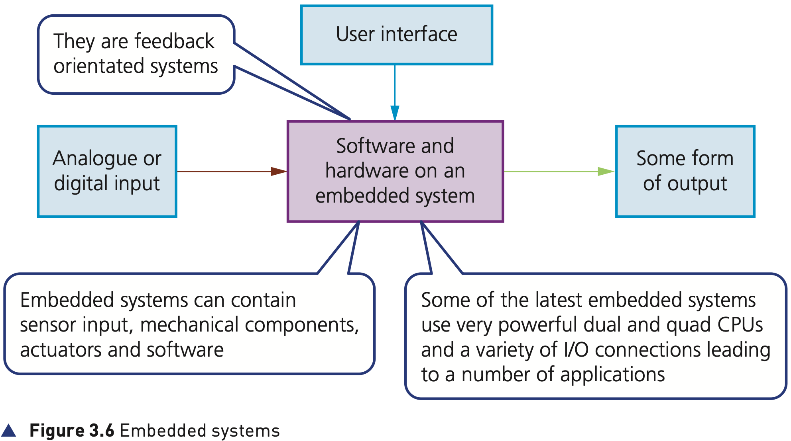
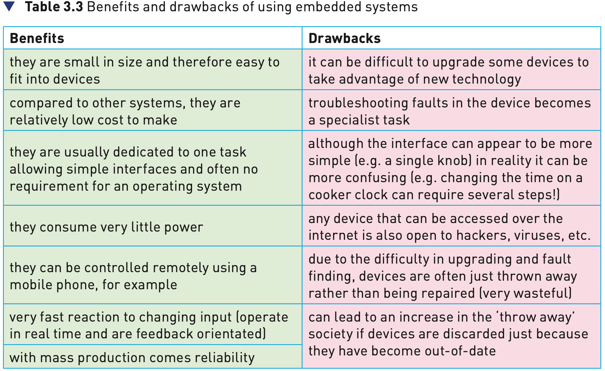

## Course Directory

### Return to the main outline

[← Back to Unit 3 Directory / 返回 Unit 3 目录](../../index.html)

## Embedded systems

### Textbook definition

An embedded system (嵌入式系统) is a combination of hardware and software which is designed to carry out a specific set of functions (特定功能集合).

The hardware is electronic, electrical or electro-mechanical (机电的).

The key idea is special purpose, not general computing.

## Embedded systems can be based on

### 1/3 Microcontroller

Microcontrollers (微控制器): this has a CPU in addition to some RAM and ROM and other peripherals all embedded onto one single chip.

Together they carry out a specific task.

## Embedded systems can be based on

### 2/3 Microprocessor

Microprocessor (微处理器): integrated circuit which only has a CPU on the chip.

There is no RAM, ROM or peripherals; these need to be added.

This is different from a microcontroller.

## Embedded systems can be based on

### 3/3 System on chip (SoC)

System on chip (SoC) (片上系统): this may contain a microcontroller as one of its components.

SoCs almost always include CPU, memory, input/output (I/O) ports and secondary storage on a single microchip.

## Embedded systems

### Figure 3.6: general pattern

{fig-align="center" width="92%"}

::: {.figure-note}
Figure 3.6 shows embedded systems as feedback-orientated systems: input enters, software/hardware processes it, and some form of output is produced.
:::

## Embedded systems

### Input can be manual or automatic

When installed in a device, either an operator can input data manually, for example selecting a temperature from a keypad or turning a dial on an oven control panel.

Or the data will come from an automatic source, such as a sensor (传感器).

Sensor input will be analogue or digital in nature, for example oxygen levels or fuel pressure in a car’s engine management system.

## Embedded systems

### Output carries out the function

The output will then carry out the function of the embedded system by sending signals to the components that are being controlled.

Examples from the textbook include:

::: {.tight-list}
- increase the power to the heating elements in an oven
- reduce fuel levels in the engine
:::

## Programmable and non-programmable

### Two device types

Depending on the device, embedded systems are either programmable (可编程的) or non-programmable (不可编程的).

Non-programmable devices need, in general, to be replaced if they require a software upgrade.

Programmable devices permit upgrading by two methods.

## Programmable devices

### Two update methods

Programmable devices permit upgrading by:

::: {.tight-list}
- connecting the device to a computer and allowing the download of updates to the software, for example updating maps on a GPS system used in a vehicle
- automatic updates via a Wi-Fi, satellite or cellular mobile phone network link, for example modern cars updating engine management systems via satellite link
:::

## Benefits and drawbacks

### Table 3.3 overview

{fig-align="center" width="90%"}

::: {.figure-note}
The table compares why embedded systems are useful and why they can create maintenance, security and replacement problems.
:::

## Benefits of using embedded systems

### Textbook benefits

::: {.tight-list}
- they are small in size and therefore easy to fit into devices
- compared to other systems, they are relatively low cost to make
- they are usually dedicated to one task, allowing simple interfaces and often no requirement for an operating system
- they consume very little power
- they can be controlled remotely using a mobile phone, for example
- very fast reaction to changing input; operate in real time and are feedback orientated
- with mass production comes reliability
:::

## Drawbacks of using embedded systems

### Textbook drawbacks

::: {.tight-list}
- it can be difficult to upgrade some devices to take advantage of new technology
- troubleshooting faults in the device becomes a specialist task
- a simple-looking interface can in reality be more confusing
- any device accessed over the internet is open to hackers, viruses, etc.
- devices are often thrown away rather than repaired, which is wasteful
- can increase the ‘throw away’ society if devices are discarded because they are out-of-date
:::

## Internet-connected embedded systems

### Remote control and optimisation

Because embedded systems can be connected to the internet, it is possible to control them remotely using a smartphone or computer.

Examples include setting the central heating system to switch on or off while away from home, or remotely instructing a set top box to record a television programme.

Engineers can optimise designs to reduce the physical size and cost of devices.

## Not a general-purpose computer

### Specific task vs multi-functional system

A computer is not an example of an embedded system.

Computers are multi-functional: they can carry out many different tasks which can be varied by using different software.

This means they are general-purpose computer systems (通用计算机系统), not embedded systems.

## Classroom Check

### Identify the specific function

For any embedded-system example, students should answer with:

input → software/hardware on embedded system → controlled output.

The answer must name the specific task; saying “it contains a processor” is not enough.

## End

### Return to the main outline

[← Back to Unit 3 Directory / 返回 Unit 3 目录](../../index.html)
