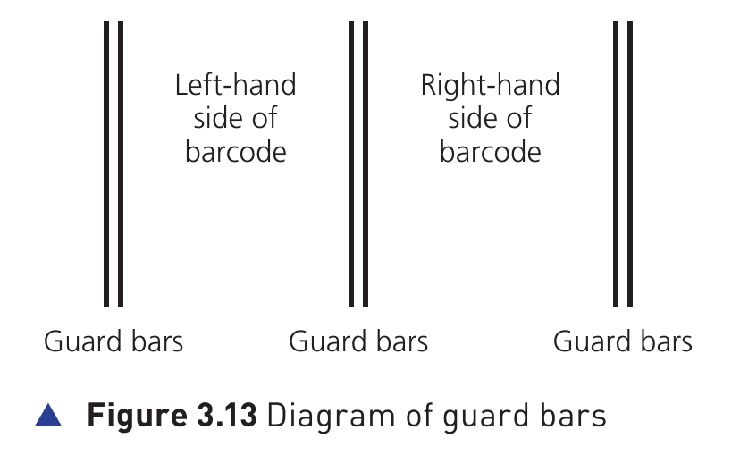
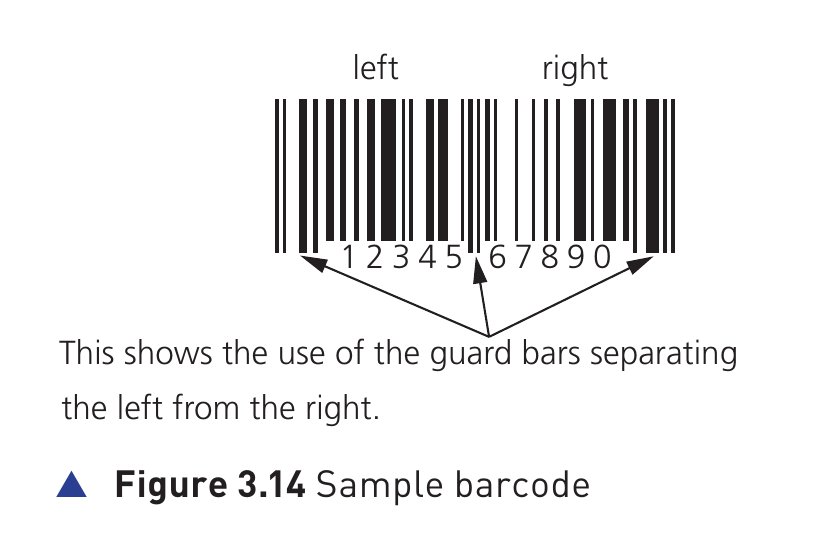
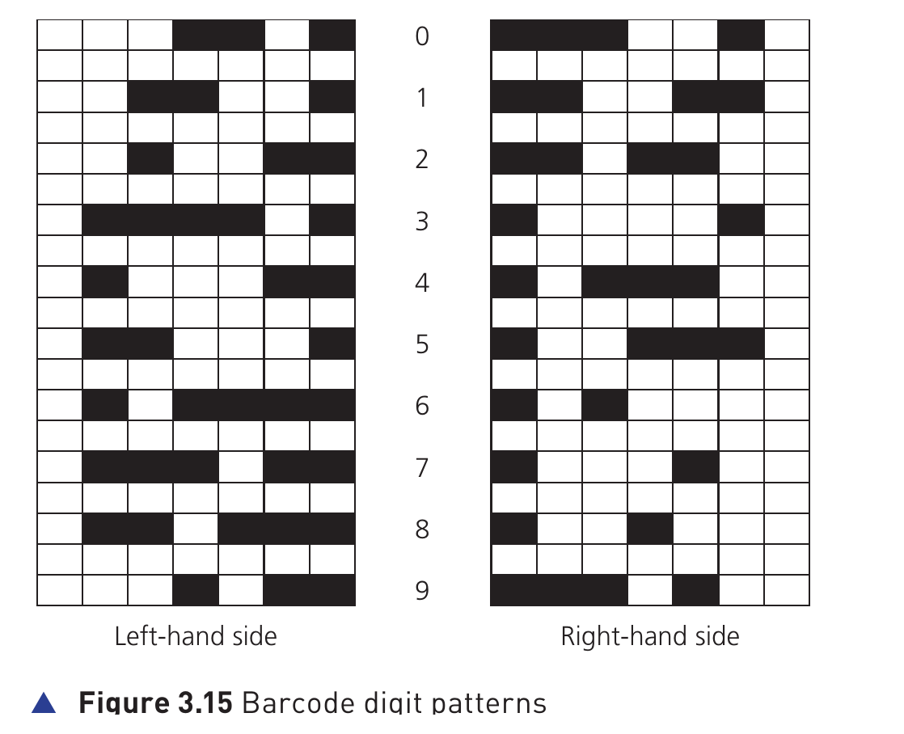
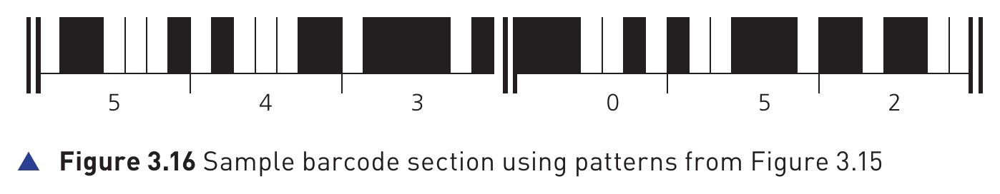

## Course Directory

### Return to the main outline

[Back to Unit 3 Directory / 返回 Unit 3 目录](../../index.html)

## Barcode Scanners

### Barcode as an input code

A barcode (条形码) is a series of dark and light parallel lines of varying thickness (不同粗细).

The numbers 0 to 9 are each represented by a unique series of lines. The textbook example adopts different codes for digits appearing on the left and for digits appearing on the right of the barcode.

## Guard bars and sample code

### Separating left from right

:::: {.columns}

::: {.column width="48%"}
{fig-align="center" width="100%"}
:::

::: {.column width="48%"}
{fig-align="center" width="100%"}
:::

::::

Guard bars (保护条) separate the left-hand side from the right-hand side.

## Digit patterns

### Left-hand and right-hand sides

{fig-align="center" width="74%"}

Each digit in the barcode is represented by bars of 1 to 4 blocks thick. Note there are different patterns for digits on the left-hand side and for digits on the right-hand side.

## Scanning direction

### Why the barcode can be scanned either way

Each digit is made up of 2 dark lines and two light lines. The width representing each digit is the same.

The digits on the left have an odd number of dark elements and always begin with a light bar; the digits on the right have an even number of dark elements and always begin with a dark bar.

This arrangement allows a barcode to be scanned in any direction.

## Sample barcode section

### Using the patterns from Figure 3.15

{fig-align="center" width="96%"}

The section of barcode represents the number 5 4 3 0 5 2.

## So what happens when a barcode is scanned?

### 1/2 Reading reflected light

- the barcode is first of all read by a red laser or red LED (light emitting diode，发光二极管)
- light is reflected back off the barcode; the dark areas reflect little or no light
- the reflected light is read by sensors (photoelectric cells，光电管)

## So what happens when a barcode is scanned?

### 2/2 Converting the pattern to digital data

- as the laser or LED light is scanned across the barcode, a pattern is generated, which is converted into digital data (数字数据)
- for example: the digit `3` on the left generates the pattern `L D D D D L D`
- this has the binary equivalent (二进制等价形式) of `0 1 1 1 1 0 1`, where `L = 0` and `D = 1`

## Table 3.4 Input and output devices at a checkout

### 1/2 Input devices and feedback

<table class="book-table">
<thead>
<tr>
<th>Input/output device</th>
<th>How it is used</th>
</tr>
</thead>
<tbody>
<tr>
<td>keypad</td>
<td>to key in the number of same items bought; to key in a weight; to key in the number under the barcode if it cannot be read by the barcode reader/scanner</td>
</tr>
<tr>
<td>screen/monitor</td>
<td>to show the cost of an item and other information</td>
</tr>
<tr>
<td>speaker</td>
<td>to make a beeping sound every time a barcode is read correctly; but also to make another sound if there is an error when reading the barcode</td>
</tr>
</tbody>
</table>

## Table 3.4 Input and output devices at a checkout

### 2/2 Printed output, payment and loose items

<table class="book-table">
<thead>
<tr>
<th>Input/output device</th>
<th>How it is used</th>
</tr>
</thead>
<tbody>
<tr>
<td>printer</td>
<td>to print out a receipt/itemised list (明细清单)</td>
</tr>
<tr>
<td>card reader/chip and PIN</td>
<td>to read the customer's credit/debit card (either using PIN or contactless，非接触式支付)</td>
</tr>
<tr>
<td>touchscreen</td>
<td>to select items by touching an icon, such as fresh fruit which may be sold loose without packaging</td>
</tr>
</tbody>
</table>

## So the barcode has been read, then what happens?

### 1/2 Stock item record and POS

- the barcode number is looked up in the stock database (库存数据库); the barcode is known as the key field (关键字段) in the stock item record
- when the barcode number is found, the stock item record is looked up
- the price and other stock item details are sent back to the checkout, or point of sale terminal (POS，销售点终端)
- the number of stock items in the record is reduced by 1 each time the barcode is read

## So the barcode has been read, then what happens?

### 2/2 Re-ordering and stock update

- this new value for number of stock is written back to the stock item record
- the number of stock items is compared to the re-order level (补货阈值); if it is less than or equal to this value, more stock items are automatically ordered
- once an order for more stock items is generated, a flag (标志位) is added to the record to stop re-ordering every time the stock item barcode is read
- when new stock items arrive, the stock levels are updated in the database

## Advantages to the management of using barcodes

### Textbook advantages

- much easier and faster to change prices on stock items
- much better, more up-to-date sales information/sales trends
- no need to price every stock item on the shelves (this reduces time and cost to the management)
- allows for automatic stock control
- possible to check customer buying habits more easily by linking barcodes to, for example, customer loyalty cards (会员卡)

## Advantages to the customers of using barcodes

### Textbook advantages

- faster checkout queues (staff do not need to remember/look up prices of items)
- errors in charging customers is reduced
- the customer is given an itemised bill (明细账单)
- cost savings can be passed on to the customer
- better track of sell by dates (保质期 / 最佳销售日期) so food should be fresher

## Library example

### Beyond supermarkets

The barcode system is used in many other areas.

For example, barcodes can be utilised in libraries where they are used in books and on the borrower's library card. Every time a book is taken out, the borrower is linked to the book automatically. This allows automatic checking of when the book is due to be returned.

## Classroom Check

### Explain the full system, not only the scanner

A complete answer should connect four ideas:

barcode structure -> light reflection and photoelectric cells -> stock database key field -> stock update and user benefits

## End

### Return to the main outline

[Back to Unit 3 Directory / 返回 Unit 3 目录](../../index.html)
