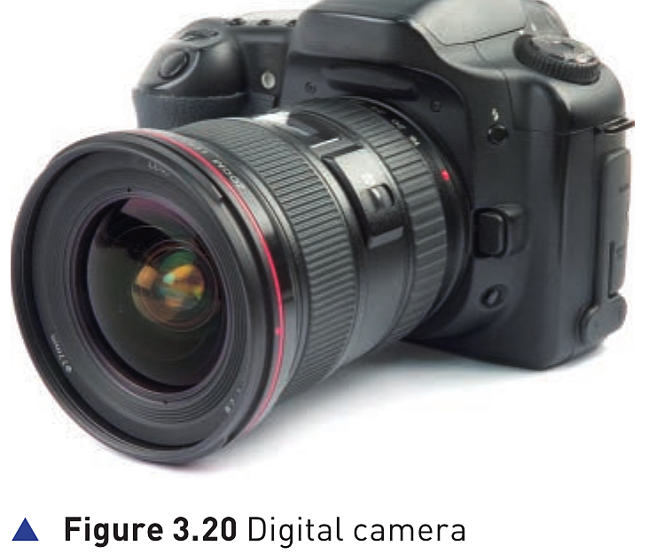
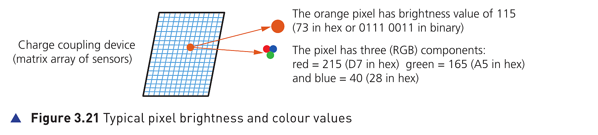
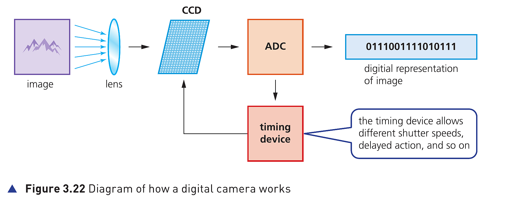

## Course Directory

### Return to the main outline

[Back to Unit 3 Directory / 返回 Unit 3 目录](../../index.html)

## Digital cameras

### Replacing traditional film cameras

:::: {.columns}

::: {.column width="42%"}
{fig-align="center" width="92%"}
:::

::: {.column width="54%"}
Digital cameras have essentially replaced the more traditional camera that used film (胶片) to capture the images.

The film required developing and then printing before the photographer could see the result of their work.

This made these cameras expensive to operate since it was not possible to delete unwanted photographs.
:::

::::

## Digital cameras

### Connection to a computer system

Modern digital cameras simply link to a computer system via a USB port (USB 接口) or by using Bluetooth (蓝牙).

Bluetooth enables wireless transfer of photographic files (照片文件的无线传输).

The key idea is that the image is already digital, so it can be transferred, stored, displayed or deleted without developing film.

## Embedded system control

### Automatic camera tasks

These cameras are controlled by an embedded system (嵌入式系统) which can automatically carry out the following tasks:

::: {.tight-list}
- adjust the shutter speed
- focus the image automatically
- operate the flash gun automatically
- adjust the aperture size
- adjust the size of the image
- remove red-eye ('red eye'，红眼) when the flash gun has been used
- and so on
:::

## What happens when a photograph is taken

### 1/5 Sub-items 1-2 of 7

- the image is captured when light passes through the lens (镜头) onto a light-sensitive cell; this cell is made up of millions of tiny sensors which are acting as photodiodes (光电二极管), i.e. charge couple devices (CCD) (电荷耦合器件) which convert light into electricity
- each of the sensors are often referred to as pixels (picture elements，像素), since they are tiny components that make up the image

## What happens when a photograph is taken

### 2/5 Sub-items 3-4 of 7

- the image is converted into tiny electric charges which are then passed through an analogue to digital converter (ADC) (模数转换器) to form a digital image array
- the ADC converts the electric charges from each pixel into levels of brightness, now in a digital format; for example, an 8-bit ADC gives `2^8` or 256 possible brightness levels per pixel, for example brightness level `01110011`

## What happens when a photograph is taken

### 3/5 Sub-item 5 of 7

- apart from brightness, the sensors also measure colour which produces another binary pattern; most cameras use a 24-bit RGB system (24 位 RGB 系统), which means each pixel has a red value (0 to 255 in denary), a green value (0 to 255) and a blue value (0 to 255)

For example, a shade of orange could be 215 (red), 165 (green) and 40 (blue), giving a binary pattern of `1101 0111 1010 0101 0010 1000`, or D7A528 written in hex (十六进制).

## What happens when a photograph is taken

### 4/5 Figure 3.21 explains sub-item 5

{fig-align="center" width="96%"}

The orange pixel has brightness value of 115, which is `73` in hex or `0111 0011` in binary.

The same pixel also has three RGB components: red `215` (`D7`), green `165` (`A5`) and blue `40` (`28`).

## What happens when a photograph is taken

### 5/5 Sub-items 6-7 of 7

- the number of pixels determines the size of the file used to store the photograph
- the quality of the image depends on the recording device (how good the camera lens is and how good the sensor array is), the number of pixels used (the more pixels used, the better the image), the levels of light and how the image is stored, for example JPEG or raw file (原始文件)

Together, these 7 sub-items describe the complete textbook process from light capture to digital data, colour values, file size and image quality.

## Mobile phones and digital cameras

### Pixel count is not the whole story

Mobile phones have caught up with digital cameras as regards number of pixels.

But the drawback is often inferior lens quality (较差的镜头质量) and limited memory for the storage of photos.

This is fast changing: at the time of writing, many smartphones now have very sophisticated optics and photography software as standard.

## Figure 3.22 How a digital camera works

### Image to digital representation

{fig-align="center" width="98%"}

The diagram shows the core chain: image -> lens -> CCD -> ADC -> digital representation of image.

The timing device allows different shutter speeds, delayed action and so on.

## Classroom Check

### Explain the conversion chain

A complete answer should move in order:

light -> lens -> light-sensitive cell / CCD -> pixels -> electric charges -> ADC -> brightness / RGB values -> digital image

Key terms to use: photodiodes, CCD, pixels, ADC, RGB, JPEG, raw file.

## End

### Return to the main outline

[Back to Unit 3 Directory / 返回 Unit 3 目录](../../index.html)
