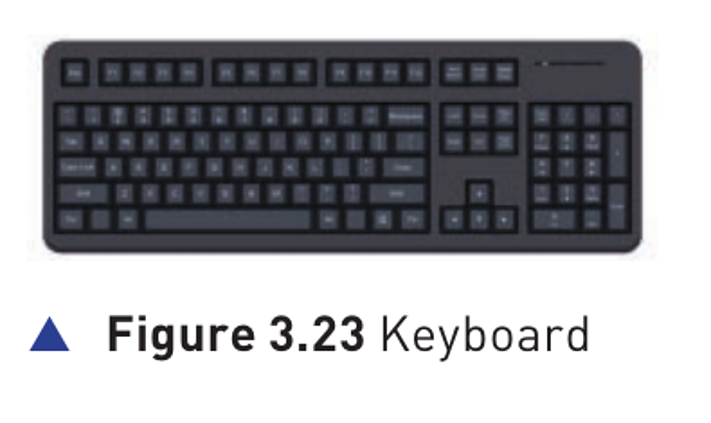
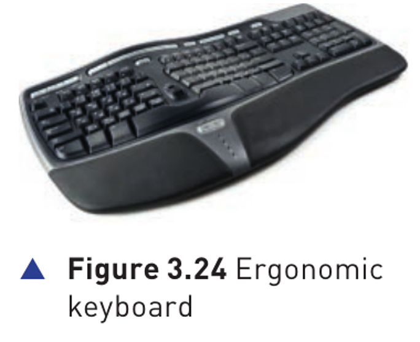
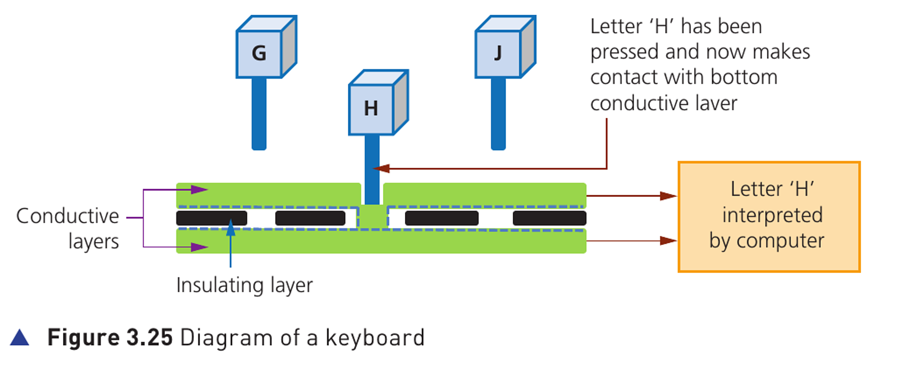

## Course Directory

### Return to the main outline

[← Back to Unit 3 Directory / 返回 Unit 3 目录](../../index.html)

## Keyboards

### Common method used for data entry

::: {.two-col}
{fig-align="center" width="100%"}

Keyboards are by far the most common method used for data entry (数据输入). They are used as the input devices (输入设备) on computers, tablets, mobile phones and many other electronic items.
:::

## Keyboards

### USB, wireless and virtual keyboards

The keyboard is connected to the computer either by using a USB connection (USB 连接) or by wireless connection (无线连接).

In the case of tablets and mobile phones, the keyboard is often virtual (虚拟的) or a type of touch screen technology (触摸屏技术).

## Keyboards

### Character to digital signal

As shown in Chapter 1, each character on a keyboard has an ASCII value (ASCII 编码值).

Each character pressed is converted into a digital signal (数字信号), which the computer interprets (解释/识别).

## Keyboards

### Speed, errors and RSI

They are a relatively slow method of data entry and are also prone to errors (错误).

However keyboards are probably still the easiest way to enter text into a computer.

Unfortunately, frequent use of these devices can lead to injuries, such as repetitive strain injury (RSI) (重复性劳损) in the hands and wrists.

## Ergonomic Keyboards

### Reducing strain during long typing

::: {.two-col}
{fig-align="center" width="92%"}

Ergonomic keyboards can help to overcome this problem — these have the keys arranged differently as shown in Figure 3.24. They are also designed to give more support to the wrists and hands when doing a lot of typing.
:::

## How the computer recognises a letter pressed on the keyboard

### 1/3 Figure 3.25 overview

{fig-align="center" width="98%"}

::: {.figure-note}
The diagram shows the H key completing contact between conductive layers, so the computer can interpret the pressed key.
:::

## How the computer recognises a letter pressed on the keyboard

### 2/3 Steps 1-3 of 5

::: {.tight-list}
- There is a membrane (薄膜) or circuit board (电路板) at the base of the keys.
- In Figure 3.25, the ‘H’ key is pressed and this completes a circuit (形成闭合电路) as shown.
- The CPU (中央处理器) in the computer can then determine which key has been pressed.
:::

## How the computer recognises a letter pressed on the keyboard

### 3/3 Steps 4-5 of 5

::: {.tight-list}
- The CPU refers to an index file (索引文件) to identify which character the key press represents.
- Each character on a keyboard has a corresponding ASCII value (ASCII 编码值) (see Chapter 1).
:::

Exam focus: do not write only “the key sends H”. A complete answer should mention circuit completion, CPU identification, index file lookup and ASCII value.

## Classroom Check

### Explain the full route from key press to character

::: {.tight-list}
- Which physical action completes the circuit?
- Which component determines which key has been pressed?
- Why does the computer need an ASCII value?
- Why might an ergonomic keyboard be used instead of a standard keyboard?
:::

## End

### Return to the main outline

[← Back to Unit 3 Directory / 返回 Unit 3 目录](../../index.html)
