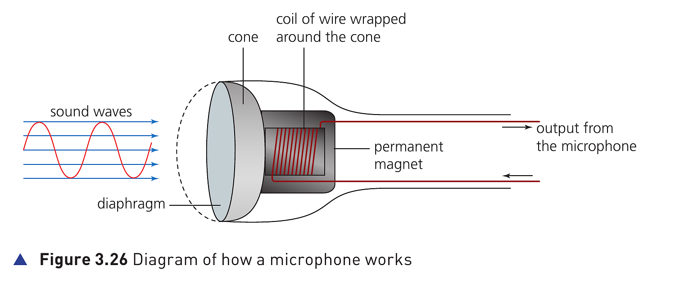
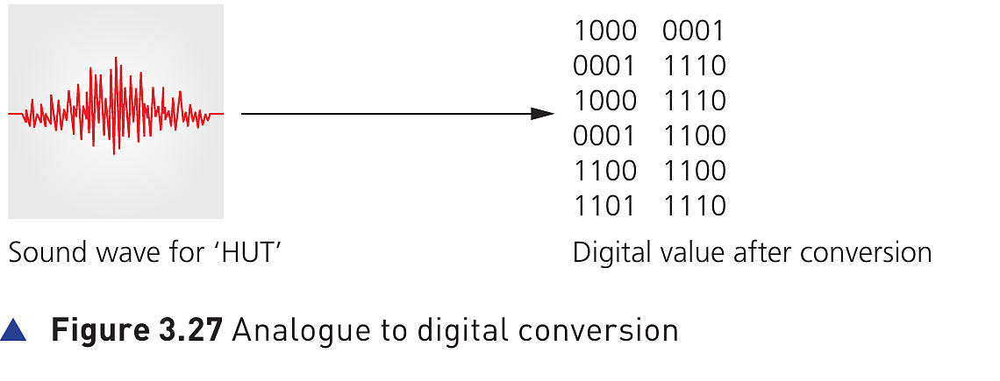

## Course Directory

### Return to the main outline

[← Back to Unit 3 Directory / 返回 Unit 3 目录](../../index.html)

## Microphones

### Sound waves into an electric current

Microphones are either built into the computer (内置于计算机) or are external devices (外部设备) connected through the USB port or using Bluetooth connectivity.

Figure 3.26 shows how a microphone can convert sound waves (声波) into an electric current (电流).

The current produced is converted to a digital format (数字格式) so that a computer can process it or store it, for example on a CD.

## Microphones

### Figure 3.26: microphone structure

{fig-align="center" width="98%"}

::: {.figure-note}
The diagram links the physical parts: diaphragm (振膜), cone (锥盆), coil of wire (线圈) and permanent magnet (永久磁铁).
:::

## How a microphone converts sound into current

### 1/3 Steps 1-2 of 5

::: {.tight-list}
- When sound is created, it causes the air to vibrate (振动).
- When a diaphragm in the microphone picks up the air vibrations, the diaphragm also begins to vibrate.
:::

## How a microphone converts sound into current

### 2/3 Step 3 of 5

A copper coil (铜线圈) is wrapped around the cone which is connected to the diaphragm.

As the diaphragm vibrates, the cone moves in and out causing the copper coil to move backwards and forwards.

## How a microphone converts sound into current

### 3/3 Steps 4-5 of 5

::: {.tight-list}
- This forwards and backwards motion causes the coil to cut through the magnetic field (磁场) around the permanent magnet, inducing an electric current (感应出电流), so an induced current is produced.
- The electric current is then either amplified (放大) or sent to a recording device. The electric current is analogue in nature (本质上是模拟信号).
:::

## Microphone Output To A Computer

### Sound card conversion

The electric current output from the microphone can also be sent to a computer where a sound card (声卡) converts the current into a digital signal (数字信号) which can then be stored in the computer.

The following diagram shows what happens when the word ‘hut’ is picked up by a microphone and is converted into digital values.

## Microphone Output To A Computer

### Figure 3.27: analogue to digital conversion

{fig-align="center" width="92%"}

::: {.figure-note}
The sound wave for HUT is converted into digital values after conversion.
:::

## Microphone Output To A Computer

### ADC and stored digital values

Look at Figure 3.27. The word ‘hut’, in the form of a sound wave (声波), has been picked up by the microphone.

This is then converted using an analogue to digital converter (ADC) (模数转换器) into digital values (数字值), which can then be stored in a computer or manipulated as required using appropriate software.

## Classroom Check

### Explain the full conversion chain

::: {.tight-list}
- What vibrates first when sound is created?
- Which part of the microphone picks up the air vibrations?
- How does the copper coil help induce an electric current?
- Why must the signal be converted by an ADC before the computer can store or manipulate it?
:::

## End

### Return to the main outline

[← Back to Unit 3 Directory / 返回 Unit 3 目录](../../index.html)
