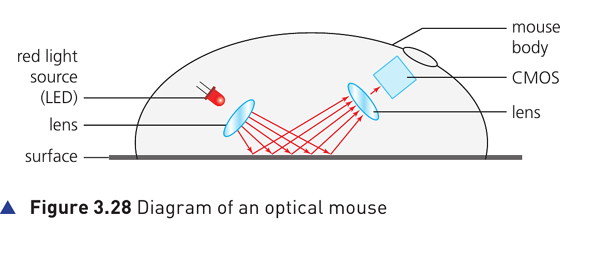

## Course Directory

### Return to the main outline

[← Back to Unit 3 Directory / 返回 Unit 3 目录](../../index.html)

## Optical Mouse

### Pointing device and image capture

An optical mouse (光学鼠标) is an example of a pointing device (指针设备).

It uses tiny cameras to take 1500 images per second.

Unlike an older mechanical mouse (机械鼠标), the optical mouse can work on virtually any surface.

## Optical Mouse

### Figure 3.28: light reflection path

{fig-align="center" width="96%"}

::: {.figure-note}
The diagram shows the red light source (LED), lens, surface reflection path, CMOS sensor and mouse body.
:::

## How an optical mouse detects movement

### 1/3 LED and surface reflection

A red LED (红色发光二极管) is used in the base of the mouse.

The red light is bounced off the surface (从表面反射), and the reflection is picked up by a complementary metal oxide semiconductor (CMOS) (互补金属氧化物半导体).

## How an optical mouse detects movement

### 2/3 CMOS pulses and DSP

The CMOS generates electric pulses (电脉冲) to represent the reflected red light.

These pulses are sent to a digital signal processor (DSP) (数字信号处理器).

## How an optical mouse detects movement

### 3/3 Coordinates and cursor movement

The processor can now work out the coordinates (坐标) of the mouse based on the changing image patterns (变化的图像模式) as it is moved about on the surface.

The computer can then move the on-screen cursor (屏幕光标) to the coordinates sent by the mouse.

## Benefits of an optical mouse over a mechanical mouse

### Textbook advantages

::: {.tight-list}
- There are no moving parts (没有运动部件), therefore it is more reliable.
- Dirt can’t get trapped in any of the mechanical components (机械部件).
- There is no need to have any special surfaces.
:::

## Wired And Wireless Optical Mice

### Bluetooth connectivity

Most optical mice use Bluetooth connectivity (蓝牙连接) rather than using a USB wired connection (USB 有线连接).

This makes the mouse more versatile (用途更灵活 / 适用场景更多).

## Wired And Wireless Optical Mice

### Advantages of a wired mouse

::: {.tight-list}
- no signal loss (信号丢失), since there is a constant signal pathway (wire)
- cheaper to operate, because there is no need to buy new batteries or charge batteries
- fewer environmental issues (环境问题), because there is no need to dispose of old batteries
:::

## Classroom Check

### Explain movement detection accurately

A complete answer should include this route:

red LED reflection → CMOS electric pulses → DSP processing → coordinates → cursor movement.

Do not only write “the mouse sends movement to the computer”.

## End

### Return to the main outline

[← Back to Unit 3 Directory / 返回 Unit 3 目录](../../index.html)
