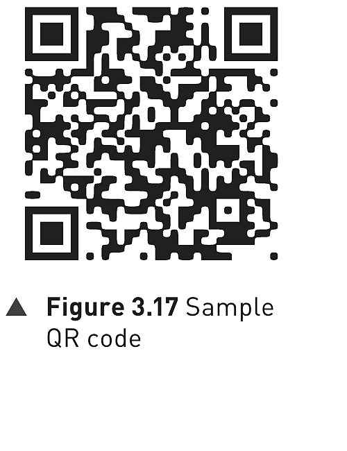
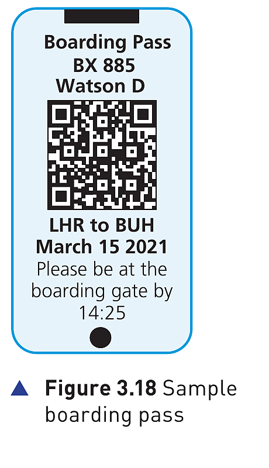

## Course Directory

### Return to the main outline

[Back to Unit 3 Directory / 返回 Unit 3 目录](../../index.html)

## Quick response (QR) codes

### Another type of barcode

:::: {.columns}

::: {.column width="38%"}
{fig-align="center" width="88%"}
:::

::: {.column width="58%"}
Another type of barcode is the quick response (QR) code (快速响应码 / 二维码).

This is made up of a matrix (矩阵) of filled-in dark squares on a light background.

For example, the QR code in Figure 3.17 is a website advertising rock music merchandise. It includes a web address in the code.
:::

::::

## Description of QR codes

### 1/2 Capacity and pixels

A QR code consists of a block of small squares (light and dark) known as pixels (像素).

It can presently hold up to 4296 characters or up to 7089 digits, and also allows internet addresses to be encoded within the QR code.

This compares to the 30 digits that is the maximum for a barcode. However, as more and more data is added, the structure of the QR code becomes more complex.

## Description of QR codes

### 2/2 Alignment and camera shot

The three large squares at the corners of the code function as alignment markers (对齐 / 定位标记).

The remaining small corner square is used to ensure the correct size and correct angle of the camera shot when the QR code is read.

{fig-align="center" width="34%"}

## Uses of QR codes

### Because QR codes can be scanned anywhere

Because of modern smartphones and tablets, which allow internet access on the move, QR codes can be scanned anywhere. This gives rise to a number of uses:

- advertising products, for example the QR code in Figure 3.17
- giving automatic access to a website or contact telephone number
- storing boarding passes electronically at airports and train stations (Figure 3.18)

## Boarding pass example

### Figure 3.18 as a mobile-use example

:::: {.columns}

::: {.column width="38%"}
{fig-align="center" width="82%"}
:::

::: {.column width="58%"}
The boarding pass shows why QR codes are useful on smartphones and tablets.

The QR code stores travel data that can be read from the screen, so the user does not need a printed ticket.

boarding pass (登机牌 / 乘车凭证) is the key application example in this part of the textbook.
:::

::::

## Reading QR codes on mobile devices

### 1/2 Camera and app

By using the built-in camera on a mobile smartphone or tablet and by downloading a QR app (application，应用程序), it is possible to read QR codes on the move using the following method:

- point the phone or tablet camera at the QR code
- the app will now process the image taken by the camera, converting the squares into readable data
- the browser software on the mobile phone or tablet automatically reads the data generated by the app
- the browser software will also decode (解码) any web addresses contained within the QR code

## Reading QR codes on mobile devices

### 2/2 Decoded result

- the user will then be sent to a website automatically
- if a telephone number was embedded in the code, the user will be sent to the phone app
- if the QR code contained a boarding pass, this will be automatically sent to the phone/tablet

## Advantages of QR codes compared to traditional barcodes

### 1/2 Capacity and error checking

- They can hold much more information.
- There will be fewer errors; the higher capacity of the QR code allows the use of built-in error-checking systems (错误检查系统).
- Normal barcodes contain almost no data redundancy (数据冗余 / duplicated data), therefore it is not possible to guard against badly printed or damaged barcodes.

## Advantages of QR codes compared to traditional barcodes

### 2/2 Scanning, transmitting and encryption

- QR codes are easier to read; they do not need expensive laser or LED (light emitting diode，发光二极管) scanners like barcodes.
- They can be read by the cameras on smartphones or tablets.
- It is easy to transmit QR codes either as text messages or images.
- It is also possible to encrypt (加密) QR codes, which gives them greater protection than traditional barcodes.

## Disadvantages of QR codes compared to traditional barcodes

### 1/2 Format and malicious code

- More than one QR format is available.
- QR codes can be used to transmit malicious codes (恶意代码), known as attagging (恶意二维码攻击).
- Since there are a large number of free apps available to a user for generating QR codes, that means anyone can do this.

## Disadvantages of QR codes compared to traditional barcodes

### 2/2 What attagging can cause

- It is relatively easy to write malicious code and embed this within the QR code.
- When the code is scanned, it is possible the creator of the malicious code could gain access to everything on the user's phone, for example photographs, address book and stored passwords.
- The user could also be sent to a fake website (假网站), or it is even possible for a virus (病毒) to be downloaded.

## New developments

### Frame QR codes

:::: {.columns}

::: {.column width="40%"}
{fig-align="center" width="86%"}
:::

::: {.column width="56%"}
Newer QR codes, called frame QR codes (框架二维码), are now being used because of the increased ability to add advertising logos.

Frame QR codes come with a canvas area (画布区域), where it is possible to include graphics or images inside the code itself.

Unlike normal QR codes, software to do this is not usually free.
:::

::::

## Activity 3.3

### QR code questions

::: {.qr-activity}
- Describe one advantage of using QR codes rather than traditional barcodes. Explain how barcodes bring the advantage you have described.
- A square QR code contains `40 x 40` tiny squares (pixels) where each tiny square represents a `0` or a `1`. Calculate how many bytes (字节) of data can be stored on the QR code.
- Describe the purpose of the three large squares at the corners of the QR code.
- Describe one disadvantage of using QR codes.
:::

## Classroom Check

### Compare without mixing up barcode and QR code

A complete answer should separate four ideas:

QR code structure -> capacity and alignment -> camera/app decoding -> advantages and risks

Key terms to use: pixels, alignment, error-checking, data redundancy, encryption, attagging.

## End

### Return to the main outline

[Back to Unit 3 Directory / 返回 Unit 3 目录](../../index.html)
