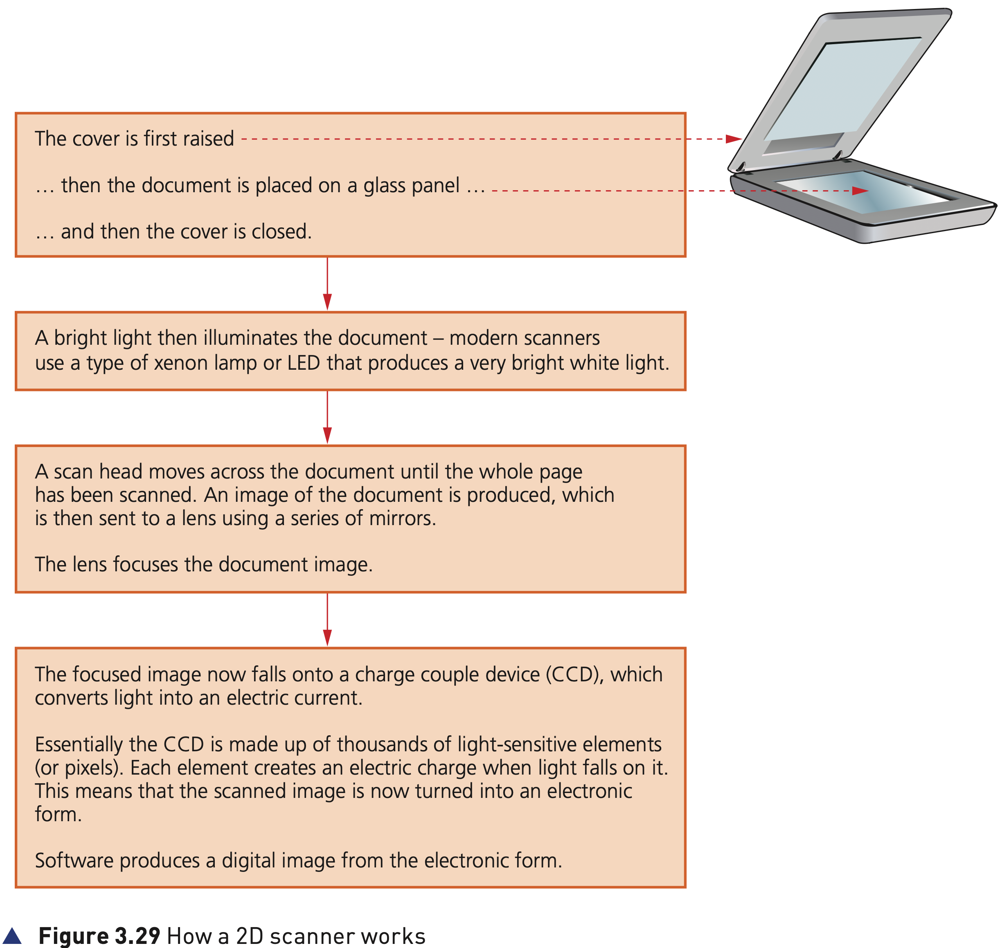
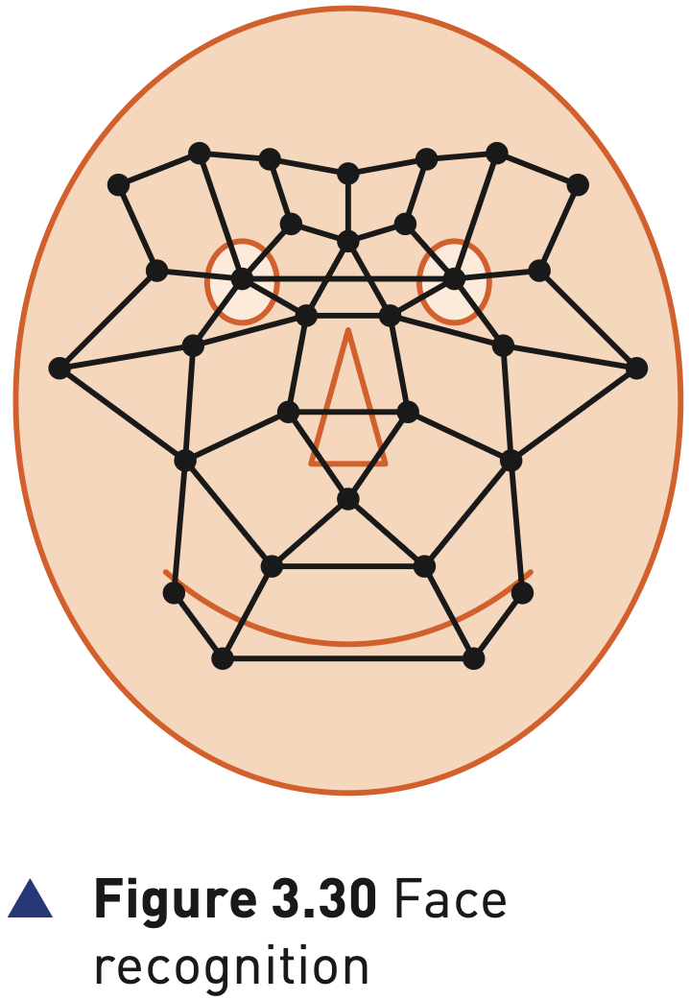
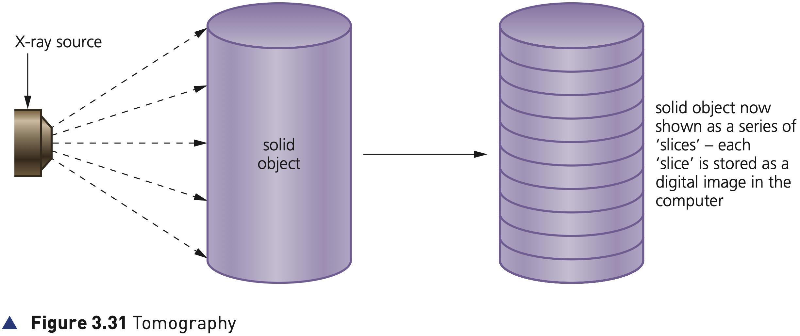

## Course Directory

### Return to the main outline

[← Back to Unit 3 Directory / 返回 Unit 3 目录](../../index.html)

## 2D and 3D scanners

### Two kinds of scanner

Scanners (扫描仪) are either two dimensional (2D) (二维) or three dimensional (3D) (三维).

2D scanners are the most common form and are generally used to input hard copy (纸质原件) documents.

The image is converted into an electronic form (电子形式) that can be stored in a computer.

## 2D scanners

### Figure 3.29: how a 2D scanner works

{fig-align="center" width="88%"}

::: {.figure-note}
Use this figure as the whole process map: cover and document placement → illumination → scan head and mirrors → lens → CCD → digital image.
:::

## How a 2D scanner works

### 1/4 Place the document

::: {.tight-list}
- The cover is first raised.
- The document is placed on a glass panel (玻璃面板).
- The cover is closed.
:::

This stage fixes the paper document in the correct position before the scanning hardware starts to capture the image.

## How a 2D scanner works

### 2/4 Illuminate the document

A bright light (强光) then illuminates the document.

Modern scanners use a type of xenon lamp (氙气灯) or LED (发光二极管) that produces a very bright white light.

## How a 2D scanner works

### 3/4 Move the scan head

A scan head (扫描头) moves across the document until the whole page has been scanned.

An image of the document is produced, which is then sent to a lens (透镜) using a series of mirrors (镜子).

The lens focuses the document image.

## How a 2D scanner works

### 4/4 CCD and digital image

The focused image now falls onto a charge couple device (CCD) (电荷耦合器件), which converts light into an electric current.

The CCD is made up of thousands of light-sensitive elements (感光元件), or pixels. Each element creates an electric charge when light falls on it.

Software produces a digital image (数字图像) from the electronic form.

## OCR

### Scanned text becomes editable text

Computers equipped with optical character recognition (OCR) (光学字符识别) software allow the scanned text from the document to be converted into a text file format (文本文件格式).

This means the scanned image can now be edited and manipulated by importing it into a word processor (文字处理软件).

If the original document was a photograph or image, then the scanned image forms an image file such as JPEG (常见图像格式).

## 3D scanners

### Solid objects and coordinates

3D scanners scan solid objects (实体物体) and produce a three-dimensional image (三维图像).

Since solid objects have x, y and z coordinates (三轴坐标), these scanners take images at several points along these three coordinates.

A digital image which represents the solid object is formed.

## 3D scanners

### CAD, 3D printing and technologies

The scanned images can be used in computer aided design (CAD) (计算机辅助设计) or sent to a 3D printer (3D 打印机) to produce a working model of the scanned image.

There are numerous technologies used in 3D scanners: lasers (激光), magnetic resonance (磁共振), white light (白光), and so on.

## Application of 2D scanners at an airport

### 1/3 Passport pages and OCR

2D scanners are used at airports to read passports (护照).

They make use of OCR technology to produce digital images (数字图像) which represent the passport pages.

Because of the OCR technology, these digital images can be manipulated in a number of ways.

## Application of 2D scanners at an airport

### 2/3 Database fields and ASCII

The OCR software is able to review these images, select the text part, and then automatically put the text into the correct fields of an existing database (数据库).

It is possible for the text to be stored in an ASCII (字符编码标准) format. It all depends on how the data is to be used.

## Application of 2D scanners at an airport

### 3/3 Passport photo and live image

At many airports the two-dimensional photograph in the passport is scanned and stored as a JPEG image (JPEG 图像).

The passenger’s face is also photographed using a digital camera, so it can be matched to the image taken from the passport.

The two digital images are compared using face recognition/detection software (人脸识别/检测软件).

## Application of 2D scanners at an airport

### Figure 3.30: face recognition

{fig-align="center" width="48%"}

::: {.figure-note}
The figure shows several key positions used by face recognition software when comparing two facial images.
:::

## Application of 2D scanners at an airport

### Face recognition data points

Data, such as:

::: {.tight-list}
- distance between the eyes (双眼距离)
- width of the nose (鼻子宽度)
- shape of the cheek bones (颧骨形状)
- length of the jaw line (下颌线长度)
- shape of the eyebrows (眉毛形状)
:::

are all used to uniquely identify a given face.

## Application of 2D scanners at an airport

### Matching the two images

When the image from the passport and the image taken by the camera are compared, these key positions on the face determine whether or not the two images represent the same face.

The key teaching point is the full route:

2D scanner → OCR / JPEG → database fields → digital camera image → face recognition comparison.

## Application of 3D scanning

### Computed tomographic (CT) scanners

Computed tomographic (CT) scanners (计算机断层扫描仪) are used to create a 3D image of a solid object.

This is based on tomography technology (断层成像技术), which builds up an image of the solid object through a series of very thin ‘slices’ (切片).

Each of these 2D slices makes up a representation of the 3D solid object.

## Application of 3D scanning

### How the slices are stored

Each slice is built up by use of X-rays (X 射线), radio frequencies (射频) or gamma imaging (伽马成像), although a number of other methods exist.

Each slice is then stored as a digital image in the computer memory.

The whole of the solid object is represented digitally in the computer memory.

## Application of 3D scanning

### Tomographic scanner names

::: {.clean-table}
| Name | CT Scanner | MRI | SPECT |
|---|---|---|---|
| Stands for | computerised tomography | magnetic resonance images | single photon emission computer tomography |
| Uses | X-rays | radio frequencies | gamma rays |
:::

The names depend on how the image is formed.

## Application of 3D scanning

### Figure 3.31: tomography

{fig-align="center" width="96%"}

::: {.figure-note}
The solid object is shown as a series of thin slices. Each slice is stored as a digital image in the computer.
:::

## Classroom Check

### Explain the difference clearly

A complete answer should keep the outputs distinct:

::: {.tight-list}
- A 2D scanner inputs hard-copy documents and produces a flat digital image, OCR text, or an image file such as JPEG.
- A 3D scanner scans solid objects using x, y and z data, or tomography slices, to produce a 3D digital representation.
:::

Do not simply write “both scanners make images”.

## End

### Return to the main outline

[← Back to Unit 3 Directory / 返回 Unit 3 目录](../../index.html)
