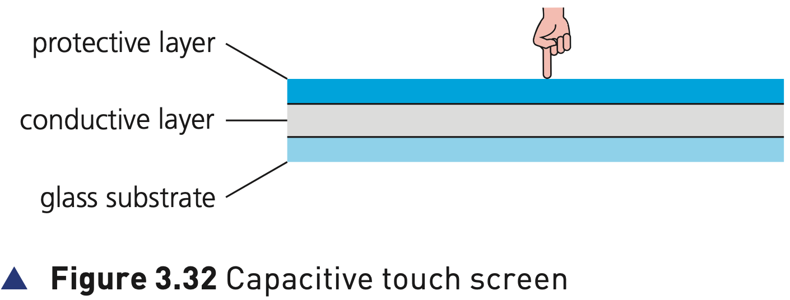
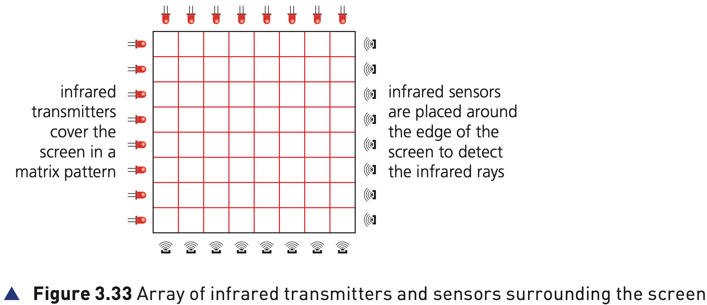
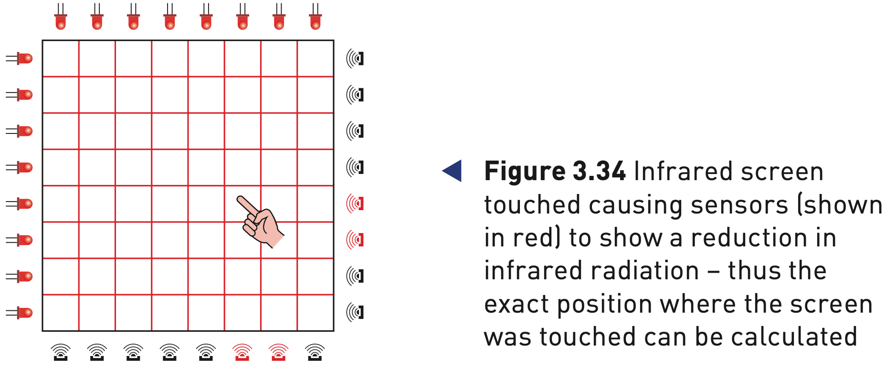
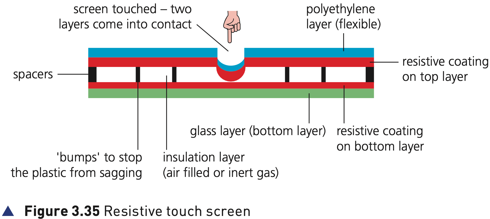

## Course Directory

### Return to the main outline

[← Back to Unit 3 Directory / 返回 Unit 3 目录](../../index.html)

## Touch screens

### Common input device

Touch screens (触摸屏) are now a very common form of input device (输入设备).

They allow simple touch selection from a menu to launch an application (app).

Touch screens allow the user to carry out the same functions as they would with a pointing device (指针设备), such as a mouse.

## Touch screens

### Three common technologies

There are three common types of touch screen technologies currently being used by mobile phone and tablet manufacturers:

::: {.tight-list}
- capacitive (电容式)
- infrared (红外式)
- resistive (电阻式, most common method at the moment)
:::

Similar technologies are used in other applications, for example food selection at a fast food restaurant.

## Capacitive touch screens

### Figure 3.32: basic structure

{fig-align="center" width="90%"}

::: {.figure-note}
The basic capacitive structure is a protective glass layer, a transparent conductive electrode layer and a glass substrate.
:::

## Capacitive touch screens

### 1/5 Glass, electrode layer and glass substrate

Capacitive touch screens are composed of a layer of glass (protective layer, 保护层), a transparent electrode (电极) or conductive layer, and a glass substrate (玻璃基底).

Since human skin is a conductor of electricity (导电体), when bare fingers or a special stylus touch the screen, the electrostatic field of the conductive layer is changed.

## Capacitive touch screens

### 2/5 Coordinates from electrostatic change

The installed microcontroller (微控制器) is able to calculate where this change took place.

It can then determine the coordinates (坐标) of the point of touching.

There are presently two main types of capacitive touch screens:

::: {.tight-list}
- surface (表面电容式)
- projective (投射电容式)
:::

## Capacitive touch screens

### 3/5 Surface capacitive screens

With surface capacitive screens (表面电容屏), sensors are placed at the corners of a screen.

Small voltages are also applied at the corners of the screen, creating an electric field (电场).

A finger touching the screen surface will draw current from each corner, reducing the capacitance (电容).

A microcontroller measures the decrease in capacitance and determines the point where the finger touched the screen.

## Capacitive touch screens

### 4/5 Projective capacitive screens

Projective capacitive screens work slightly differently.

The transparent conductive layer is now in the form of an X-Y matrix pattern (X-Y 矩阵图案).

This creates a three dimensional (3D) electrostatic field (静电场). When a finger touches the screen, it disturbs the 3D electrostatic field, allowing a microcontroller to determine the coordinates of the point of contact.

## Capacitive touch screens

### 5/5 Touch methods and multi-touch

Surface capacitive screens only work with a bare finger or stylus.

Projective capacitive screens work with bare fingers, stylus and thin surgical or cotton gloves.

They also allow multi-touch (多点触控) facility, for example pinching or sliding.

## Capacitive touch screens

### Advantages compared to the other two technologies

::: {.tight-list}
- Better image clarity than resistive screens, especially in strong sunlight (强烈阳光).
- Very durable screens that have high scratch resistance (抗刮性).
- Projective capacitive screens allow multi-touch.
:::

## Capacitive touch screens

### Disadvantages compared to the other two technologies

::: {.tight-list}
- Surface capacitive screens only work with bare fingers or a special stylus.
- They are sensitive to electromagnetic radiation (电磁辐射), such as magnetic fields or microwaves.
:::

## Infrared touch screens

### Figure 3.33: transmitters and sensors

{fig-align="center" width="92%"}

::: {.figure-note}
Infrared transmitters and infrared sensors are placed around the edge of the screen to create and detect a matrix of infrared rays.
:::

## Infrared touch screens

### 1/3 Infrared beams around the screen

Infrared touch screens use a glass screen with an array of sensors (传感器) and infrared transmitters (红外发射器).

The sensors detect the infrared radiation (红外辐射).

## Infrared touch screens

### 2/3 Figure 3.34: broken beams show touch position

{fig-align="center" width="86%"}

::: {.figure-note}
When a finger touches the screen, some infrared beams are broken and the corresponding sensors show a reduction in infrared radiation.
:::

## Infrared touch screens

### 3/3 Microcontroller calculates the position

If any of the infrared beams are broken, for example with a finger touching the screen, the infrared radiation reaching the sensors is reduced.

The sensor readings are sent to a microcontroller (微控制器) that calculates where the screen was touched.

## Infrared touch screens

### Advantages compared to the other two technologies

::: {.tight-list}
- Allows multi-touch facilities.
- Has good screen durability.
- The operability isn’t affected by a scratched or cracked screen.
:::

## Infrared touch screens

### Disadvantages compared to the other two technologies

::: {.tight-list}
- The screen can be sensitive to water or moisture (水或湿气).
- It is possible for accidental activation to take place if the infrared beams are disturbed in some way.
- Sometimes sensitive to light interference (光线干扰).
:::

## Resistive touch screens

### Figure 3.35: two resistive layers

{fig-align="center" width="96%"}

::: {.figure-note}
The upper flexible polyethylene layer and the bottom glass layer are separated until pressure makes the two coated layers touch.
:::

## Resistive touch screens

### 1/4 Layers and materials

Resistive touch screens are made up of two layers of electrically resistive material (电阻材料) with a voltage applied across them.

The upper layer is made of flexible polyethylene (聚乙烯, a type of polymer) with a resistive coating on one side.

The bottom layer is made of glass also with a resistive coating, usually indium tin oxide (氧化铟锡), on one side.

## Resistive touch screens

### 2/4 Air or inert gas separation

These two layers are separated by air or an inert gas (惰性气体), such as argon (氩气).

When the top polyethylene surface is touched, the two layers make contact.

Since both layers are coated in a resistive material, a circuit is now completed which results in a flow of electricity.

## Resistive touch screens

### 3/4 Voltage change to digital data

The point of contact is detected where there was a change in voltage (电压).

A microcontroller converts the voltage, created when the two resistive layers touch, to digital data (数字数据).

It then sends the digital data to the microprocessor (微处理器).

## Resistive touch screens

### 4/4 Detection method summary

The important route is:

pressure on top layer → two resistive layers touch → circuit completed → voltage changes → microcontroller sends digital data.

This is different from capacitive electrostatic field change and infrared broken beams.

## Resistive touch screens

### Advantages compared to the other two technologies

::: {.tight-list}
- Good resistance to dust and water.
- Can be used with bare fingers, stylus and gloved hand.
:::

## Resistive touch screens

### Disadvantages compared to the other two technologies

::: {.tight-list}
- Low touch sensitivity; sometimes users have to press down harder.
- Doesn’t support multi-touch facility.
- Poor visibility in strong sunlight.
- Vulnerable to scratches on the screen, because it is made of polymer.
:::

## Classroom Check

### Match each technology to its detection method

::: {.tight-list}
- Capacitive: detects a change in the electrostatic field.
- Infrared: detects broken infrared beams and reduced infrared radiation at sensors.
- Resistive: detects pressure when two resistive layers touch and voltage changes.
:::

A strong answer should also mention one advantage and one disadvantage for each technology.

## End

### Return to the main outline

[← Back to Unit 3 Directory / 返回 Unit 3 目录](../../index.html)
