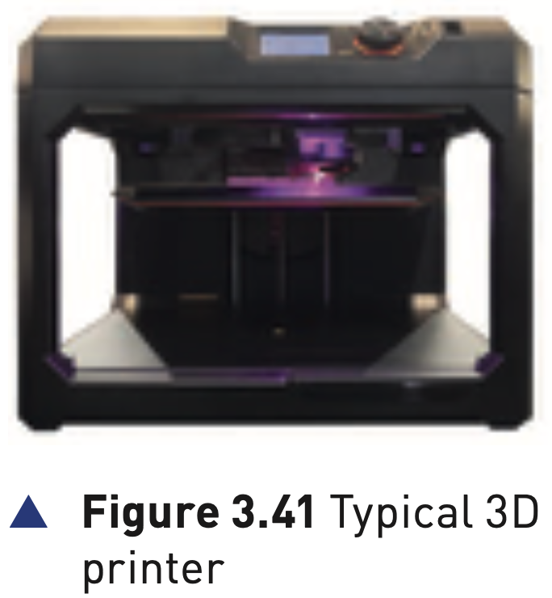
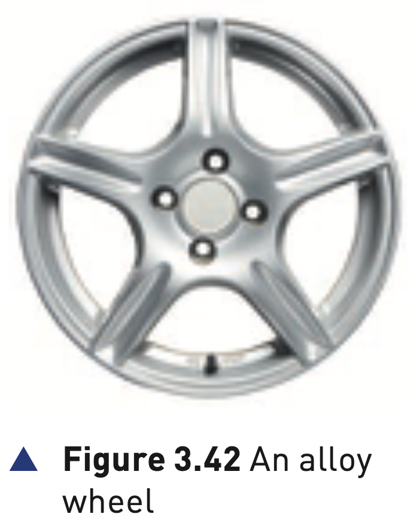
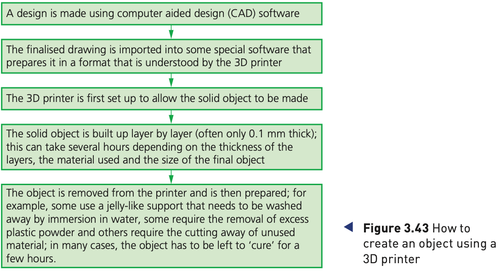

## Course Directory

### Return to the main outline

[← Back to Unit 3 Directory / 返回 Unit 3 目录](../../index.html)

## 3D printers

### Solid objects that work

3D printers are used to produce solid objects (实体物体) that actually work.

They are primarily based on inkjet and laser printer technology.

The solid object is built up layer by layer (逐层) using materials such as powdered resin, powdered metal, paper or ceramic.

## 3D printers

### Figure 3.41: typical 3D printer

{fig-align="center" width="54%"}

::: {.figure-note}
3D printers vary in size: from the size of a microwave oven up to the size of a small car.
:::

## Figure 3.42

### Alloy wheel example

{fig-align="center" width="54%"}

::: {.figure-note}
The alloy wheel was made using an industrial 3D printer from many 0.1 mm layers of powdered metal using binder 3D printing.
:::

## Additive manufacturing

### Building up layer by layer

3D printers use additive manufacturing (增材制造): the object is built up layer by layer.

This is in sharp contrast to subtractive manufacturing (减材制造), where material is removed to make the object.

For example, carving a statue removes stone; 3D printing builds the statue up using powdered stone.

## Additive manufacturing

### CNC contrast

Similarly, CNC machining removes metal to form an object.

3D printing would produce the same item by building up the object from layers of powdered metal.

The exam phrase to remember is: additive adds layers; subtractive removes material.

## Direct 3D printing

### Inkjet technology with vertical movement

Direct 3D printing uses inkjet technology.

A print head can move left to right as in a normal printer.

However, the print head can also move up and down to build up the layers of an object.

## Binder 3D printing

### Two passes for each layer

Binder 3D printing is similar to direct 3D printing.

This method uses two passes for each layer:

::: {.tight-list}
- the first pass sprays dry powder
- the second pass sprays a binder, a type of glue, to form a solid layer
:::

## Newer hardening methods

### Lasers and UV light

Newer technologies are using lasers (激光) and UV light (紫外线) to harden liquid polymers.

This further increases the diversity of products which can be made.

## Figure 3.43

### How to create an object using a 3D printer

{fig-align="center" width="86%"}

::: {.figure-note}
The figure summarises the complete workflow: CAD design, printer preparation, layer-by-layer building, removal, finishing and curing.
::: 

## How to create a solid object using 3D printers

### 1/2 Digital preparation

There are a number of steps in the process:

::: {.tight-list}
- A design is made using computer aided design (CAD) software.
- The finalised drawing is imported into special software that prepares it in a format understood by the 3D printer.
- The 3D printer is first set up to allow the solid object to be made.
:::

## How to create a solid object using 3D printers

### 2/2 Layer build and finishing

::: {.tight-list}
- The solid object is built up layer by layer, often only 0.1 mm thick; this can take several hours.
- The object is removed from the printer and prepared.
- Support material may be washed away, excess powder removed, unused material cut away, or the object left to cure (固化) for a few hours.
:::

## Uses of 3D printing

### Textbook examples

3D printing is regarded as possibly the next industrial revolution.

The textbook examples include:

::: {.tight-list}
- covering of prosthetic limbs made to exactly fit the limb
- precision reconstructive surgery, such as facial reconstruction from skull scans
- aerospace wings and parts: lightweight precision parts
- fashion and art
- parts for items no longer in production, such as suspension parts for a vintage car
:::

## Classroom Check

### Manufacturing contrast

Explain the difference between additive and subtractive manufacturing using one example.

A strong answer also mentions 0.1 mm layers, CAD preparation, and post-processing after the object is removed from the printer.

## End

### Return to the main outline

[← Back to Unit 3 Directory / 返回 Unit 3 目录](../../index.html)
