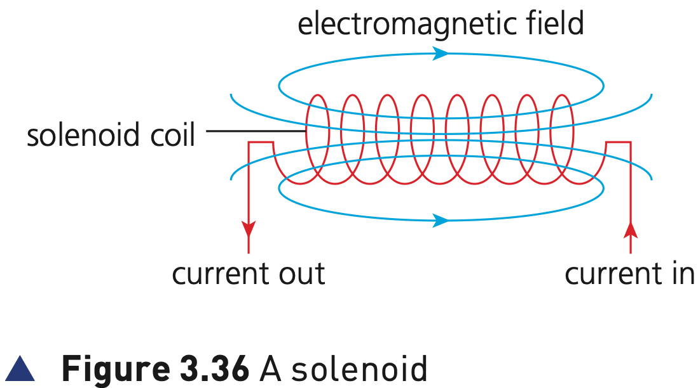

## Course Directory

### Return to the main outline

[← Back to Unit 3 Directory / 返回 Unit 3 目录](../../index.html)

## Actuators

### Output devices for control

When a computer is used to control devices, such as a conveyer belt (传送带) or a valve (阀门), it is usually necessary to use an actuator (执行器).

The actuator makes the physical output happen, for example to start/stop the conveyer belt or open/close the valve.

## Actuators

### Textbook definition

An actuator is a mechanical or electromechanical device (机械或机电设备), such as a relay (继电器), solenoid (螺线管) or motor (电动机).

In a control system, the computer has already processed data; the actuator carries out the controlled action.

## Solenoid example

### Figure 3.36: a solenoid

{fig-align="center" width="82%"}

::: {.figure-note}
The solenoid coil carries current. This produces an electromagnetic field around the coil.
:::

## Solenoid example

### Electrical signal to magnetic field

The textbook uses a solenoid as the example.

A solenoid converts an electrical signal (电信号) into a magnetic field (磁场), producing linear motion (直线运动).

This is the key output-device idea: an electronic signal becomes physical movement.

## Solenoid example

### Plunger movement

If a plunger (柱塞), for example a magnetised metal bar, is placed inside the coil, it will move when a current is applied to the coil.

This movement can allow the solenoid to operate a valve or a switch.

## Rotary solenoids

### Rotational movement

There are also examples of rotary solenoids (旋转螺线管), where a cylindrical coil is used.

In this case, when a current is supplied to the coil, it causes a rotational movement of the plunger.

So actuators can produce either linear movement or rotational movement, depending on the design.

## Classroom Check

### Sensor vs actuator

Explain why a temperature sensor and an actuator are not the same type of device.

A strong answer should say:

::: {.tight-list}
- a sensor provides input data to the computer
- the computer processes the data
- an actuator produces the physical output action
:::

## End

### Return to the main outline

[← Back to Unit 3 Directory / 返回 Unit 3 目录](../../index.html)
