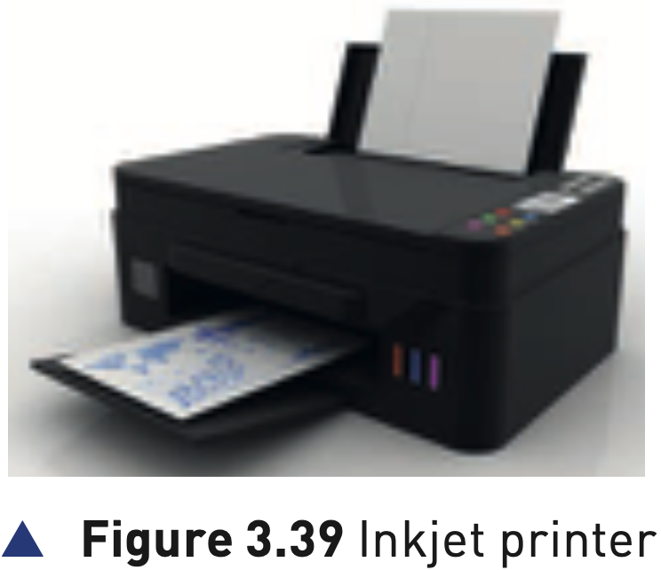

## Course Directory

### Return to the main outline

[← Back to Unit 3 Directory / 返回 Unit 3 目录](../../index.html)

## Inkjet printers

### Main parts

Inkjet printers are essentially made up of:

::: {.tight-list}
- a print head (打印头), which consists of nozzles (喷嘴) that spray droplets of ink onto the paper to form characters
- an ink cartridge or ink cartridges (墨盒)
- a stepper motor (步进电机) and belt, which moves the print head assembly across the page from side to side
- a paper feed (进纸装置), which automatically feeds pages as required
:::

## Inkjet printers

### Figure 3.39: inkjet printer

{fig-align="center" width="58%"}

::: {.figure-note}
Use the image to link the external printer body to the internal printing process: cartridges, print head, movement and paper feed.
:::

## Ink cartridges

### Colour combinations

The textbook describes either one cartridge for each colour, blue, yellow and magenta, and a black cartridge.

Some systems use one single cartridge containing all three colours plus black.

Some systems use six colours.

## Ink droplets

### Two production technologies

The ink droplets are produced currently using two different technologies:

::: {.tight-list}
- Thermal bubble (热气泡)
- Piezoelectric (压电)
:::

Whatever technology is used, the basic steps in the printing process are the same.

## Thermal bubble

### Heat, bubble and vacuum

Tiny resistors create localised heat which makes the ink vaporise.

This causes the ink to form a tiny bubble; as the bubble expands, some of the ink is ejected from the print head onto the paper.

When the bubble collapses, a small vacuum is created which allows fresh ink to be drawn into the print head.

## Piezoelectric

### Crystal vibration

A crystal is located at the back of the ink reservoir for each nozzle.

The crystal is given a tiny electric charge which makes it vibrate.

This vibration forces ink to be ejected onto the paper; at the same time more ink is drawn in for further printing.

## Table 3.6: inkjet printing process

### 1/3 Driver and buffer stages

::: {.clean-table}
| Stage | Description of what happens |
|---:|---|
| 1 | the data from the document is sent to a printer driver |
| 2 | the printer driver ensures that the data is in a format that the chosen printer can understand |
| 3 | a check is made to ensure that the printer is available to print, for example busy, off-line or out of ink |
| 4 | the data is then sent to the printer and stored in a temporary memory known as a printer buffer |
:::

## Table 3.6: inkjet printing process

### 2/3 Paper and print head stages

::: {.clean-table}
| Stage | Description of what happens |
|---:|---|
| 5 | a sheet of paper is fed into the printer; a sensor checks whether paper is available or jammed |
| 6 | as the paper is fed through, the print head moves side to side, printing text or image; four ink colours are sprayed in exact amounts |
| 7 | at the end of each full pass, the paper is advanced slightly to allow the next line to be printed |
:::

## Table 3.6: inkjet printing process

### 3/3 Repeat and interrupt stages

::: {.clean-table}
| Stage | Description of what happens |
|---:|---|
| 8 | if there is more data in the printer buffer, the process from stage 5 is repeated until the buffer is empty |
| 9 | once the printer buffer is empty, the printer sends an interrupt to the CPU requesting more data |
:::

The process continues until the whole document has been printed.

## Applications of inkjet printers

### When inkjet is appropriate

Inkjet printers are often used for printing one-off photos or where only a few pages of good quality, colour printing is needed.

The small ink cartridges or small paper trays would not be an issue with such applications.

## Classroom Check

### Keep technology and process separate

A complete answer should separate:

::: {.tight-list}
- how ink droplets are produced: thermal bubble or piezoelectric
- how the print job is managed: printer driver, availability check, printer buffer, paper feed, line-by-line printing and interrupt
:::

## End

### Return to the main outline

[← Back to Unit 3 Directory / 返回 Unit 3 目录](../../index.html)
