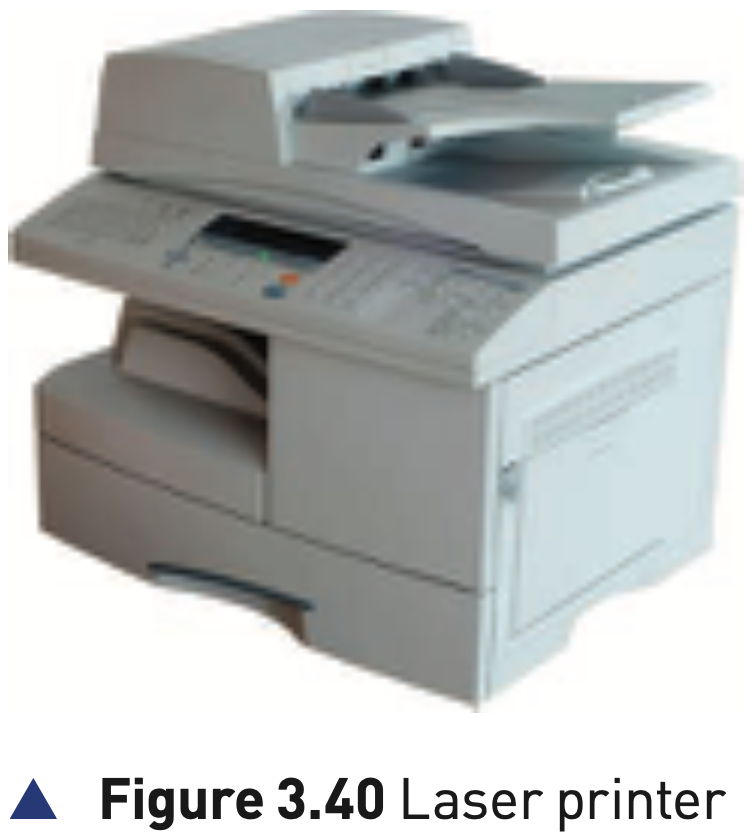

## Course Directory

### Return to the main outline

[← Back to Unit 3 Directory / 返回 Unit 3 目录](../../index.html)

## Laser printers

### Toner and static electricity

Laser printers use dry powder ink rather than liquid ink.

This dry powder ink is called toner (碳粉).

Laser printers make use of the properties of static electricity (静电) to produce text and images.

Unlike inkjet printers, laser printers print the whole page in one go.

## Laser printers

### Figure 3.40: laser printer

{fig-align="center" width="62%"}

::: {.figure-note}
Use the picture as a reminder that the output device is different from inkjet: laser printers use toner, a charged drum, paper transfer and a fuser.
:::

## Colour laser printers

### Four toner cartridges

Colour laser printers use four toner cartridges:

::: {.tight-list}
- blue
- cyan
- magenta
- black
:::

Although the actual technology is different to monochrome printers, the printing method is similar, but coloured dots are used to build up the text and images.

## Table 3.7: laser printing process

### 1/3 Driver and buffer stages

::: {.clean-table}
| Stage | Description of what happens |
|---:|---|
| 1 | the data from the document is sent to a printer driver |
| 2 | the printer driver ensures that the data is in a format that the chosen printer can understand |
| 3 | a check is made to ensure that the printer is available, for example busy, off-line or out of ink |
| 4 | the data is sent to the printer and stored in a temporary memory known as a printer buffer |
:::

## Table 3.7: laser printing process

### 2/3 Drum, laser and toner stages

::: {.clean-table}
| Stage | Description of what happens |
|---:|---|
| 5 | a printing drum is given a positive charge; a laser beam removes the positive charge in certain areas, leaving negatively charged areas matching the page |
| 6 | the drum is coated with positively charged toner; toner sticks only to the negatively charged parts of the drum |
| 7 | a negatively charged sheet of paper is rolled over the drum |
| 8 | toner on the drum sticks to the paper to produce an exact copy of the page |
:::

## Table 3.7: laser printing process

### 3/3 Paper release, fuser and discharge

::: {.clean-table}
| Stage | Description of what happens |
|---:|---|
| 9 | the electric charge on the paper is removed after one rotation of the drum so the paper does not stick to the drum |
| 10 | the paper goes through a fuser (定影器), heated rollers that melt the ink so it fixes permanently to the paper |
| 11 | a discharge lamp (放电灯) removes all electric charge from the drum, making it ready for the next page |
:::

## Applications of laser printers

### High volume and high quality

Laser printers produce high quality printouts and are very fast when making multiple copies of a document.

Any application that needs high volume printing, in colour or monochrome, would choose the laser printer.

The textbook example is producing a large number of high-quality flyers or posters for advertising.

## Applications of laser printers

### Toner cartridges and paper trays

Laser printers have two advantages for high-volume work:

::: {.tight-list}
- large toner cartridges
- large paper trays, often holding more than a ream of paper
:::

These features make them more suitable than inkjet printers when many pages are required.

## Classroom Check

### Compare with inkjet accurately

A clear comparison should include:

::: {.tight-list}
- inkjet: liquid ink droplets, print head, line-by-line printing
- laser: toner, static electricity, charged drum, whole-page printing, fuser and discharge lamp
:::

## End

### Return to the main outline

[← Back to Unit 3 Directory / 返回 Unit 3 目录](../../index.html)
