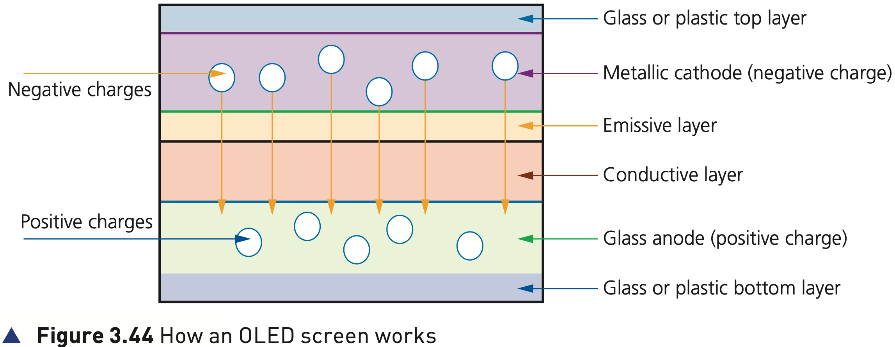
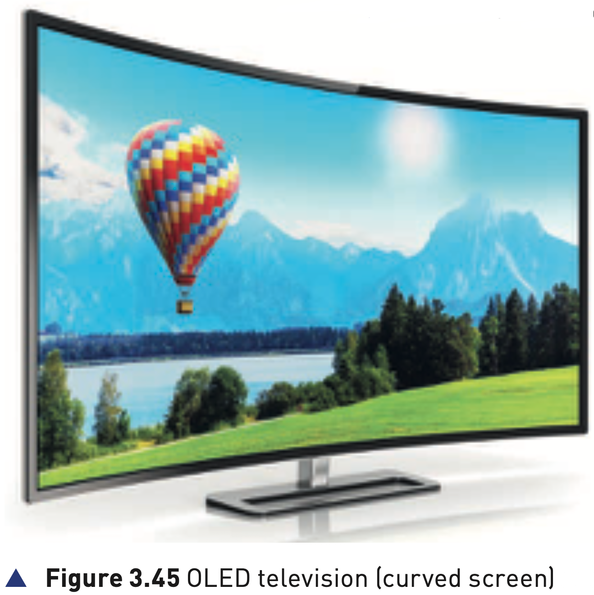

## Course Directory

### Return to the main outline

[← Back to Unit 3 Directory / 返回 Unit 3 目录](../../index.html)

## LED and LCD screens

### Visual output technologies

An LED screen is made up of tiny light emitting diodes (发光二极管).

Each LED is either red, green or blue in colour.

By varying the electric current sent to each LED, its brightness can be controlled, producing a vast range of colours.

## LED screens

### Large outdoor displays

This type of screen tends to be used for large outdoor displays due to the brilliance of the colours produced.

Recent advancements in LED technology have led to the introduction of OLED screens.

Be careful: many television screens advertised as LED are actually LCD screens which are backlit using LEDs.

## LCD screens

### Liquid crystals and pixels

LCD screens are made up of tiny liquid crystals (液晶).

These tiny crystals make up an array of pixels that are affected by changes in applied electric fields.

The important point is that for LCD screens to work, they require some form of backlighting (背光).

## LCD screens

### LED backlighting is not a pure LED screen

Because LCDs don’t produce any light, LCD screens are back-lit using light emitting diode technology.

They must not be confused with pure LED screens.

Use of LED backlighting gives a very good contrast and brightness range.

## CCFL and LED backlighting

### Older and newer backlight methods

Before the use of LEDs, LCD screens used cold cathode fluorescent lamp (CCFL) as the back-lit method.

CCFL uses two fluorescent tubes behind the LCD screen to supply the light source.

When LEDs are used, a matrix of tiny blue-white LEDs is used behind the LCD screen.

## LED backlighting advantages

### 1/2 Image and speed advantages

LEDs have become increasingly more popular as the method of backlighting because:

::: {.tight-list}
- LEDs reach their maximum brightness almost immediately; there is no need to warm up
- LEDs give a whiter light that sharpens the image and makes the colours appear more vivid
- CCFL had a slightly yellowish tint
- LEDs produce a brighter light that improves the colour definition
:::

## LED backlighting advantages

### 2/2 Size, reliability and power advantages

::: {.tight-list}
- monitors using LED technology are much thinner than monitors using CCFL technology
- LEDs last indefinitely; this makes the technology more reliable and makes for a more consistent product
- LEDs consume very little power, producing less heat and using less energy
:::

## Organic light emitting diodes (OLED)

### Organic materials and electrodes

Newer LED technology is making use of organic light emitting diodes (OLEDs).

These use organic materials (有机材料), made up of carbon compounds, to create semiconductors that are very flexible.

Organic films are sandwiched between two charged electrodes: one metallic cathode and one glass anode.

## Organic light emitting diodes (OLED)

### Figure 3.44: how an OLED screen works

{fig-align="center" width="94%"}

::: {.figure-note}
When an electric field is applied to the electrodes, the organic layers give off light. No separate backlight is required.
:::

## OLED screens

### Self-contained light source

Since OLEDs require no backlighting, there is no longer a need to use LCD technology.

OLED is a self-contained system.

This allows for very thin screens.

## OLED screens

### Figure 3.45: curved OLED screen

{fig-align="center" width="68%"}

::: {.figure-note}
The important aspect of OLED technology is how thin and flexible it can make the screen.
:::

## OLED screen possibilities

### Bend, fold and attach to fabric

Using OLED technology, it is possible to bend screens to any shape.

The textbook suggests possible phones that wrap around your wrist, folded screens that fit into a pocket, and folding OLED displays attached to fabrics to create smart clothing.

## Advantages of OLED

### 1/2 Thinner, lighter and brighter

Compared to existing LEDs and LCDs:

::: {.tight-list}
- plastic organic layers are thinner, lighter and more flexible than crystal structures used in LEDs or LCDs
- light-emitting layers are lighter and can be made from plastic rather than glass
- OLEDs give a brighter light than LEDs
- OLEDs do not require backlighting like LCD screens
:::

## Advantages of OLED

### 2/2 Power, size and viewing angle

::: {.tight-list}
- OLEDs generate their own light
- OLEDs use much less power than LCD screens, important in battery-operated devices such as mobile phones
- OLEDs can be made into large, thin sheets for advertising boards
- OLEDs have a very large field of view, about 170 degrees
:::

## Classroom Check

### Do not confuse LED and LCD-LED

A precise answer should say:

::: {.tight-list}
- true LED screens use LEDs as the display elements
- LCD screens use liquid crystals and require backlighting
- many “LED TVs” are LCD screens backlit with LEDs
- OLED screens generate their own light and do not need backlighting
:::

## End

### Return to the main outline

[← Back to Unit 3 Directory / 返回 Unit 3 目录](../../index.html)
