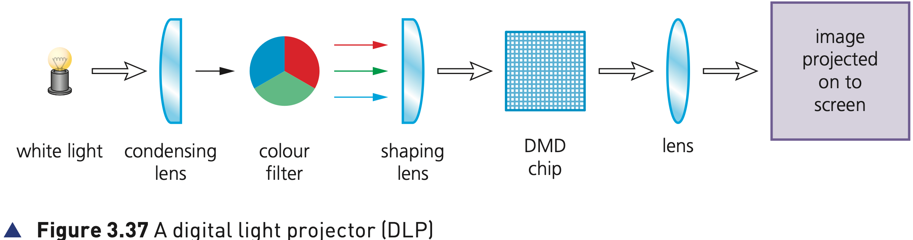
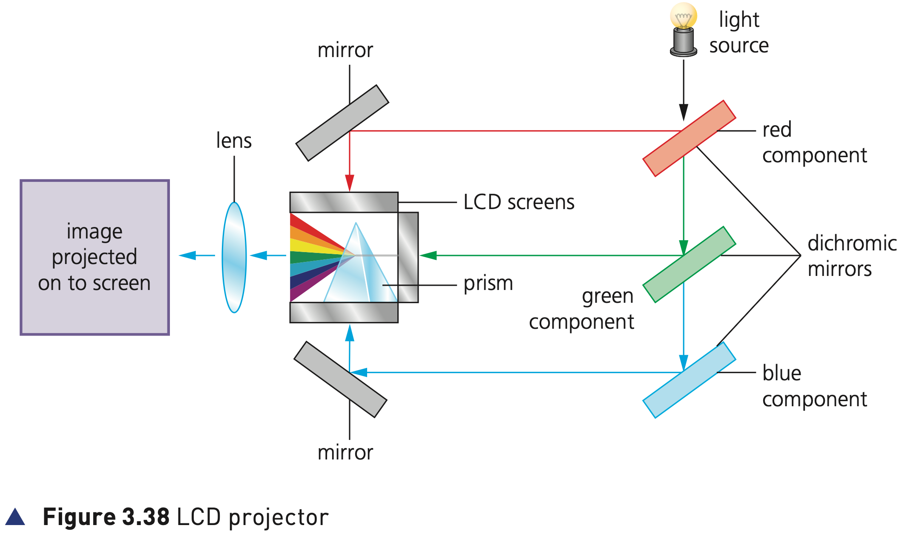

## Course Directory

### Return to the main outline

[← Back to Unit 3 Directory / 返回 Unit 3 目录](../../index.html)

## Light projectors

### Two common types

There are two common types of light projector:

::: {.tight-list}
- digital light projector (DLP) (数字光处理投影仪)
- liquid crystal display (LCD) projector (液晶显示投影仪)
:::

Projectors are used to project computer output onto larger screens or even onto interactive whiteboards.

## Digital light projectors (DLP)

### Micro mirrors on a DMD chip

The use of millions of micro mirrors (微镜) on a small digital micromirror device (DMD chip) (数字微镜设备/芯片) is the key to how these devices work.

The number of micro mirrors and the way they are arranged on the DMD chip determines the resolution (分辨率) of the digital image.

## Digital light projectors (DLP)

### Figure 3.37: light path

{fig-align="center" width="96%"}

::: {.figure-note}
Follow the path: white light → condensing lens → colour filter → shaping lens → DMD chip → lens → image projected onto screen.
:::

## Digital light projectors (DLP)

### ON, OFF and greyscale

When the micro mirrors tilt towards the light source, they are ON.

When the micro mirrors tilt away from the light source, they are OFF.

This creates a light or dark pixel on the projection screen.

The micro mirrors can switch on or off several thousand times a second, creating various grey shades; typically 1024 grey shades can be produced.

## Digital light projectors (DLP)

### Colour from RGB light

A bright white light source, for example from a xenon bulb, passes through a colour filter on its way to the DMD chip.

The white light is split into the primary colours: red, green and blue.

The DLP projector can create over 16 million different colours.

## Digital light projectors (DLP)

### DMD chip note

The DMD chip is a microoptoelectromechanical system (MOEMS) (微光机电系统).

It contains several thousand microscopic mirrors made out of polished aluminium metal and arranged on the chip surface.

Each mirror is about 16 µm in size and corresponds to a pixel in the displayed screen image.

## Liquid crystal display (LCD) projector

### Older technology than DLP

LCD projectors are older technology than DLP.

Essentially, a high-intensity beam of light passes through an LCD display and then onto a screen.

A powerful beam of white light is generated from a bulb or LED inside the projector body.

## Liquid crystal display (LCD) projector

### Figure 3.38: RGB separation and recombination

{fig-align="center" width="92%"}

::: {.figure-note}
Dichromic mirrors separate the light into red, green and blue components. The prism recombines the three versions of the image.
:::

## Liquid crystal display (LCD) projector

### Dichromic mirrors and LCD screens

The beam of light is sent to chromatic-coated mirrors known as dichromic mirrors (分色镜).

These reflect the light back at different wavelengths corresponding to red, green and blue light components.

The three different coloured light components pass through three LCD screens.

## Liquid crystal display (LCD) projector

### Three versions become one image

Each LCD screen is composed of thousands of tiny pixels which can either block light or let it through.

This produces three different versions of the same image: red shades, green shades and blue shades.

These images are re-combined using a special prism (棱镜) to produce a full colour image.

Finally, the image passes through the projector lens onto a screen.

## Table 3.5: DLP projectors

### Advantages and disadvantages

::: {.clean-table}
| Advantages | Disadvantages |
|---|---|
| higher contrast ratios | image tends to suffer from ‘shadows’ when showing a moving image |
| higher reliability/longevity | DLP do not have grey components in the image |
| quieter running than LCD projector | colour definition is frequently not as good as LCD projectors because the colour saturation is not as good |
| uses a single DMD chip, so no issues lining up images | |
| smaller and lighter than LCD projector | |
| better suited to dusty or smoky atmospheres | |
:::

## Table 3.5: LCD projectors

### Advantages and disadvantages

::: {.clean-table}
| Advantages | Disadvantages |
|---|---|
| give a sharper image than DLP projectors | contrast ratios are not as good as DLPs, although improving |
| have better colour saturation than DLP projectors | LCD projectors have a limited life |
| more efficient in their use of energy than DLP technology | LCD panels are organic and tend to degrade with time |
| generate less heat | screens can turn yellow and colours degrade over time |
:::

## Classroom Check

### Compare the image-forming method

A clear comparison should mention:

::: {.tight-list}
- DLP uses micro mirrors on a DMD chip; ON/OFF mirror states create light or dark pixels.
- LCD uses dichromic mirrors, three LCD screens and a prism to recombine red, green and blue images.
- Table 3.5 compares reliability, contrast ratios, colour saturation, size and lifetime.
:::

## End

### Return to the main outline

[← Back to Unit 3 Directory / 返回 Unit 3 目录](../../index.html)
