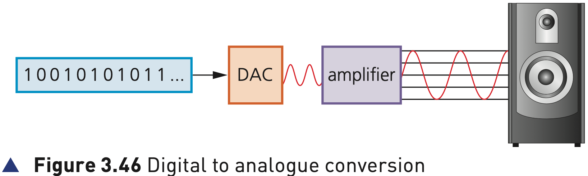
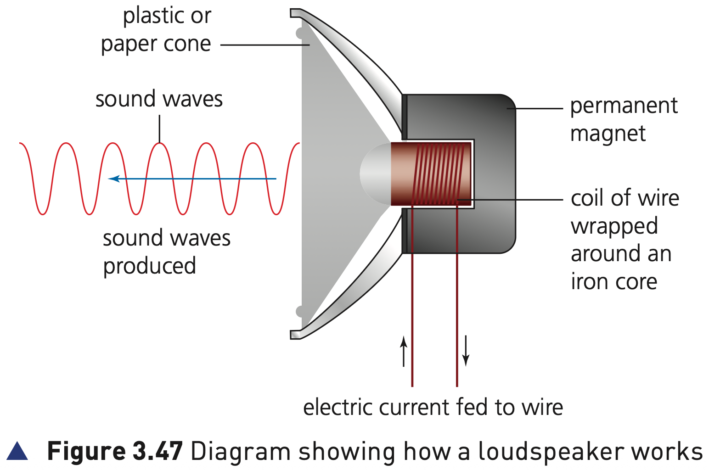

## Course Directory

### Return to the main outline

[← Back to Unit 3 Directory / 返回 Unit 3 目录](../../index.html)

## Loudspeakers

### Output devices that produce sound

Loudspeakers (扬声器) are output devices that produce sound.

When connected to a computer system, digitised sound stored on a file needs to be converted into sound.

The key route is: digital data → analogue electrical signal → physical vibration → sound waves.

## Digital to analogue conversion

### Figure 3.46: DAC and amplifier

{fig-align="center" width="92%"}

::: {.figure-note}
The digital data first passes through a digital to analogue converter (DAC), then through an amplifier before it can drive the loudspeaker.
:::

## DAC and amplifier

### Preparing the electrical signal

The digital data is first passed through a digital to analogue converter (DAC) (数模转换器), where it is changed into an electric current (电流).

This is then passed through an amplifier (放大器), since the current generated by the DAC will be very small.

The amplifier creates a current large enough to drive a loudspeaker.

## Loudspeaker structure

### Figure 3.47: how a loudspeaker works

{fig-align="center" width="88%"}

::: {.figure-note}
The key physical parts are the coil of wire, iron core, permanent magnet and plastic or paper cone.
:::

## How a loudspeaker works

### 1/3 Coil, iron core and electromagnet

When an electric current flows through the coil of wire (线圈) wrapped around an iron core (铁芯), the core becomes a temporary electromagnet.

A permanent magnet (永磁体) is positioned very close to this electromagnet.

## How a loudspeaker works

### 2/3 Varying current causes vibration

As the electric current through the coil of wire varies, the induced magnetic field in the iron core also varies.

This causes the iron core to be attracted towards the permanent magnet.

As the current varies, this causes the iron core to vibrate.

## How a loudspeaker works

### 3/3 Cone vibration produces sound waves

The iron core is attached to a cone made of paper or thin synthetic material.

When the iron core vibrates, the cone also vibrates.

This produces sound waves (声波).

## Full playback chain

### From file to sound

A complete answer should include:

digital data → DAC → electric current → amplifier → temporary electromagnet → cone vibration → sound waves.

This contrasts with a microphone input process, which uses ADC to convert analogue sound into digital values.

## Classroom Check

### Activity 3.4 style

Describe how music stored on backing store can be played through analogue loudspeakers.

A strong answer should not stop at “the speaker plays the file”; it must include DAC conversion, amplification, coil/core magnetism, cone vibration and sound waves.

## End

### Return to the main outline

[← Back to Unit 3 Directory / 返回 Unit 3 目录](../../index.html)
