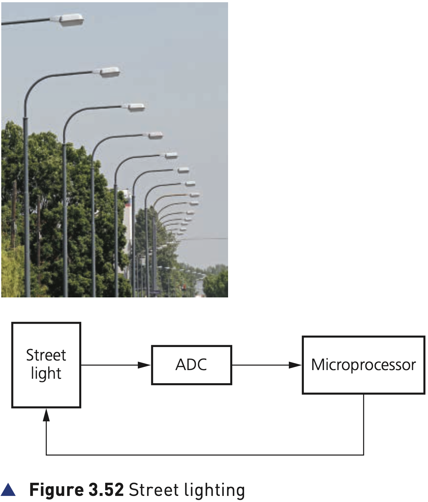
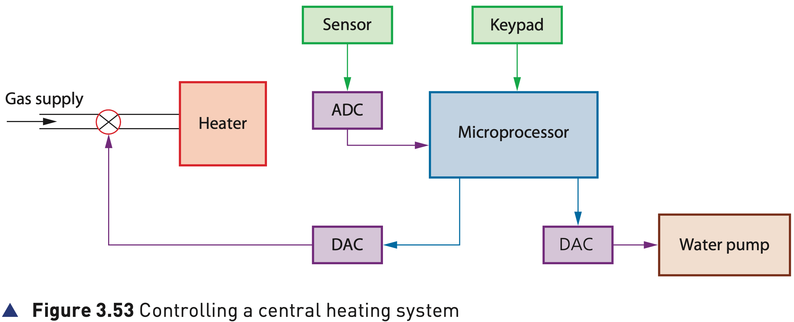
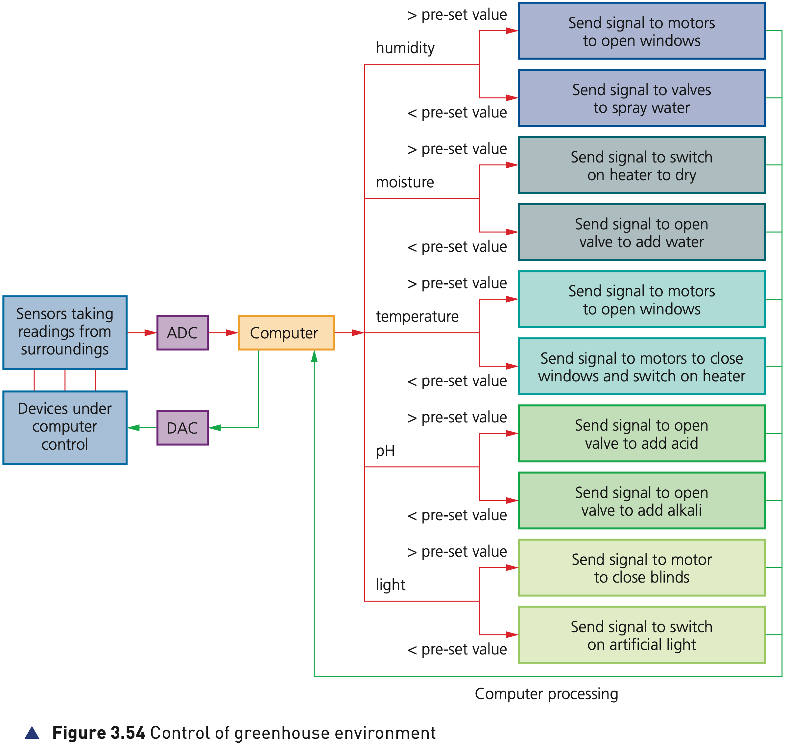
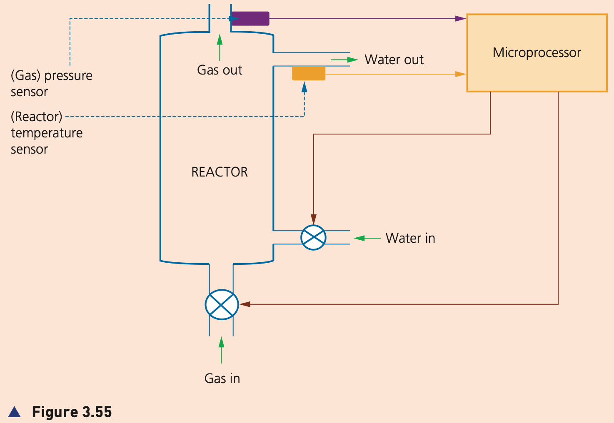
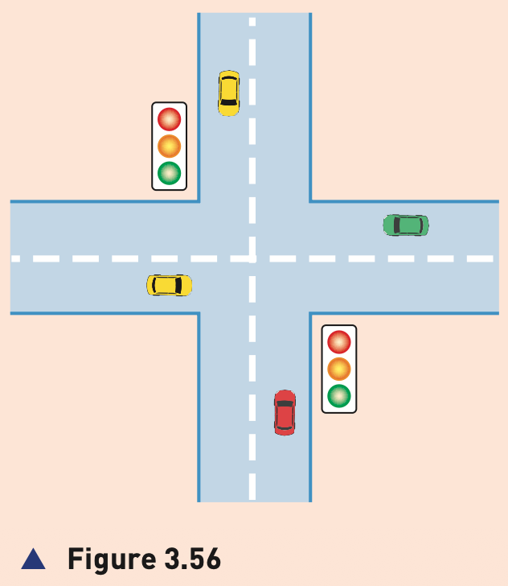

## Course Directory

### Return to the main outline

[← Back to Unit 3 Directory / 返回 Unit 3 目录](../../index.html)

## Control Applications

### One loop, several contexts

This deck follows the textbook order for control applications: street lighting, anti-lock braking systems, central heating systems, chemical process control and greenhouse environment control.

Keep the route visible: sensor → ADC → microprocessor → DAC/actuator → changed process.

## Figure 3.52

### Street lighting

{fig-align="center" width="78%"}

::: {.figure-note}
The street lamp is fitted with a light sensor which constantly sends data to the microprocessor.
:::

## Street Lighting 1/3

### Input and sampling

The light sensor sends data to the ADC interface.

The ADC changes the data into digital form and sends it to the microprocessor.

The data value changes according to whether it is sunny, cloudy, raining or night time.

The microprocessor samples the data every minute, or at some other frequency rate.

## Street Lighting 2/3

### Switching on

If the data from the sensor &lt; value stored in memory, a signal is sent from the microprocessor to the street lamp and the lamp is switched on.

The lamp stays switched on for 30 minutes before the sensor readings are sampled again.

This prevents the lamp flickering off and on during brief heavy cloud cover.

## Street Lighting 3/3

### Switching off

If the data from the sensor &gt;= value stored in memory, a signal is sent from the microprocessor to the street lamp and the lamp is switched off.

The lamp stays switched off for 30 minutes before sensor readings are sampled again.

This prevents the lamp flickering off and on during heavy cloud cover.

## Anti-Lock Braking 1/3

### Magnetic field sensors

Anti-lock braking systems (ABS) use magnetic field sensors to stop the wheels locking up if the brakes have been applied too sharply.

When one of the car wheels rotates too slowly, that is, it is locking up, a magnetic field sensor sends data to a microprocessor.

## Anti-Lock Braking 2/3

### Comparing wheel speed

The microprocessor checks the rotation speed of the other three wheels.

If they are different, that is, rotating faster, the microprocessor sends a signal to the braking system and the braking pressure to the affected wheel is reduced.

The wheel's rotational speed is then increased to match the other wheels.

## Anti-Lock Braking 3/3

### Constant adjustment

The checking of the rotational speed using magnetic field sensors is done several times a second.

The braking pressure to all the wheels can be constantly changing to prevent any wheel locking up under heavy braking.

This is felt as a judder on the brake pedal as the braking system is constantly switched off and on.

If one wheel rotates too quickly, braking pressure is increased to that wheel until it matches the other three.

## Figure 3.53

### Central heating

{fig-align="center" width="86%"}

::: {.figure-note}
The gas valve and water pump are controlled by the microprocessor through output control.
:::

## Central Heating 1/4

### Gas supply and water pump

In this example, a gas supply is used to heat water using a heater.

A valve on the gas supply is controlled by a microprocessor and is opened if the heating levels need to be increased.

A water pump is used to pump hot water around the central heating system whenever the temperature drops below a pre-set value.

## Central Heating 2/4

### Pre-set value

The required temperature is keyed in and stored in the microprocessor memory.

This is called the pre-set value.

The temperature sensor is constantly sending data readings to the microprocessor.

## Central Heating 3/4

### ADC and comparison

The sensor data is first sent to an ADC to convert the analogue data into digital data.

The digital data is sent to the microprocessor, and the microprocessor compares this data with the pre-set value.

If the temperature reading &gt;= pre-set value, then no action is taken.

## Central Heating 4/4

### Actuator outputs

If the temperature reading &lt; pre-set value, a signal is sent:

::: {.tight-list}
- to an actuator via a DAC to open the gas valve to the heater
- to an actuator via a DAC to turn on the water pump
:::

The process continues until the central heating is switched off.

## Chemical Process 1/3

### Two required conditions

A certain chemical process only works if:

::: {.tight-list}
- the temperature is above 70°C
- the pH acidity level is less than 3.5
:::

A heater is used to heat the reactor and valves are used to add acid when necessary.

The aim is to maintain the required acidity as well as the required temperature.

## Chemical Process 2/3

### Sensor readings

Temperature and pH sensors read data from the chemical process.

This data is converted to digital using an ADC and then sent to the computer.

The computer compares the incoming data with pre-set values stored in memory.

## Chemical Process 3/3

### Control rules

::: {.tight-list}
- if the temperature &lt; 70°C, a signal is sent to switch on the heater
- if the temperature &gt;= 70°C, a signal is sent to switch off the heaters
- if the pH &gt; 3.5, a signal is sent to open a valve and acid is added
- if the pH &lt;= 3.5, a signal is sent to close this valve
- computer signals are changed into analogue signals using a DAC so that heaters and valves can be controlled
:::

This continues as long as the computer system is activated.

## Figure 3.54

### Greenhouse environment

{fig-align="center" width="90%"}

::: {.figure-note}
Five different sensors could be used: humidity, moisture, temperature, pH and light.
:::

## Greenhouse 1/3

### Humidity path

Because of the number of sensors, this is clearly quite a complex problem.

Consider the humidity sensor only. It sends a signal to an ADC, which sends a digital signal to the computer.

The computer compares the input with stored pre-set values and decides what action needs to be taken.

## Greenhouse 2/3

### Humidity outputs

If humidity is &gt; pre-set value, the computer sends a signal to a DAC to operate the motors to open windows, reducing the humidity.

If humidity is &lt; pre-set value, the computer sends a signal to open valves to spray water into the air.

If the reading equals the pre-set value, then no action is taken.

## Greenhouse 3/3

### Other sensor outputs

::: {.tight-list}
- moisture: heater to dry, or open valve to add water
- temperature: open windows, or close windows and switch on heater
- pH: open valve to add acid, or open valve to add alkali
- light: close blinds, or switch on artificial light
:::

The control process continues as long as the system is switched on.

Similar arguments can be used for all five sensors.

## Activity 3.5 1/4

### Car air conditioning

An air conditioning unit in a car is being controlled by a microprocessor and a number of sensors.

::: {.tight-list}
- describe the main differences between control and monitoring of a process
- describe how the sensors and microprocessor would be used to control the air conditioning unit in the car
- name at least two different sensors that might be used
- explain the role of positive feedback in the description
- drawing a diagram of the intended process may be helpful
:::

## Activity 3.5 2/4

### Greenhouse pH

Look at Figure 3.54 and describe how the pH sensor would be used to control the acidity levels in the soil to optimise growing conditions in the greenhouse.

The answer should follow the same route as the other Figure 3.54 sensors: sensor reading, ADC, computer comparison with a pre-set value, DAC if needed, and output to a valve.

## Figure 3.55

### Nuclear reactor activity

{fig-align="center" width="82%"}

::: {.figure-note}
The pump symbol in Figure 3.55 represents a gas or liquid pump.
:::

## Activity 3.5 3/4

### 300°C and 10 bar

The nuclear reactor task states:

::: {.tight-list}
- a temperature sensor monitors the reactor temperature; if this exceeds 300°C, the water flow into the reactor is increased
- a pressure sensor monitors the gas pressure of carbon dioxide circulating in the reactor; if this is less than 10 bar, the gas pump is opened
- describe how the sensors and microprocessor are used to maintain the correct water temperature and gas pressure
- name other hardware devices needed, such as pumps, ADC, DAC and actuators
:::

## Figure 3.56

### Traffic light activity

{fig-align="center" width="52%"}

::: {.figure-note}
Figure 3.56 shows a junction controlled by traffic lights.
:::

## Activity 3.5 4/4

### Road sensors and light sequence

Describe how sensors in the road and a microprocessor are used to control the traffic at the junction.

The microprocessor is able to change the colour sequence of the traffic lights.

## Classroom Check

### Same loop in every application

A strong answer should include:

::: {.tight-list}
- the sensor and property being measured
- ADC before computer comparison if sensor data is analogue
- comparison with a threshold, stored value or pre-set value
- DAC and actuator/output device where physical control is needed
- repeated sampling so feedback changes the next readings
- the exact condition from the application, such as every minute, 30 minutes, 70°C, pH 3.5, 300°C or 10 bar
- Activity 3.5 wording: positive feedback, pH control, gas/liquid pump, road sensors and traffic-light colour sequence
:::

## End

### Return to the main outline

[← Back to Unit 3 Directory / 返回 Unit 3 目录](../../index.html)
