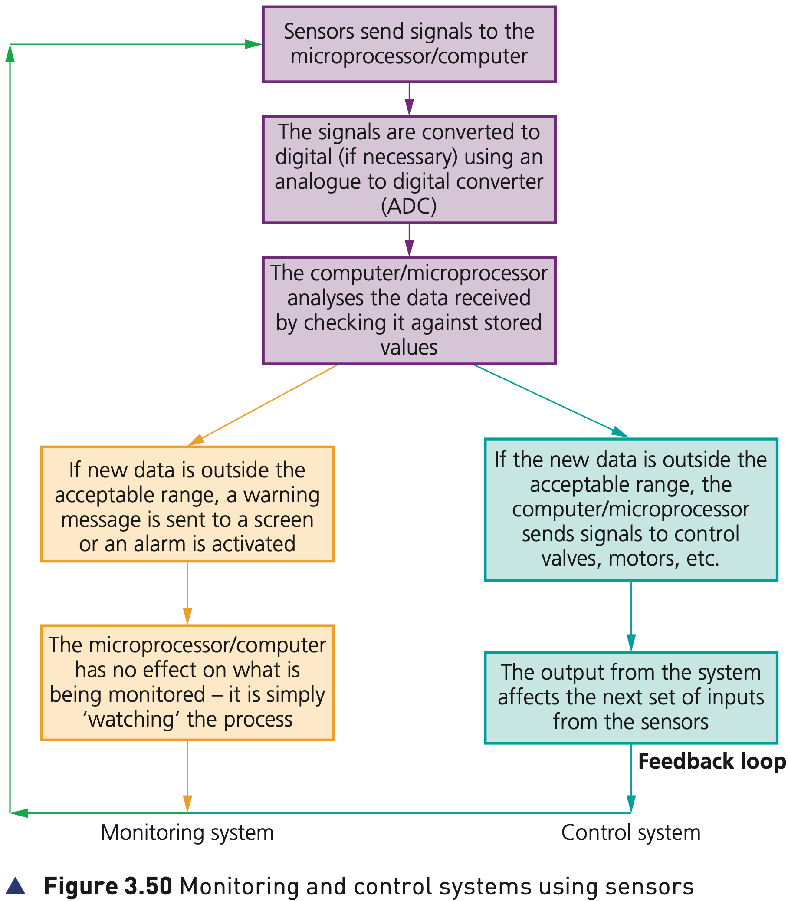
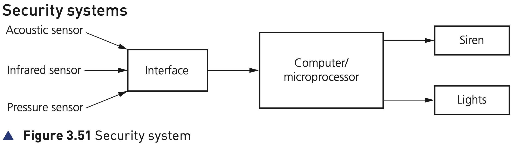

## Course Directory

### Return to the main outline

[← Back to Unit 3 Directory / 返回 Unit 3 目录](../../index.html)

## Monitoring Systems

### Watching the process

Sensors are used in both monitoring and control applications.

There is a subtle difference between how these two methods work.

In a monitoring system, the microprocessor/computer has no effect on what is being monitored; it is simply watching the process.

## Figure 3.50

### Monitoring path

{fig-align="center" width="94%"}

::: {.figure-note}
Use the left-hand side of Figure 3.50 for monitoring: sensor input, ADC if necessary, comparison with stored values, then a warning message or alarm output.
:::

## Monitoring Path

### Stored values and warnings

The sensors send signals to the microprocessor/computer.

The signals are converted to digital if necessary using an analogue to digital converter (ADC).

The computer/microprocessor analyses the data received by checking it against stored values.

## Monitoring Path

### Outside the acceptable range

If new data is outside the acceptable range, a warning message is sent to a screen or an alarm is activated.

The important distinction is that the system warns or displays; it does not change the process being monitored.

## Examples of Monitoring

### Textbook examples

::: {.tight-list}
- patient monitoring in a hospital for vital signs such as heart rate and temperature
- monitoring of intruders in a burglar alarm system
- checking the temperature levels in a car engine
- monitoring pollution levels in a river
:::

## Figure 3.51

### Security system

{fig-align="center" width="92%"}

::: {.figure-note}
Figure 3.51 concentrates on the sensor input side of the security system.
:::

Note: compare this to Figure 3.9, which shows the security system in more detail.

## Security System 1/3

### Activation and sensor inputs

The system is activated by keying in a password on a keypad.

::: {.tight-list}
- the infrared sensor picks up the movement of an intruder in the building
- the acoustic sensor picks up sounds such as footsteps or breaking glass
- the pressure sensor picks up the weight of an intruder coming through a door or through a window
:::

## Security System 2/3

### ADC, sampling and stored values

The sensor data is passed through an ADC if it is in an analogue form to produce digital data.

The computer/microprocessor samples the digital data coming from these sensors at a given frequency, for example every 5 seconds.

The data is compared with the stored values by the computer/microprocessor.

## Security System 3/3

### Siren, lights and reset

If any incoming data values are outside the acceptable range, the computer sends a signal:

::: {.tight-list}
- to a siren to sound the alarm
- to a light to start flashing lights
- through a DAC if the devices need analogue values to operate them
:::

The alarm continues to sound, or the lights continue to flash, until the system is reset with a password.

## Patient Monitoring 1/2

### Vital signs

A number of sensors are attached to the patient.

These measure vital signs such as temperature, heart rate and breathing rate.

The sensors are all attached to a computer system and constantly send data back to the computer.

## Patient Monitoring 2/2

### Alarm or digital readout

The computer samples the data at frequent intervals.

The range of acceptable values for each parameter is keyed into the computer, and the values from the sensors are compared with those keyed in.

If anything is out of the acceptable range, a signal is sent to sound an alarm.

If data from the sensors is within range, the values are shown in graphical form on a screen and/or a digital readout (digital read out).

Monitoring continues until the sensors are disconnected from the patient.

## Monitoring Answer Pattern

### What to include

::: {.tight-list}
- sensor readings are sent to the computer/microprocessor
- analogue readings pass through an ADC if necessary
- data is sampled at a stated frequency
- data is compared with stored or acceptable values
- if outside the acceptable range, a warning message, screen display, siren or alarm is triggered
- the system has no effect on what is being monitored
- in patient monitoring, monitoring continues until the sensors are disconnected
:::

## Classroom Check

### Keep monitoring separate from control

A complete answer should include:

::: {.tight-list}
- the sensors used and the physical property each one measures
- the ADC step if the sensor data is analogue
- comparison with stored values or an acceptable range
- the warning, alarm, screen output, siren or flashing lights
- the fact that monitoring only watches the process; it does not alter it
- the stopping condition where relevant, such as sensors being disconnected or the system being reset
:::

## End

### Return to the main outline

[← Back to Unit 3 Directory / 返回 Unit 3 目录](../../index.html)
