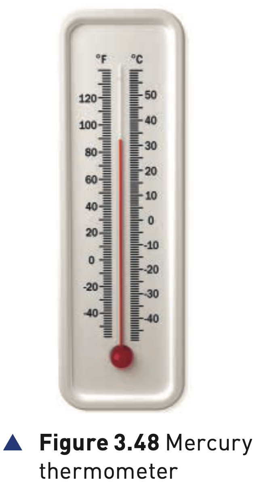
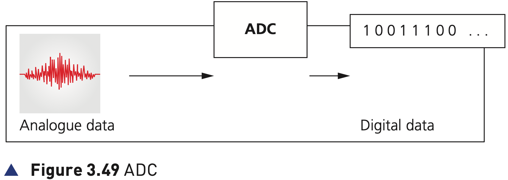

## Course Directory

### Return to the main outline

[← Back to Unit 3 Directory / 返回 Unit 3 目录](../../index.html)

## Sensors

### Physical properties

Sensors (传感器) are input devices which read or measure physical properties (物理属性) from their surroundings.

Examples include temperature, pressure, acidity level and length.

## Real Data

### Analogue in nature

Real data is analogue (模拟的) in nature; this means it is constantly changing and does not have a single discrete value.

Therefore, analogue data needs some form of interpretation (解释/判读) by the user.

## Figure 3.48

### Mercury thermometer

{fig-align="center" width="78%"}

The temperature measurement on a mercury thermometer requires the user to look at the height of the mercury column and use their best judgement by looking at the scale.

## Analogue Values

### Infinite possible readings

There are an infinite number of values depending on how precisely the height of the mercury column is measured.

Computers cannot make any sense of these physical quantities, so the data needs to be converted into a digital format.

## Figure 3.49

### Analogue to digital converter

{fig-align="center" width="96%"}

This is usually achieved by an analogue to digital converter, or ADC (模数转换器).

This device converts physical values into discrete digital values (离散数字值).

## DAC and Actuators

### Digital to analogue converter

When the computer is used to control devices, such as a motor or a valve, it is necessary to use a digital to analogue converter, or DAC (数模转换器).

These devices need analogue data to operate in many cases.

Actuators (执行器) are used in such control applications.

## Feedback

### Output changes the next input

Sensor readings may cause the microprocessor to, for example, alter a valve or a motor that will then change the next reading taken by the sensor.

The output from the microprocessor will impact on the next input received as it attempts to bring the system within the desired parameters.

This is known as feedback (反馈).

## Constant Sensor Values

### Sensors keep sending readings

Sensors send out constant values; they do not suddenly send a reading when the parameter they are measuring changes.

It is the microprocessor they are giving the input to that will analyse the incoming data and take the necessary action.

## Table 3.8 Sensors 1/5

### Temperature, moisture and humidity

::: {.clean-table}
| Sensor | Description of sensor | Example applications |
|---|---|---|
| Temperature sensors | Measures temperature of the surroundings by sending signals; these signals will change as the temperature changes. | Control of a central heating system; control/monitor a chemical process; control/monitor temperature in a greenhouse. |
| Moisture sensors | Measures water levels in, for example, soil; it is based on the electrical resistance of the sample being monitored. | Control/monitor moisture levels in soil in a greenhouse; monitor the moisture levels in a food processing factory. |
| Humidity sensors | Measures the amount of water vapour in a sample of air; the conductivity of air will change depending on the amount of water present. | Monitor humidity levels in a building; monitor humidity levels in a microchip factory; monitor/control humidity levels in the air in a greenhouse. |
:::

## Table 3.8 Sensors 2/5

### Light and infrared

::: {.clean-table}
| Sensor | Description of sensor | Example applications |
|---|---|---|
| Light | Uses photoelectric cells that produce an output in the form of an electric current depending on the brightness of the light. | Switching street lights on or off depending on light levels; switch on car headlights automatically when it gets dark. |
| Active infrared | Uses an invisible beam of infrared radiation picked up by a detector; if the beam is broken, there will be a change in the amount of infrared radiation reaching the detector. | Turn on car windscreen wipers automatically when it detects rain on the windscreen; security alarm system when an intruder breaks the infra-red beam. |
| passive infrared | Measures the heat radiation given off by an object, for example, the temperature of an intruder or the temperature in a fridge. | Security alarm system detecting body heat; monitor the temperature inside an industrial freezer or chiller unit. |
:::

## Table 3.8 Sensors 3/5

### Pressure, sound and gas

::: {.clean-table}
| Sensor | Description of sensor | Example applications |
|---|---|---|
| Pressure sensors | A pressure sensor is a transducer (换能器) and generates different electric currents depending on the pressure applied. | Weighing of lorries at a weighing station; measure the gas pressure in a nuclear reactor. |
| Acoustic/sound | These are basically microphones that convert detected sound into electric signals or pulses. | Pick up the noise of footsteps in a security system; detect the sound of liquids dripping at a faulty pipe joint. |
| Gas sensors | Common examples are oxygen or carbon dioxide sensors; they produce outputs that vary with the oxygen or carbon dioxide levels present. | Monitor pollution levels in the air at an airport; monitor oxygen and carbon dioxide levels in a greenhouse; monitor oxygen levels in a car exhaust. |
:::

## Table 3.8 Sensors 4/5

### Acidity, magnetic fields and motion

::: {.clean-table}
| Sensor | Description of sensor | Example applications |
|---|---|---|
| pH sensors | Measures acidity through changes in voltages in, for example, soil. | Monitor/control acidity levels in the soil in a greenhouse; control acidity levels in a chemical process. |
| Magnetic field sensors | Measures changes in magnetic fields; the signal output will depend on how the magnetic field changes. | Detect magnetic field changes in mobile phones and CD players; used in anti-lock braking systems in cars. |
| accelerometers | Measures acceleration and motion of an application, that is, the change in velocity; a piezoelectric cell output varies according to the change in velocity. | Used in cars to measure rapid deceleration and apply air bags in a crash; used by mobile phones to change between portrait and landscape mode. |
:::

## Table 3.8 Sensors 5/5

### Presence, flow and level

::: {.clean-table}
| Sensor | Description of sensor | Example applications |
|---|---|---|
| Proximity sensors | Detects the presence of a nearby object. | Detect when a face is close to a mobile phone screen and switch off screen when held to the ear. |
| Flow-rate sensors | Measures the flow rate of a moving liquid or gas and produces an output based on the amount of liquid or gas passing over the sensor. | Used in respiratory devices and inhalers in hospitals; measure gas flows in pipes, for example, natural gas. |
| level sensors | Uses ultrasonics to detect changing liquid levels, or capacitance/conductivity to measure static levels; level sensors can also be optical or mechanical in nature. | Monitor levels in a petrol tank in a car; monitor powder levels in tablet production; leak detection in refrigerant. |
:::

## Sensor Choice

### Link the sensor to the measured property

Exam answers should identify the property being measured before naming the sensor.

For example: soil acidity → pH sensor; gas pressure → pressure sensor; light level → light sensor; rapid deceleration → accelerometer.

## Classroom Check

### Keep the sensor answer precise

A complete answer should include:

::: {.tight-list}
- what physical property the sensor is reading or measuring
- why analogue data may need an ADC before the computer can use it
- why output to motors or valves may need a DAC and an actuator
- how feedback means the output can affect the next input
- that sensors send out constant values; the microprocessor analyses the incoming data
:::

## Bridge

### Monitoring and control applications

Sensors are used in both monitoring and control applications.

The next deck compares how these two methods work.

## End

### Return to the main outline

[← Back to Unit 3 Directory / 返回 Unit 3 目录](../../index.html)
