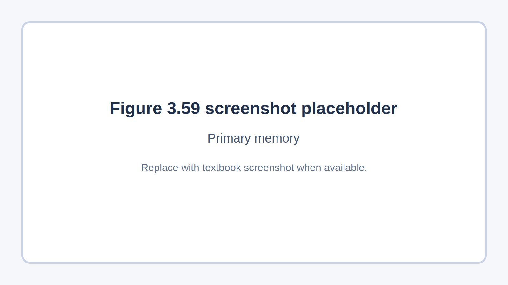
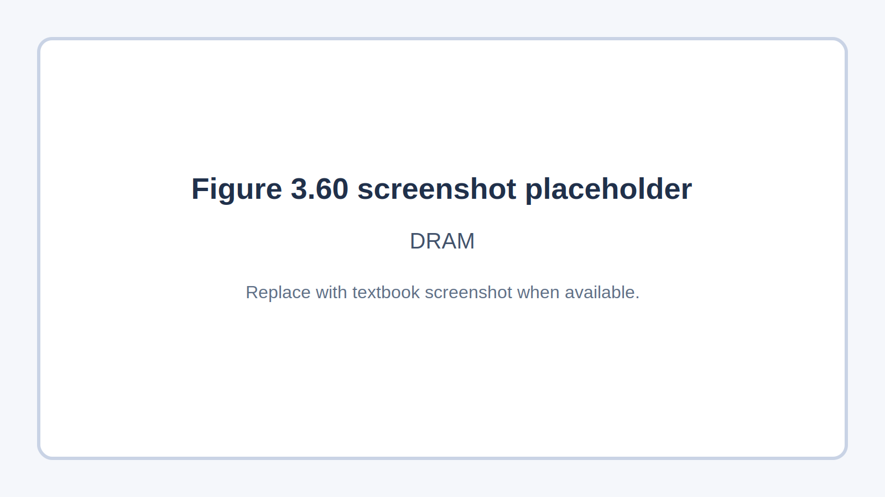
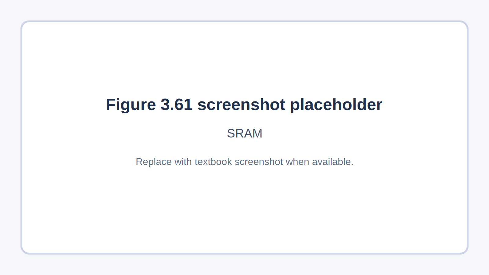

## Course Directory

### Return to the main outline

[← Back to Unit 3 Directory / 返回 Unit 3 目录](../../index.html)

## 3.3.1 Primary memory

### Random access memory (RAM)

All computer systems come with some form of RAM (随机存储器).

The word random refers to the fact that any memory location in RAM can be accessed independent of which memory location was last used.

When you run an application or program, data is retrieved from secondary storage and placed temporarily into RAM. Access time to locate data is much faster in RAM than in secondary or off-line devices.

## RAM Features

### What the textbook emphasises

Features of RAM include:

::: {.tight-list}
- it has read/write capability; it can be written to or read from
- the data can be changed by the user or the computer
- it is used to store data, files, part of an application or part of the operating system currently in use
- it is volatile memory (易失性内存), which means memory contents are lost when powering off the computer
:::

In general, the larger the size of RAM the faster the computer will operate.

## RAM When It Becomes Full

### Why more RAM helps

RAM never runs out of memory; it continues to operate but just becomes slower and slower as more data is stored.

As RAM becomes full, the CPU has to continually access secondary data storage devices to overwrite old data on RAM with new data.

By increasing the RAM size, the number of times this has to be done is considerably reduced; thus making the computer operate more quickly.

## Figure 3.59

### Primary memory

{fig-align="center" width="88%"}

Figure 3.59 screenshot placeholder: Primary memory.

## DRAM

### Transistors and capacitors

There are currently two types of RAM technology:

::: {.tight-list}
- dynamic RAM (DRAM)
- static RAM (SRAM)
:::

Each DRAM chip consists of transistors and capacitors.

::: {.tight-list}
- capacitor — this holds the bits of information (0 or 1)
- transistor — this acts like a switch; it allows the chip control circuitry to read the capacitor or change the capacitor's value
- DRAM must be constantly refreshed
- the capacitor needs to be re-charged every 15 microseconds
:::

## Figure 3.60

### DRAM

{fig-align="center" width="88%"}

Figure 3.60 screenshot placeholder: DRAM.

## DRAM Advantages

### Compared with SRAM

DRAMs have a number of advantages over SRAMs:

::: {.tight-list}
- they are much less expensive to manufacture than SRAM
- they consume less power than SRAM
- they have a higher memory capacity than SRAM
:::

## SRAM

### Flip-flops and speed

A major difference between SRAM and DRAM is that SRAM (静态随机存储器) doesn't need to be constantly refreshed.

It makes use of flip-flops (触发器), which hold each bit of memory.

SRAM is much faster than DRAM when it comes to data access:

::: {.tight-list}
- SRAM access time is typically 25 nanoseconds
- DRAM access time is typically 60 nanoseconds
:::

## Figure 3.61

### SRAM

{fig-align="center" width="88%"}

Figure 3.61 screenshot placeholder: SRAM.

## Table 3.9

### Differences between DRAM and SRAM

::: {.clean-table}
| DRAM | SRAM |
|---|---|
| consists of a number of transistors and capacitors | uses flip flops to hold each bit of memory |
| needs to be constantly refreshed | does not need to be constantly refreshed |
| less expensive to manufacture than SRAM | has a faster data access time than DRAM |
| has a higher memory capacity than SRAM | CPU memory cache makes use of SRAM |
| main memory is constructed from DRAM |  |
| consumes less power than SRAM |  |
:::

## Memory Cache

### Why SRAM is used there

DRAM is the most common type of RAM used in computers, but where absolute speed is essential, for example, in the CPU's memory cache (高速缓存), SRAM is the preferred technology.

Memory cache is a high-speed portion of the memory. It is effective because most programs access the same data or instructions many times.

By keeping as much of this information as possible in SRAM, the computer avoids having to access the slower DRAM.

## Classroom Check

### Keep the RAM distinctions precise

A complete answer should include:

::: {.tight-list}
- that RAM is volatile and can be written to and read from
- that any memory location in RAM can be accessed independently of the last one used
- that DRAM uses transistors and capacitors and needs constant refresh
- that SRAM uses flip-flops and does not need refresh
- that SRAM is faster and is used in memory cache
- that DRAM is cheaper and has higher capacity
:::

## Bridge

### Next: ROM

The next deck stays within 3.3.1 Primary memory and covers ROM.

## End

### Return to the main outline

[← Back to Unit 3 Directory / 返回 Unit 3 目录](../../index.html)
