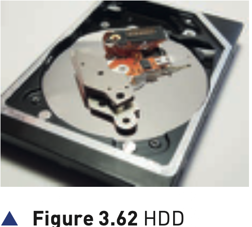
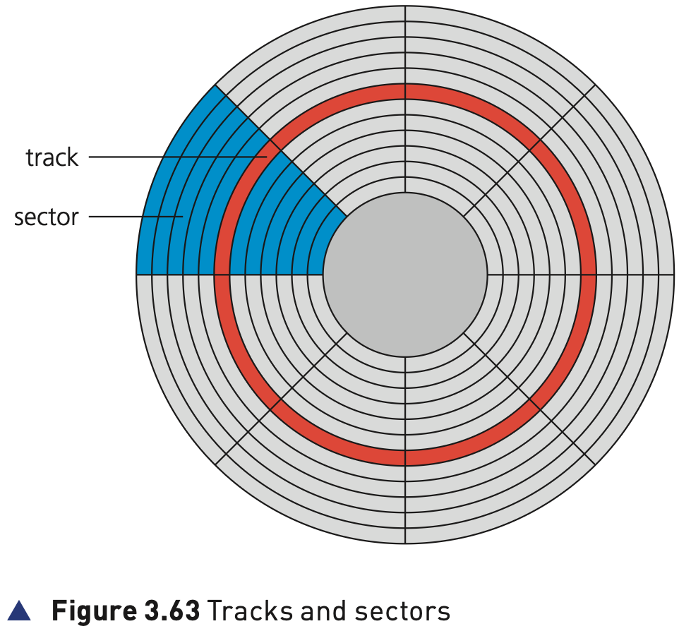

## Course Directory

### Return to the main outline

[← Back to Unit 3 Directory / 返回 Unit 3 目录](../../index.html)

## 3.3.3 Magnetic storage

### Hard disk drives (HDD)

Secondary (and off-line) storage falls into three categories according to the technology used:

::: {.tight-list}
- magnetic (磁性)
- solid state (固态)
- optical (光存储)
:::

Hard disk drives (HDD) are still one of the most common methods used to store data on a computer.

## Figure 3.62

### HDD

{fig-align="center" width="72%"}

## HDD Structure

### Platters and read-write heads

Data is stored in a digital format on the magnetic surfaces of the disks (or platters).

::: {.tight-list}
- the hard disk drive will have a number of platters that can spin at about 7000 times a second
- read-write heads (读写磁头) consist of electromagnets that are used to read data from or write data to the platters
- platters can be made from aluminium, glass or a ceramic material
- a number of read-write heads can access all of the surfaces of the platters in the disk drive
- normally each platter will have two surfaces which can be used to store data
:::

## Figure 3.63

### Tracks and sectors

{fig-align="center" width="78%"}

These read-write heads can move very quickly. Typically, they can move from the centre of the disk to the edge of the disk (and back again) 50 times a second.

Data is stored on the surface in sectors (扇区) and tracks (磁道). A sector on a given track will contain a fixed number of bytes.

## Latency

### Why access is slow

Unfortunately, hard disk drives have very slow data access when compared to, for example, RAM.

Many applications require the read-write heads to constantly look for the correct blocks of data; this means a large number of head movements.

Latency (延迟) is defined as the time it takes for a specific block of data on a data track to rotate around to the read-write head.

Users will sometimes notice the effect of latency when they see messages such as 'Please wait' or, at its worst, 'not responding'.

## Fragmentation and Removable HDDs

### Performance and portability

When a file or data is stored on a HDD, the required number of sectors needed to store the data will be allocated. However, the sectors allocated may not be adjacent to each other.

Through time, the HDD will undergo numerous deletions and editing which leads to sectors becoming increasingly fragmented (碎片化), resulting in a gradual deterioration of HDD performance.

Defragmentation software (磁盘碎片整理软件) can improve this situation by 'tidying up' the disk sectors.

All data in a given sector on a HDD will be read in order (that is, sequentially); however, access to the sector itself will be by a direct read-write head movement.

Removable hard disk drives are essentially HDDs external to the computer that can be connected to the computer using one of the USB ports.

## Classroom Check

### Keep the HDD description faithful

A complete answer should include:

::: {.tight-list}
- that HDDs are a form of magnetic storage
- that data is stored on magnetic platters and accessed by read-write heads
- that data is organised in tracks and sectors
- that latency is the time taken for a data block to rotate round to the read-write head
- that fragmentation slows access because sectors may not be adjacent
- that removable HDDs can be connected using a USB port
:::

## Bridge

### Next: solid-state storage

The next decks move from magnetic storage to solid-state storage, including SSD and flash memory.

## End

### Return to the main outline

[← Back to Unit 3 Directory / 返回 Unit 3 目录](../../index.html)
