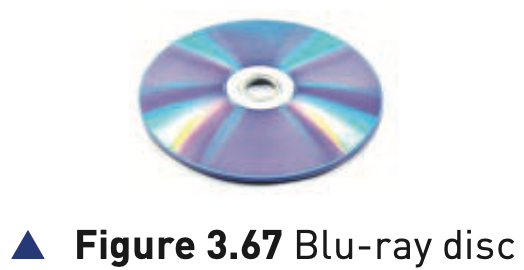
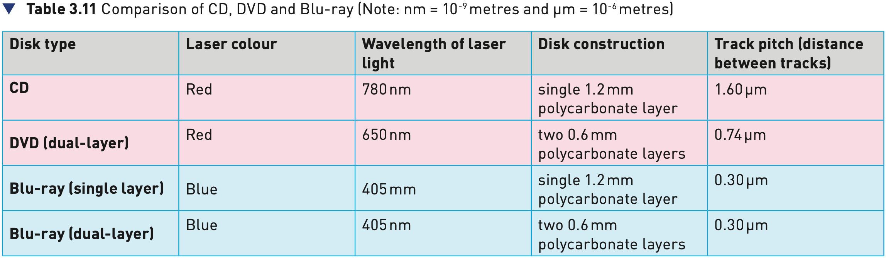

## Course Directory

### Return to the main outline

[← Back to Unit 3 Directory / 返回 Unit 3 目录](../../index.html)

## 3.3.3 Optical storage

### Blu-ray discs

Blu-ray discs are another example of optical storage media. However, they are fundamentally different to DVDs in their construction and in the way they carry out read-write operations.

Note: it is probably worth mentioning why they are called Blu-ray rather than Blue-ray; the simple reason is it was impossible to copyright the word 'Blue' and hence the use of the word 'Blu'.

## Figure 3.67

### Blu-ray disc

{fig-align="center" width="76%"}

## Main Differences

### DVD and Blu-ray

The main differences between DVD and Blu-ray are:

::: {.tight-list}
- a blue laser, rather than a red laser, is used to carry out read and write operations
- the wavelength of blue light is only 405 nanometres compared to 650 nm for red light
- using blue laser light means that the pits and lands can be much smaller
- consequently, Blu-ray can store up to five times more data than normal DVD
- single-layer Blu-ray discs use a 1.2 mm thick polycarbonate disk
- dual-layer Blu-ray and normal DVDs both use a sandwich of two 0.6 mm thick disks
- Blu-ray disks automatically come with a secure encryption system to help prevent piracy and copyright infringement
- the data transfer rate for a DVD is 10 Mbps and for a Blu-ray disc it is 36 Mbps
:::

## Capacity and Interactivity

### Comparison notes from the textbook

Since Blu-ray discs can come in single layer or dual-layer format (unlike DVD, which is always dual-layer), it is worth comparing the differences in capacity and interactivity of the two technologies.

::: {.tight-list}
- a standard dual-layer DVD has a storage capacity of 4.7 GB
- a single-layer Blu-ray disc has a storage capacity of 27 GB
- a dual-layer Blu-ray disc has a storage capacity of 50 GB
:::

Blu-ray allows greater interactivity than DVDs. For example, with Blu-ray, it is possible to:

::: {.tight-list}
- record high definition television programmes
- skip quickly to any part of the disc
- create playlists of recorded movies and television programmes
- edit or re-order programmes recorded on the disc
- automatically search for empty space on the disc to avoid over-recording
- access websites and download subtitles and other interesting features
:::

## Table 3.11

### Comparison of CD, DVD and Blu-ray

{fig-align="center" width="92%"}

## Common Uses

### Movies, games and software

The most common use of DVD and Blu-ray is the supply of movies or games.

The memory capacity of CDs is not big enough to store most movies.

All these optical storage media are used as back-up systems (备份系统) for photos, music and multimedia files.

Manufacturers sometimes supply their software, for example printer drivers, using CDs and DVDs. When the software is supplied in this way, the disk is usually in a read-only format.

## Classroom Check

### Focus on the textbook comparison

A complete answer should include:

::: {.tight-list}
- that Blu-ray uses a blue laser at 405 nm rather than a red laser
- that smaller pits and lands allow Blu-ray to store much more data than DVD
- that single-layer Blu-ray is 27 GB and dual-layer Blu-ray is 50 GB
- that Blu-ray comes with a secure encryption system
- that Blu-ray allows greater interactivity than DVD
- that DVD and Blu-ray are commonly used for movies or games
:::

## Bridge

### Next: 3.3.4 Virtual memory

The next deck moves from storage media to virtual memory.

## End

### Return to the main outline

[← Back to Unit 3 Directory / 返回 Unit 3 目录](../../index.html)
