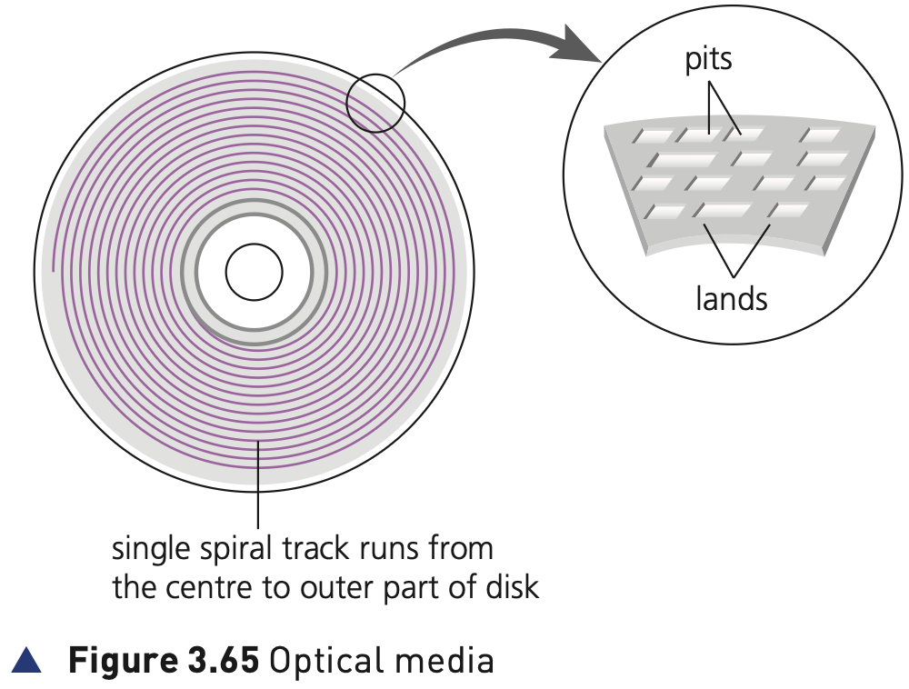
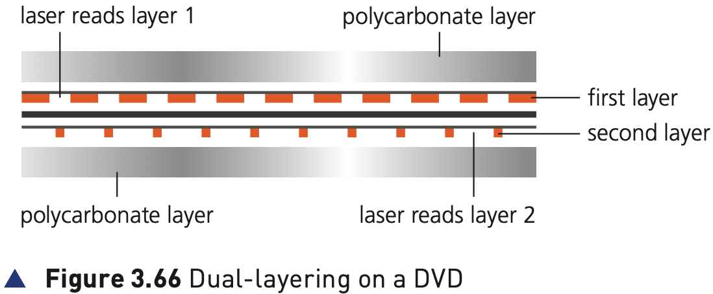

## Course Directory

### Return to the main outline

[← Back to Unit 3 Directory / 返回 Unit 3 目录](../../index.html)

## 3.3.3 Optical storage

### CD/DVD disks

CDs and DVDs are described as optical storage devices (光存储设备). Laser light is used to read and write data to and from the surface of the disk.

## Figure 3.65

### Optical media

{fig-align="center" width="74%"}

Both CDs and DVDs use a thin layer of metal alloy or light-sensitive organic dye to store the data.

Both systems use a single spiral track which runs from the centre of the disk to the edge.

When a disk spins, the optical head moves to the point where the laser beam contacts the disk surface and follows the spiral track from the centre outwards.

## CD/DVD Reading and Writing

### Pits, lands and sectors

As with a HDD, a CD/DVD is divided into sectors allowing direct access to data.

As in the case of HDD, the outer part of the disk runs faster than the inner part of the disk.

The data is stored in pits (凹点) and lands (平面) on the spiral track.

A red laser is used to read and write the data.

CDs and DVDs can be designated 'R' (write once only) or 'RW' (can be written to or read from many times).

## Figure 3.66

### Dual-layering on a DVD

{fig-align="center" width="78%"}

## DVD Technology

### Why DVD stores more data

DVD technology is slightly different to that used in CDs. One of the main differences is the potential for dual-layering (双层记录), which considerably increases the storage capacity.

::: {.tight-list}
- there are two individual recording layers
- two layers of a standard DVD are joined together with a transparent polycarbonate spacer
- a very thin reflector is sandwiched between the two layers
- reading and writing of the second layer is done by a red laser focusing at a fraction of a millimetre difference compared to the first layer
:::

Standard single-layer DVDs still have a larger storage capacity than CDs because the 'pit' size and track width are both smaller.

DVDs use lasers with a wavelength of 650 nanometres; CDs use lasers with a wavelength of 780 nanometres.

The shorter the wavelength of the laser light, the greater the storage capacity of the medium.

## Typical Uses

### Software distribution and transfer

Manufacturers sometimes supply their software, for example printer drivers, using CDs and DVDs.

When the software is supplied in this way, the disk is usually in a read-only format.

CDs and DVDs can also be used to transfer files between computers and as back-up systems for photos, music and multimedia files.

## Classroom Check

### Keep the optical-storage wording precise

A complete answer should include:

::: {.tight-list}
- that CDs and DVDs are optical storage devices using laser light
- that both use a single spiral track from the centre to the edge of the disk
- that data is stored in pits and lands
- that CDs/DVDs can be R or RW
- that DVD technology can use dual-layering
- that DVDs use 650 nm lasers and CDs use 780 nm lasers
:::

## Bridge

### Next: Blu-ray discs

The next deck continues the optical storage section with Blu-ray discs.

## End

### Return to the main outline

[← Back to Unit 3 Directory / 返回 Unit 3 目录](../../index.html)
