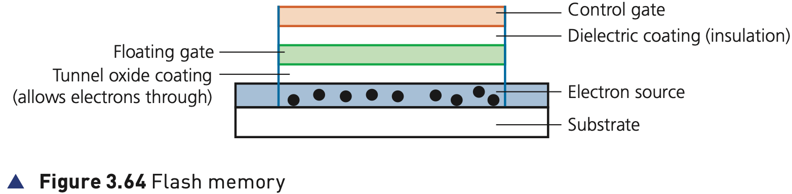

## Course Directory

### Return to the main outline

[← Back to Unit 3 Directory / 返回 Unit 3 目录](../../index.html)

## 3.3.3 Solid-state storage

### Solid state drives (SSD)

Latency is an issue in HDDs as described earlier. A solid state drive (SSD) removes this issue considerably since it has no moving parts and all data is retrieved at the same rate.

They do not rely on magnetic properties. The most common type of solid state storage devices store data by controlling the movement of electrons (电子) within NAND or NOR chips.

## Floating Gate and Control Gate

### How the data is stored

The data is stored as 0s and 1s in millions of tiny transistors. At each junction one transistor is called a floating gate and the other is called a control gate.

This effectively produces a non-volatile rewritable memory.

Floating gate and control gate transistors use CMOS (complementary metal oxide semiconductor) NAND technology.

## Figure 3.64

### Flash memory

{fig-align="center" width="78%"}

Flash memories make use of a matrix (矩阵). At each intersection on the matrix there is a floating gate and a control gate.

## Bit Values and Charge

### Why the memory is non-volatile

A dielectric coating (绝缘层) separates the two transistors, which allows the floating gate transistor to retain its charge.

::: {.tight-list}
- the floating gate transistor has a value of 1 when it is charged
- it has a value of 0 when it is not charged
- to program one of these intersection cells, a voltage is applied to the control gate
- electrons from the electron source are attracted to it
- due to the dielectric coating, the electrons become trapped in the floating gate
:::

After about 12 months, this charge can leak away, which is why a solid state device should be used at least once a year to be certain it will retain its memory.

## SSD Benefits

### Why SSD became common

The main benefits of this newer solid state technology over hard disk drives are:

::: {.tight-list}
- they are more reliable (no moving parts to go wrong)
- they are considerably lighter (which makes them suitable for laptops)
- they do not have to get up to speed before they work properly
- they have a lower power consumption
- they run much cooler than HDDs
- because of no moving parts, they are very thin
- data access is considerably faster than HDD
:::

## SSD Drawbacks

### Endurance and erase-before-write

The main drawback of SSD is still the longevity (寿命) of the technology.

Most solid state storage devices are conservatively rated at only 20 GB of write operations per day over a three year period. This is known as SSD endurance.

For this reason, SSD technology is still not used in all servers, for example, where a huge number of write operations take place every day.

However, the durability of these solid state systems is being improved by a number of manufacturers and they are rapidly becoming more common in applications such as servers and cloud storage devices.

It is also not possible to over-write existing data on a flash memory device; it is necessary to first erase the old data and then write the new data at the same location.

## Classroom Check

### Keep the SSD explanation tied to the textbook

A complete answer should include:

::: {.tight-list}
- that SSD uses electrons in NAND/NOR chips rather than magnetic platters
- that each junction uses a floating gate and a control gate
- that a dielectric coating traps charge so the memory is non-volatile
- that SSD has no moving parts and therefore lower latency than HDD
- that SSD has endurance limits and existing data must be erased before new data is written
:::

## Bridge

### Next: memory sticks and flash memories

The next deck stays within 3.3.3 Solid-state storage and covers memory sticks / flash memories.

## End

### Return to the main outline

[← Back to Unit 3 Directory / 返回 Unit 3 目录](../../index.html)
