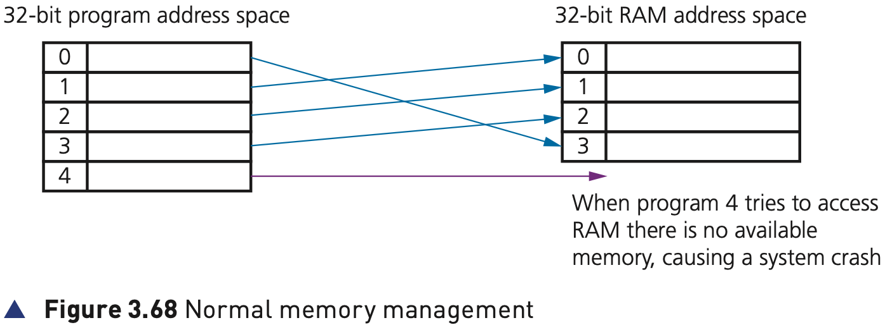
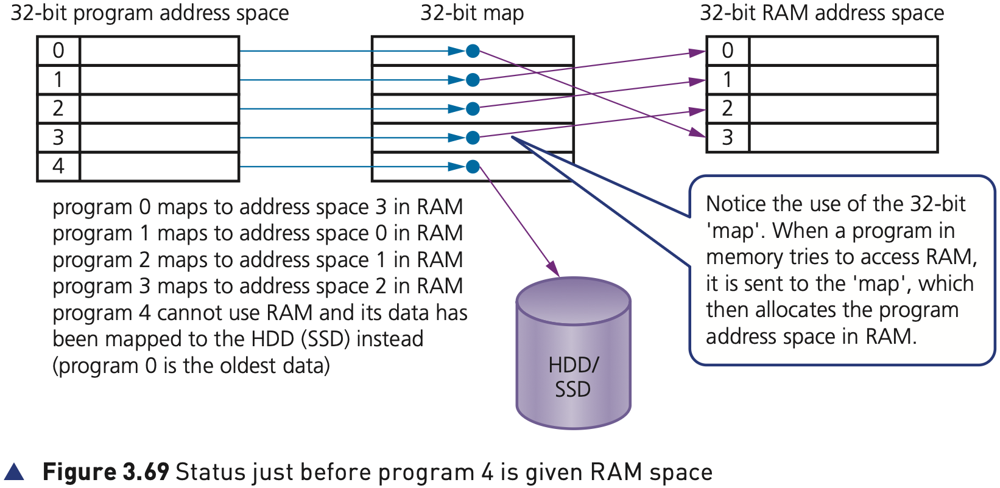
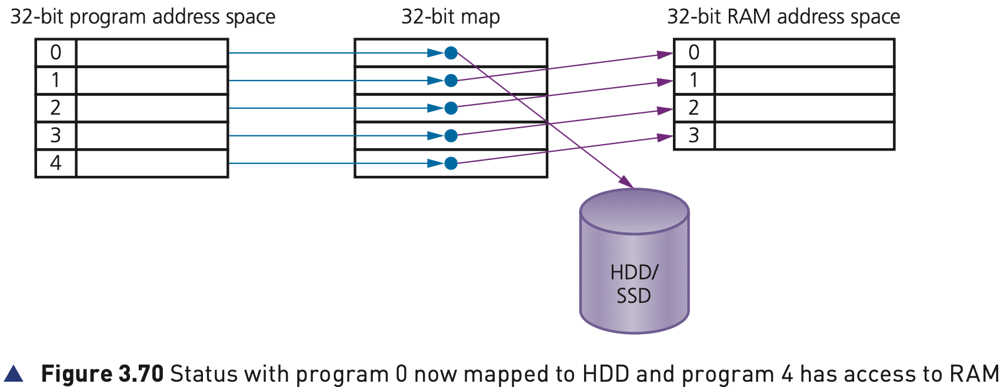

## Course Directory

### Return to the main outline

[← Back to Unit 3 Directory / 返回 Unit 3 目录](../../index.html)

## 3.3.4 Virtual memory

### Why it is needed

One of the problems associated with memory management is the case when processes run out of RAM.

If the amount of available RAM is exceeded due to multiple programs running, it is likely to cause a system crash.

This can be solved by utilising the hard disk drive (or SSD) if we need more memory. This is the basis behind virtual memory (虚拟内存).

Essentially, RAM is the physical memory, while virtual memory is RAM + swap space on the hard disk or SSD.

## Figure 3.68

### Without virtual memory

Suppose we have five programs (numbered 0 to 4) that are in memory, all requiring access to RAM.

{fig-align="center" width="88%"}

When program 4 tries to access RAM there is no available memory, causing a system crash.

## Figure 3.69

### Status just before program 4 is given RAM space

To allow all five programs to access RAM as required, data is moved out of RAM into HDD/SSD and then other data is moved out of HDD/SSD into RAM.

{fig-align="center" width="90%"}

Notice the use of the 32-bit map. When a program in memory tries to access RAM, it is sent to the map, which then allocates the program address space in RAM.

Program 4 cannot use RAM yet and its data has been mapped to the HDD/SSD instead because program 0 is the oldest data.

## Figure 3.70

### Status with program 0 mapped to HDD/SSD

Virtual memory now moves the oldest data out of RAM into the HDD/SSD to allow program 4 to gain access to RAM.

{fig-align="center" width="90%"}

The map is updated to reflect the new situation:

::: {.tight-list}
- data from program 0 is now mapped to the HDD/SSD instead
- address space 3 is left free for use by program 4
- program 4 now maps to address space 3 in RAM
:::

Virtual memory gives the illusion of unlimited memory being available.

## Paging, Benefits and Drawbacks

### What the textbook emphasises

In computer operating systems, paging (分页) is used by memory management to store and retrieve data from HDD/SSD and copy it into RAM.

A page is a fixed-length consecutive block of data utilised in virtual memory systems.

The main benefits of virtual memory are:

::: {.tight-list}
- programs can be larger than physical memory and still be executed
- there is no need to waste memory with data that is not being used
- it reduces the need to buy and install more expensive RAM memory
:::

However, accessing data in virtual memory is slower, so the larger the RAM the faster the CPU can operate.

## Disk Thrashing

### The main drawback

When using HDD for virtual memory the main drawback is disk thrashing (磁盘抖动).

As main memory fills, more and more data needs to be swapped in and out of virtual memory leading to a very high rate of hard disk read/write head movements.

If more and more time is spent moving data in and out of memory than actually doing any processing, then the processing speed of the computer will be considerably reduced.

A point can be reached when the execution of a process comes to a halt since the system is so busy moving data in and out of memory rather than doing any actual execution. This is known as the thrash point.

Thrashing can be reduced by:

::: {.tight-list}
- installing more RAM
- reducing the number of programs running at a time
- reducing the size of the swap file (交换文件)
- making use of a solid state drive (SSD) rather than using HDD
:::

## Classroom Check

### Keep virtual memory tied to the textbook model

A complete answer should include:

::: {.tight-list}
- that virtual memory is RAM + swap space on the hard disk or SSD
- that virtual memory avoids a system crash when RAM is exceeded
- that the textbook model uses a map to show which program is in RAM and which is on HDD/SSD
- that the oldest data can be moved out of RAM to make space
- that paging uses fixed-length blocks called pages
- that disk thrashing is the main drawback when too much swapping happens
:::

## Bridge

### Next: 3.3.5 Cloud storage

The next deck moves from virtual memory to cloud storage.

## End

### Return to the main outline

[← Back to Unit 3 Directory / 返回 Unit 3 目录](../../index.html)
