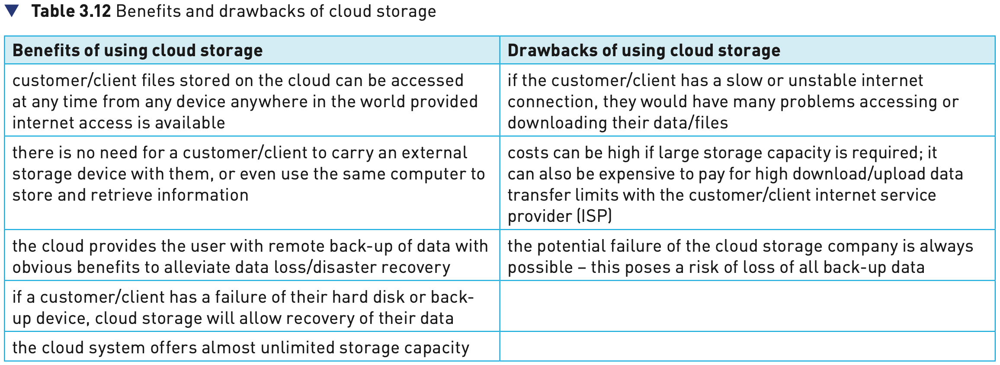

## Course Directory

### Return to the main outline

[← Back to Unit 3 Directory / 返回 Unit 3 目录](../../index.html)

## 3.3.5 Cloud storage

### Public and private cloud computing

Cloud storage is a method of data storage where data is stored on remote servers.

The same data is stored on more than one server in case of maintenance or repair, allowing clients to access data at any time. This is known as data redundancy (数据冗余).

The physical environment is owned and managed by a hosting company and may include hundreds of servers in many locations.

## Three Common Systems

### Public, private and hybrid cloud

There are three common systems:

::: {.tight-list}
- Public cloud — the customer/client and cloud storage provider are different companies
- Private cloud — storage is provided by a dedicated environment behind a company firewall; customer/client and cloud storage provider are integrated and operate as a single entity
- Hybrid cloud — a combination of the two above environments; some data resides in the private cloud and less sensitive or less commercial data can be accessed from a public cloud storage provider
:::

Instead of saving data on a local hard disk or other storage device, a user can save their data 'in the cloud'.

## Table 3.12

### Benefits and drawbacks of cloud storage

{fig-align="center" width="94%"}

## Data Security

### Questions the textbook raises

Companies that transfer vast amounts of confidential data from their own systems to a cloud service provider are effectively relinquishing control of their own data security.

This raises a number of questions:

::: {.tight-list}
- what physical security exists regarding the building where the data is housed?
- how good is the cloud service provider's resistance to natural disasters or power cuts?
- what safeguards exist regarding personnel who work for the cloud service company?
:::

## Potential Data Loss

### Why some users remain nervous

There is a risk that important and irreplaceable data could be lost from the cloud storage facilities.

Actions from hackers, such as gaining access to accounts or pharming attacks, could lead to loss or corruption of data.

Users need to be certain that sufficient safeguards exist to overcome these risks.

## Security Breach Examples

### Textbook examples

The textbook gives several examples:

::: {.tight-list}
- the XEN security threat forced several cloud operators to reboot all their cloud servers
- a large cloud service provider permanently lost data during a routine back-up procedure
- the celebrity photos cloud hacking scandal leaked more than 100 private photos
- in 2016, the National Electoral Institute of Mexico had 93 million voter registrations compromised
:::

These examples suggest why some people are nervous of using cloud storage for important files.

## Classroom Check

### Keep the cloud-storage answer concrete

A complete answer should include:

::: {.tight-list}
- that cloud storage stores data on remote servers
- that data redundancy means the same data is stored on more than one server
- the three systems: public, private and hybrid cloud
- benefits and drawbacks should match Table 3.12
- that data security and pharming risks are important concerns
- that the textbook gives real examples of major cloud-security breaches
:::

## Bridge

### Next: 3.4 Network hardware

The next section moves from storage to network hardware.

## End

### Return to the main outline

[← Back to Unit 3 Directory / 返回 Unit 3 目录](../../index.html)
