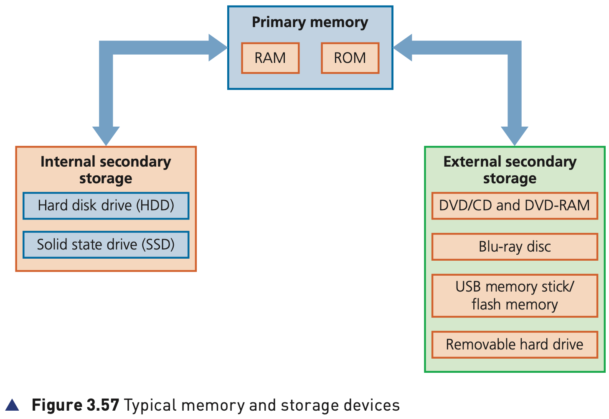
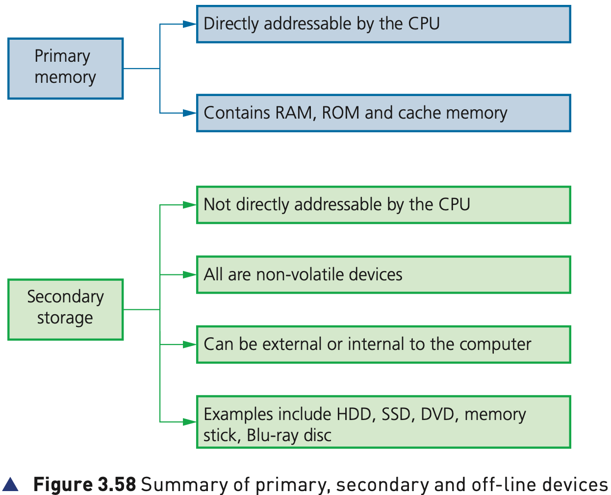

## Course Directory

### Return to the main outline

[← Back to Unit 3 Directory / 返回 Unit 3 目录](../../index.html)

## 3.3 Data storage

### Memory and storage

All computers require some form of memory (内存) and storage (存储).

Memory is usually referred to as the internal devices used to store data that the computer can access directly. This is also known as primary memory (主存储器). This memory can be the user's workspace, temporary data or data that is key to running the computer.

Storage devices allow users to store applications, data and files. The user's data is stored permanently and they can change it or read it as they wish.

## Why Storage Is Needed

### Transfer and data loss protection

Storage needs to be larger than internal memory since the user may wish to store large files such as music files or videos.

Storage devices can also be removable to allow data, for example, to be transferred between computers.

Removable devices allow a user to store important data in a different location in case of data loss (数据丢失).

However, all of this removable storage has become less important with the advent of technology such as data drop (数据投送) and cloud storage (云存储).

## Figure 3.57

### Typical memory and storage devices

{fig-align="center" width="88%"}

## Two Distinct Groups

### Primary memory and secondary storage

Memory and storage devices can be split up into two distinct groups:

::: {.tight-list}
- primary memory (主存储器)
- secondary storage (二级存储)
:::

## Figure 3.58

### Summary of primary and secondary devices

{fig-align="center" width="90%"}

The key distinction is whether a device is directly addressable by the CPU.

## Classroom Check

### Keep the distinction precise

A complete answer should include:

::: {.tight-list}
- that memory refers to internal devices that the computer can access directly
- that this is also known as primary memory
- that storage is used to hold applications, data and files permanently
- that memory and storage devices are split into primary memory and secondary storage
- that the key difference is whether the device is directly addressable by the CPU
:::

## Bridge

### Next: 3.3.1 Primary memory

The next decks explain primary memory, including RAM, DRAM, SRAM and ROM.

## End

### Return to the main outline

[← Back to Unit 3 Directory / 返回 Unit 3 目录](../../index.html)
