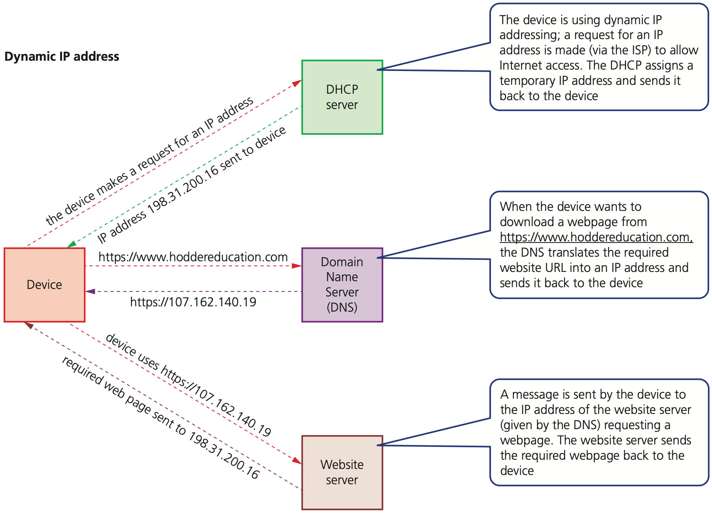
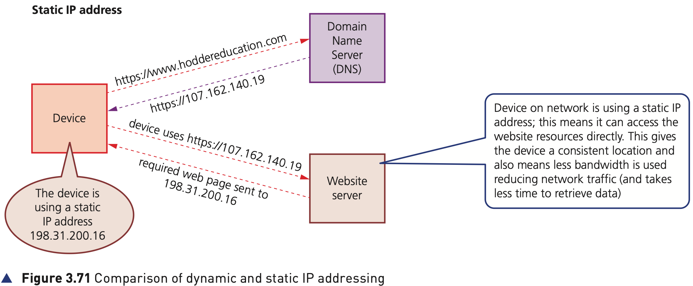

## Course Directory

### Return to the main outline

[← Back to Unit 3 Directory / 返回 Unit 3 目录](../../index.html)

## Static and Dynamic IP Addresses

### Two types of IP address

IP addresses can be either static (don't change) or dynamic (change every time a device connects to the internet).

## Static IP Addresses

### Permanently assigned by ISP

Static IP addresses are permanently assigned to a device by the internet service provider (ISP); they do not change each time a device logs onto the internet.

Static IP addresses are usually assigned to:

::: {.tight-list}
- remote servers which are hosting a website
- an online database
- a File Transfer Protocol (FTP) server
:::

In other words, a File Transfer Protocol (FTP) server is one of the common examples used in the textbook.

## Dynamic IP Addresses

### Assigned each time by DHCP

Dynamic IP addresses are assigned by the ISP each time a device logs onto the internet.

This is done using Dynamic Host Configuration Protocol (DHCP).

A computer on the internet, configured as a DHCP server, is used by the ISP to automatically assign an IP address to a device.

As the name suggests, a dynamic IP address could be different every time a device connects to the internet.

## Table 3.14

### Dynamic and static IP addresses

::: {.clean-table}
| Dynamic IP addresses | Static IP addresses |
|---|---|
| greater privacy since they change each time a user logs on | since static IP addresses do not change, they allow each device to be fully traceable |
| dynamic IP addresses can be an issue when using, for example, VoIP since this type of addressing is less reliable as it can disconnect and change the IP address causing the VoIP connection to fail | allow for faster upload and download speeds |
|  | more expensive to maintain since the device must be constantly running so that information is always available |
:::

## Figure 3.71

### Comparison of dynamic IP addressing

{fig-align="center" width="92%"}

The diagram shows how a device contacts web servers that are also connected to the internet:

::: {.tight-list}
- a DHCP server supplies a dynamic IP address to the device
- a DNS server looks up the domain name of the desired website into an IP address
- a website server contains the web pages of the desired website
:::

## Figure 3.71

### Comparison of static IP addressing

{fig-align="center" width="92%"}

When a device on the network is using a static IP address, it can access website resources directly. This gives the device a consistent location and also means less bandwidth is used, reducing network traffic.

## Classroom Check

### Keep the distinction precise

A complete answer should include:

::: {.tight-list}
- that static IP addresses are permanently assigned by the ISP
- that dynamic IP addresses are assigned each time by DHCP
- that static IP addresses are used for websites, databases and FTP servers
- that dynamic IP gives greater privacy but can be a problem for VoIP
- that Figure 3.71 involves DHCP, DNS and a website server
:::

## Bridge

### Next: 3.4.4 Routers

The next deck explains how routers move packets between networks.

## End

### Return to the main outline

[← Back to Unit 3 Directory / 返回 Unit 3 目录](../../index.html)
