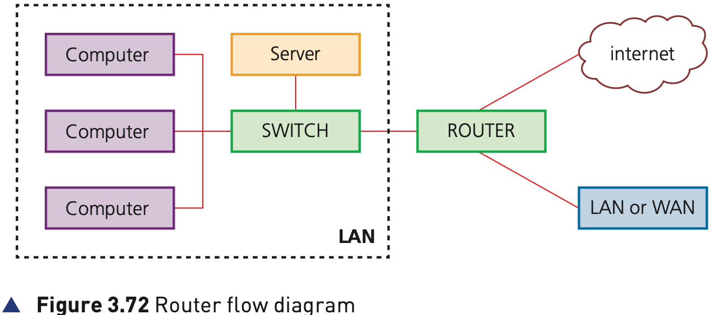

## Course Directory

### Return to the main outline

[← Back to Unit 3 Directory / 返回 Unit 3 目录](../../index.html)

## 3.4.4 Routers

### Joining one network to another

Routers enable data packets to be routed between different networks, for example, to join a LAN to a WAN.

The router takes data transmitted in one format from a network, which is using a particular protocol, and converts the data to a protocol and format understood by another network, thereby allowing them to communicate.

A router would typically have an internet cable plugged into it and several cables connecting to computers and other devices on the LAN.

## Figure 3.72

### Router flow diagram

{fig-align="center" width="86%"}

## Firewall and Main Function

### Protection and protocol transfer

Broadband routers sit behind a firewall (防火墙). The firewall protects the computers on a network.

The router's main function is to transmit internet and transmission protocols between two networks and also allow private networks to be connected together.

## Router to Switch to Device

### How the packet reaches the destination

Routers inspect the data package sent to it from any computer on any of the networks connected to it.

Since every computer on the same network has the same part of an internet protocol (IP) address, the router is able to send the data packet to the appropriate switch.

The data will then be delivered to the correct device using the MAC destination address.

If the MAC address does not match any device connected to the switch, it passes on to another switch on the same network until the appropriate device is found.

Routers can be wired or wireless devices.

## Activity 3.8

### Textbook review questions

1. Explain each of the following terms:
   a Network interface card (NIC)
   b MAC address
   c IP address
   d Router
   e DHCP server

2. a Give two features of dynamic IP addresses.  
   b Give two features of static IP addresses.  
   c Explain why we need both types of IP address.

3. Describe three differences between MAC addresses and IP addresses.

## Classroom Check

### Keep the router path explicit

A complete answer should include:

::: {.tight-list}
- that routers move packets between different networks
- that routers convert data to a protocol and format understood by another network
- that routers often pass packets to a switch, which then uses the MAC destination address
- that broadband routers sit behind a firewall
- that routers can be wired or wireless
:::

## Bridge

### End of 3.4 Network hardware

This completes the main 3.4 Network hardware content in the current production scope.

## End

### Return to the main outline

[← Back to Unit 3 Directory / 返回 Unit 3 目录](../../index.html)
